# Sample ABFs

This is a small collection of various ABFs I practice developing with. Many of them were emailed to me by contributors. If you have a unique type of ABF file, email it to me and I will include it here. Note that this page is generated automatically by [dataThumbnails.py](/tests/tests/dataThumbnails.py).

## 05210017_vc_abf1.abf
ABF (version 1.8.3.0) with 2 channels (pA, pA), sampled at 40.0 kHz, containing 6 sweeps, having no tags, with a total length of 0.17 minutes, recorded with protocol "Apply ACh with imaging (VC) 2 (no movies)". 
[View the full header](headers/05210017_vc_abf1.md)<a href='headers/05210017_vc_abf1.png'>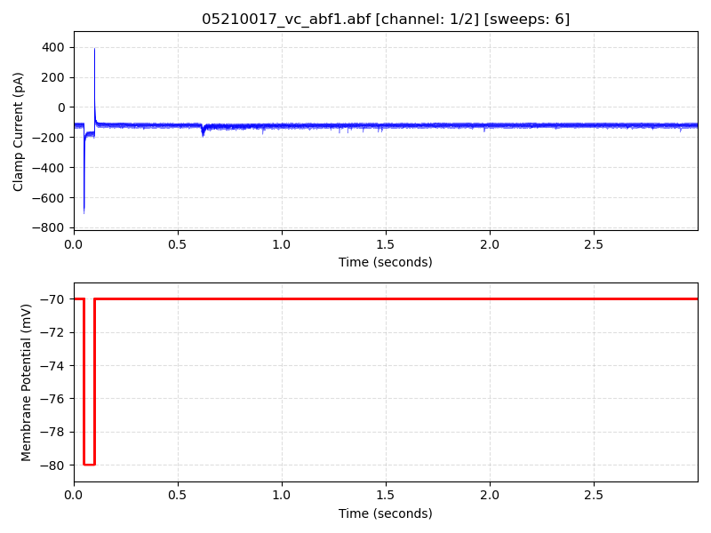</a>

## 130618-1-12.abf
ABF (version 1.2.9.9) with 1 channel (pA), sampled at 50.0 kHz, containing 3 sweeps, having no tags, with a total length of 0.07 minutes, recorded without a protocol file. 
[View the full header](headers/130618-1-12.md)<a href='headers/130618-1-12.png'>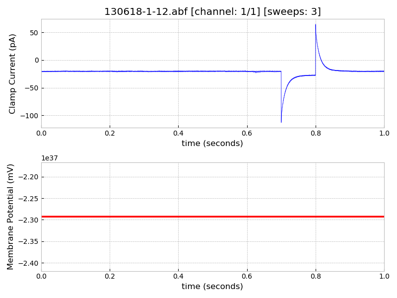</a>

## 14o08011_ic_pair.abf
ABF (version 2.0.0.0) with 2 channels (mV, mV), sampled at 10.0 kHz, containing 3 sweeps, having no tags, with a total length of 4.00 minutes, recorded with protocol "pair-loose-60". 
[View the full header](headers/14o08011_ic_pair.md)<a href='headers/14o08011_ic_pair.png'>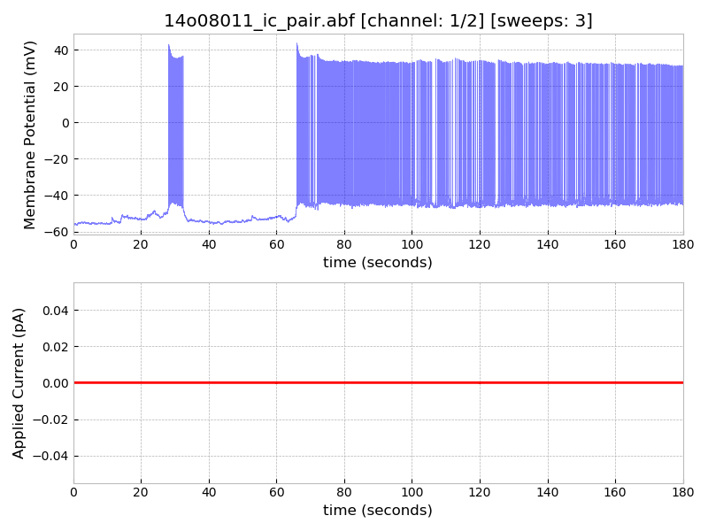</a>

## 14o16001_vc_pair_step.abf
ABF (version 2.0.0.0) with 2 channels (pA, pA), sampled at 10.0 kHz, containing 13 sweeps, having no tags, with a total length of 0.93 minutes, recorded with protocol "pair-MTIV". 
[View the full header](headers/14o16001_vc_pair_step.md)<a href='headers/14o16001_vc_pair_step.png'>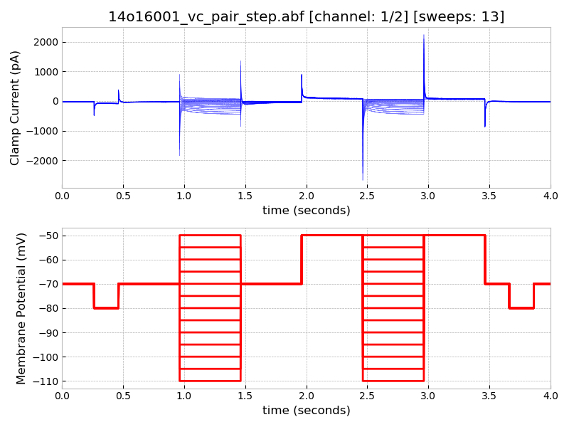</a>

## 16d05007_vc_tags.abf
ABF (version 2.0.0.0) with 1 channel (pA), sampled at 20.0 kHz, containing 187 sweeps, having 2 tags (+TGOT, -TGOT), with a total length of 6.27 minutes, recorded with protocol "0402 VC 2s MT-50". 
[View the full header](headers/16d05007_vc_tags.md)<a href='headers/16d05007_vc_tags.png'>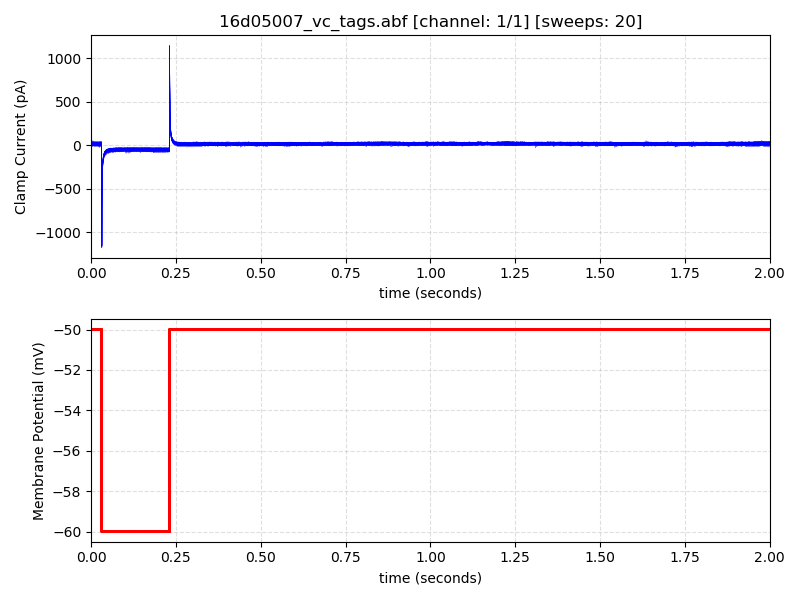</a>

## 16d22006_kim_gapfree.abf
ABF (version 2.0.0.0) with 2 channels (dB, mV), sampled at 10.0 kHz, containing 1 sweep, having no tags, with a total length of 0.80 minutes, recorded with protocol "mapping". 
[View the full header](headers/16d22006_kim_gapfree.md)<a href='headers/16d22006_kim_gapfree.png'>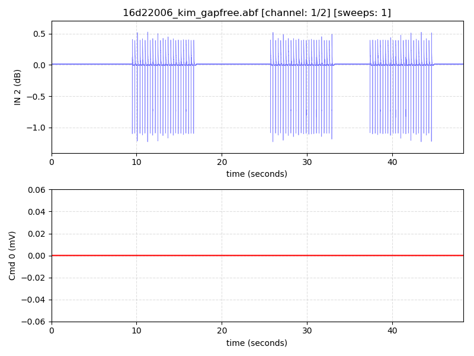</a>

## 171116sh_0011.abf
ABF (version 2.6.0.0) with 1 channel (pA), sampled at 20.0 kHz, containing 20 sweeps, having no tags, with a total length of 0.17 minutes, recorded with protocol "0201 memtest". 
[View the full header](headers/171116sh_0011.md)<a href='headers/171116sh_0011.png'>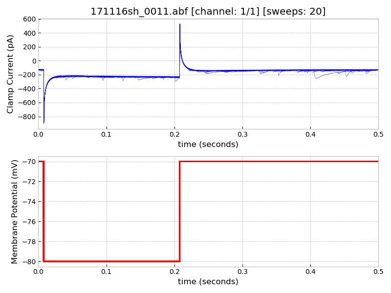</a>

## 171116sh_0012.abf
ABF (version 2.6.0.0) with 1 channel (pA), sampled at 20.0 kHz, containing 7 sweeps, having no tags, with a total length of 0.47 minutes, recorded with protocol "0202 IV dual". 
[View the full header](headers/171116sh_0012.md)<a href='headers/171116sh_0012.png'>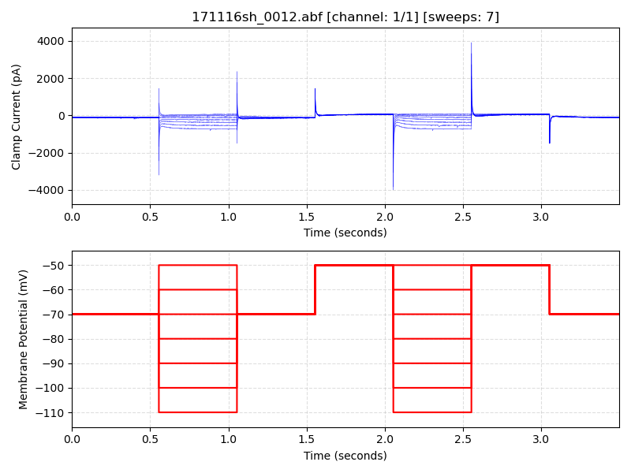</a>

## 171116sh_0013.abf
ABF (version 2.6.0.0) with 1 channel (pA), sampled at 20.0 kHz, containing 13 sweeps, having no tags, with a total length of 0.23 minutes, recorded with protocol "0203 IV fast". 
[View the full header](headers/171116sh_0013.md)<a href='headers/171116sh_0013.png'>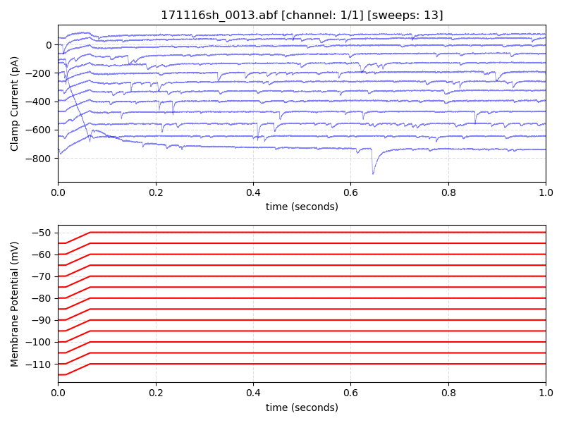</a>

## 171116sh_0014.abf
ABF (version 2.6.0.0) with 1 channel (pA), sampled at 20.0 kHz, containing 50 sweeps, having no tags, with a total length of 0.10 minutes, recorded with protocol "0204 Cm ramp". 
[View the full header](headers/171116sh_0014.md)<a href='headers/171116sh_0014.png'>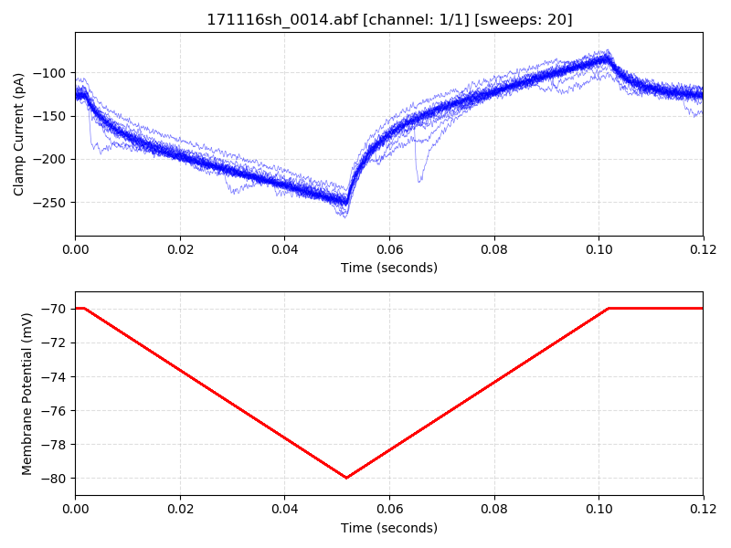</a>

## 171116sh_0015-ATFwaveform.abf
ABF (version 2.6.0.0) with 1 channel (pA), sampled at 10.0 kHz, containing 3 sweeps, having no tags, with a total length of 0.67 minutes, recorded with protocol "0221 VC sine sweep 70 +- 5 mV". 
[View the full header](headers/171116sh_0015-ATFwaveform.md)<a href='headers/171116sh_0015-ATFwaveform.png'>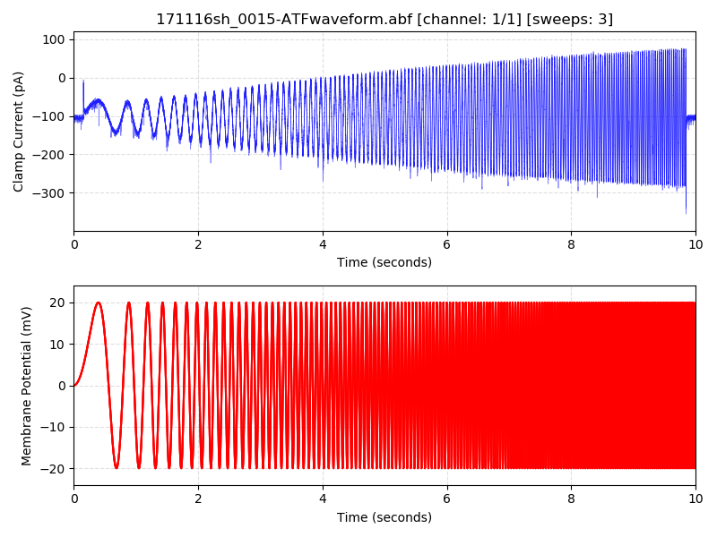</a>

## 171116sh_0015.abf
ABF (version 2.6.0.0) with 1 channel (pA), sampled at 10.0 kHz, containing 3 sweeps, having no tags, with a total length of 0.67 minutes, recorded with protocol "0221 VC sine sweep 70 +- 5 mV". 
[View the full header](headers/171116sh_0015.md)<a href='headers/171116sh_0015.png'>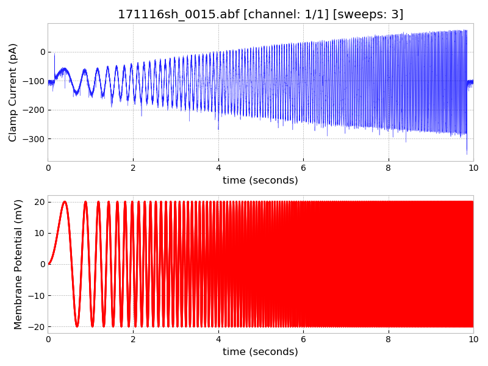</a>

## 171116sh_0016.abf
ABF (version 2.6.0.0) with 1 channel (mV), sampled at 20.0 kHz, containing 11 sweeps, having no tags, with a total length of 0.20 minutes, recorded with protocol "0111 continuous ramp". 
[View the full header](headers/171116sh_0016.md)<a href='headers/171116sh_0016.png'>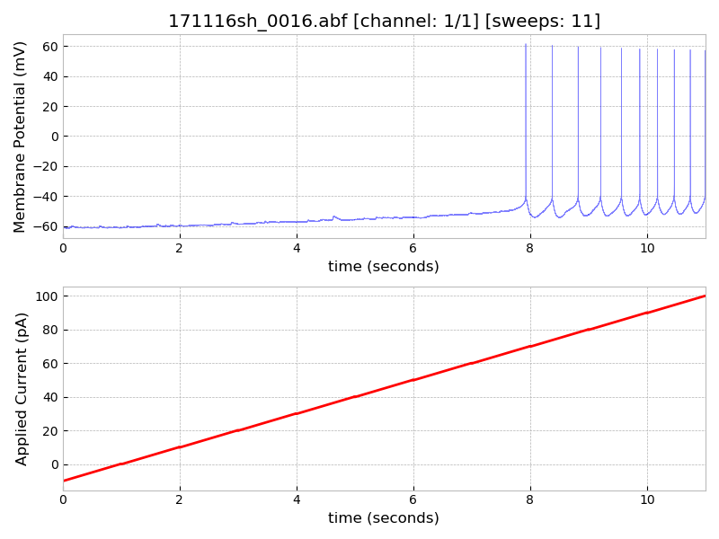</a>

## 171116sh_0017.abf
ABF (version 2.6.0.0) with 1 channel (mV), sampled at 10.0 kHz, containing 3 sweeps, having no tags, with a total length of 0.67 minutes, recorded with protocol "0121 IC sine sweep 0 +- 20 pA". 
[View the full header](headers/171116sh_0017.md)<a href='headers/171116sh_0017.png'>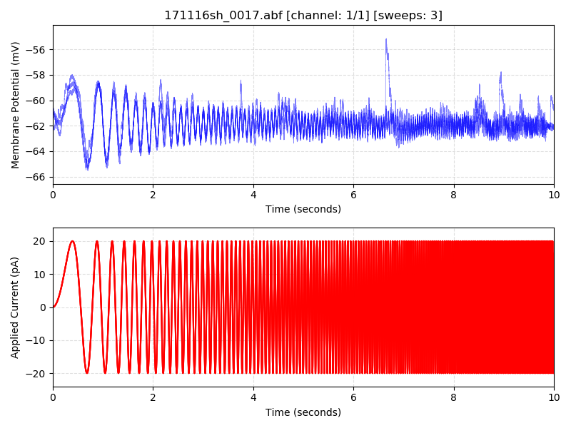</a>

## 171116sh_0018.abf
ABF (version 2.6.0.0) with 1 channel (mV), sampled at 20.0 kHz, containing 17 sweeps, having no tags, with a total length of 0.90 minutes, recorded with protocol "0113 steps dual -100 to 300 step 25". 
[View the full header](headers/171116sh_0018.md)<a href='headers/171116sh_0018.png'>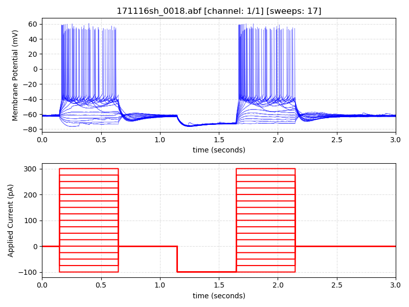</a>

## 171116sh_0019.abf
ABF (version 2.6.0.0) with 1 channel (mV), sampled at 20.0 kHz, containing 22 sweeps, having no tags, with a total length of 1.15 minutes, recorded with protocol "0114 steps dual -100 to 2000 step 100". 
[View the full header](headers/171116sh_0019.md)<a href='headers/171116sh_0019.png'>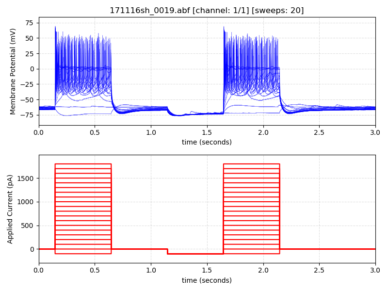</a>

## 171116sh_0020.abf
ABF (version 2.6.0.0) with 1 channel (pA), sampled at 20.0 kHz, containing 7 sweeps, having no tags, with a total length of 1.33 minutes, recorded with protocol "0406 VC 10s MT-50". 
[View the full header](headers/171116sh_0020.md)<a href='headers/171116sh_0020.png'>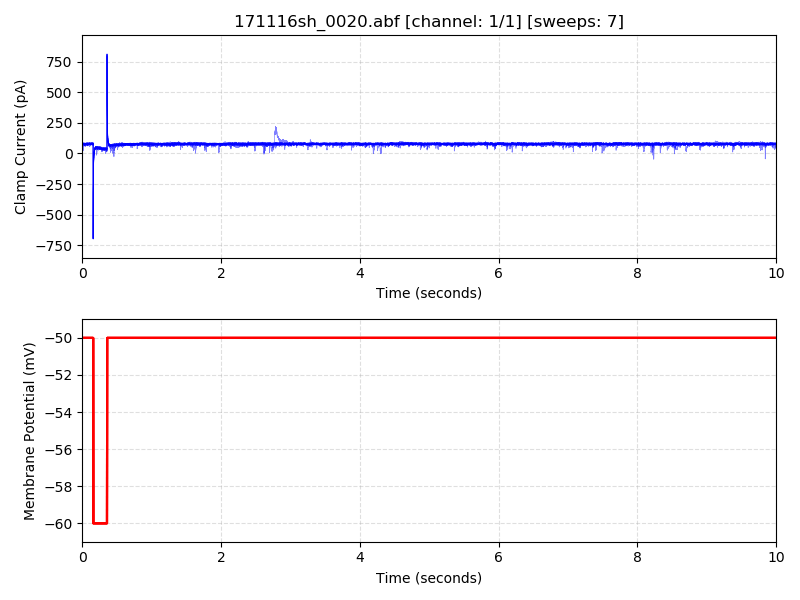</a>

## 171116sh_0020_saved.abf
ABF (version 1.2.9.9) with 1 channel (pA), sampled at 20.0 kHz, containing 7 sweeps, having no tags, with a total length of 1.33 minutes, recorded without a protocol file. 
[View the full header](headers/171116sh_0020_saved.md)<a href='headers/171116sh_0020_saved.png'>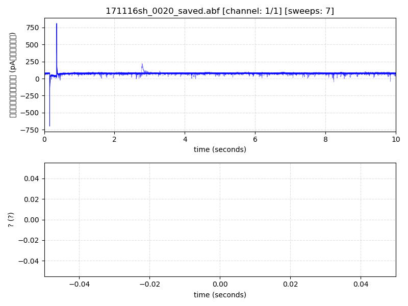</a>

## 171117_HFMixFRET.abf
ABF (version 2.0.0.0) with 4 channels (uA, mV, V, V), sampled at 10.0 kHz, containing 13 sweeps, having no tags, with a total length of 14.40 minutes, recorded with protocol "fret_fv_2s". 
[View the full header](headers/171117_HFMixFRET.md)

## 17o05024_vc_steps.abf
ABF (version 2.6.0.0) with 1 channel (pA), sampled at 20.0 kHz, containing 7 sweeps, having no tags, with a total length of 0.47 minutes, recorded with protocol "0202 IV dual". 
[View the full header](headers/17o05024_vc_steps.md)<a href='headers/17o05024_vc_steps.png'>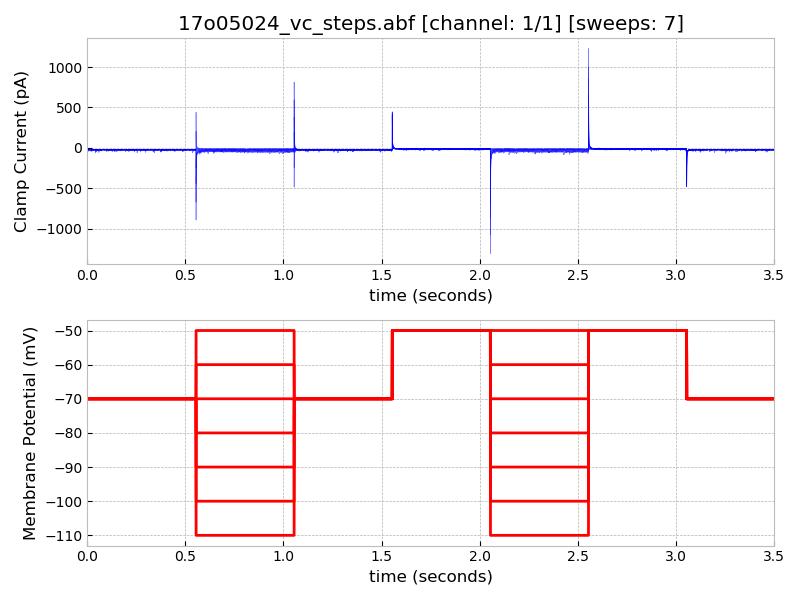</a>

## 17o05026_vc_stim.abf
ABF (version 2.6.0.0) with 1 channel (pA), sampled at 20.0 kHz, containing 8 sweeps, having no tags, with a total length of 1.50 minutes, recorded with protocol "0501 opto -50". 
[View the full header](headers/17o05026_vc_stim.md)<a href='headers/17o05026_vc_stim.png'>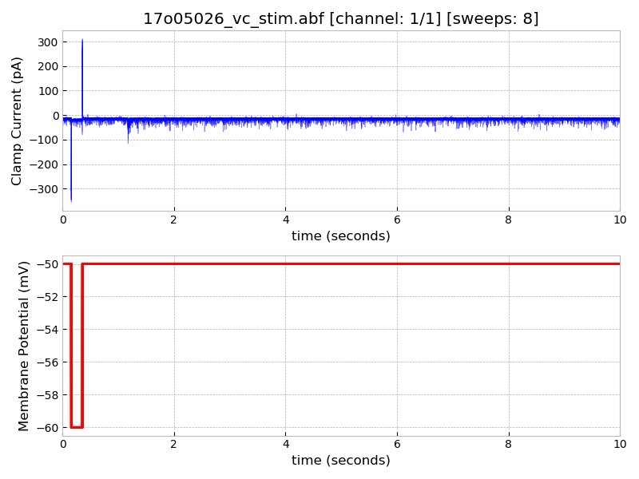</a>

## 17o05027_ic_ramp.abf
ABF (version 2.6.0.0) with 1 channel (mV), sampled at 20.0 kHz, containing 2 sweeps, having no tags, with a total length of 0.05 minutes, recorded with protocol "0111 continuous ramp". 
[View the full header](headers/17o05027_ic_ramp.md)<a href='headers/17o05027_ic_ramp.png'>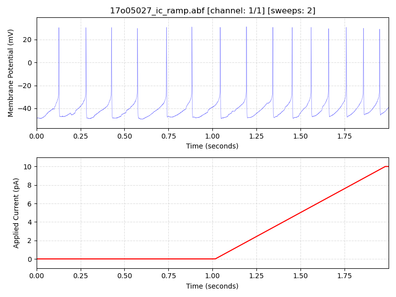</a>

## 17o05028_ic_steps.abf
ABF (version 2.6.0.0) with 1 channel (mV), sampled at 20.0 kHz, containing 16 sweeps, having no tags, with a total length of 0.85 minutes, recorded with protocol "0112 steps dual -50 to 150 step 10". 
[View the full header](headers/17o05028_ic_steps.md)<a href='headers/17o05028_ic_steps.png'>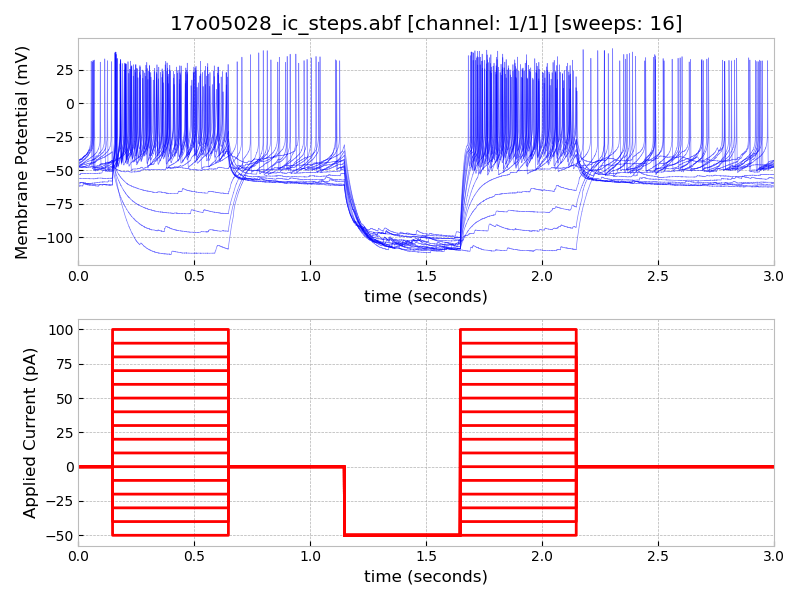</a>

## 180415_aaron_temp.abf
ABF (version 2.3.0.0) with 2 channels (V, deg C), sampled at 100.0 kHz, containing 1 sweep, having no tags, with a total length of 0.02 minutes, recorded with protocol "PacemakerTempTest". 
[View the full header](headers/180415_aaron_temp.md)<a href='headers/180415_aaron_temp.png'>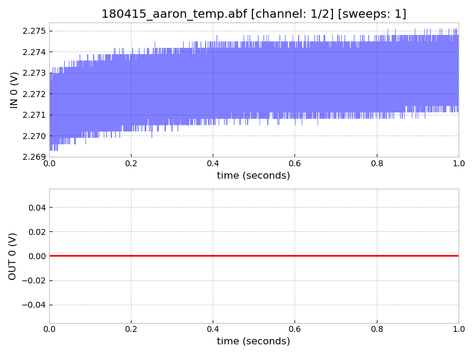</a>

## 18425108.abf
ABF (version 2.9.0.0) with 2 channels (nA, mV), sampled at 25.0 kHz, containing 1 sweep, having no tags, with a total length of 4.00 minutes, recorded with protocol "11 - 15 pulse AHP w_laser". 
[View the full header](headers/18425108.md)<a href='headers/18425108.png'>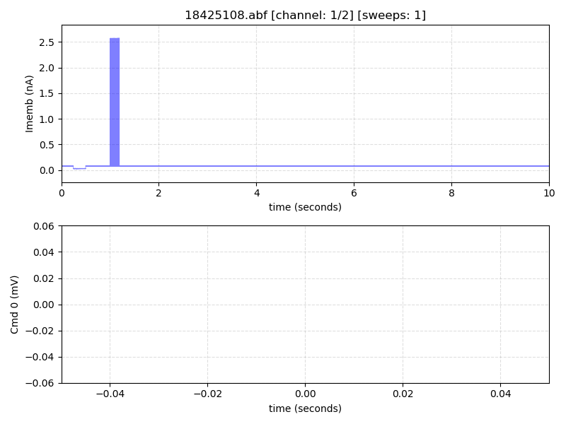</a>

## 18425108_abf1.abf
ABF (version 1.8.4.0) with 2 channels (nA, mV), sampled at 50.0 kHz, containing 1 sweep, having no tags, with a total length of 0.08 minutes, recorded with protocol "11 - 15 pulse AHP w_laser". 
[View the full header](headers/18425108_abf1.md)<a href='headers/18425108_abf1.png'>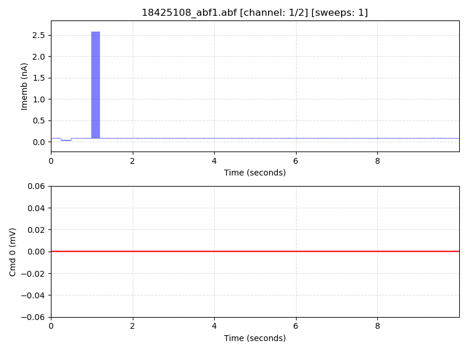</a>

## 18702001-biphasicTrain.abf
ABF (version 2.6.0.0) with 2 channels (pA, A), sampled at 20.0 kHz, containing 3 sweeps, having no tags, with a total length of 0.07 minutes, recorded with protocol "0201 memtest". 
[View the full header](headers/18702001-biphasicTrain.md)<a href='headers/18702001-biphasicTrain.png'>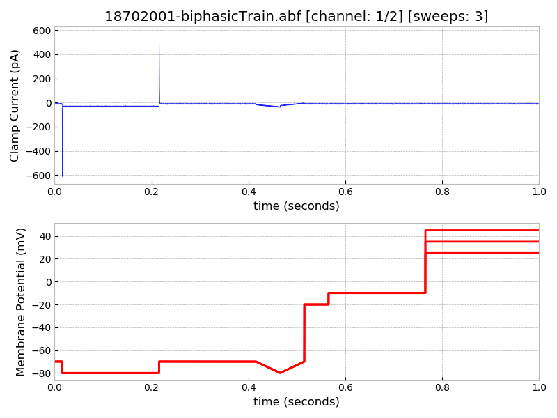</a>

## 18702001-cosTrain.abf
ABF (version 2.6.0.0) with 2 channels (pA, A), sampled at 20.0 kHz, containing 3 sweeps, having no tags, with a total length of 0.07 minutes, recorded with protocol "0201 memtest". 
[View the full header](headers/18702001-cosTrain.md)<a href='headers/18702001-cosTrain.png'>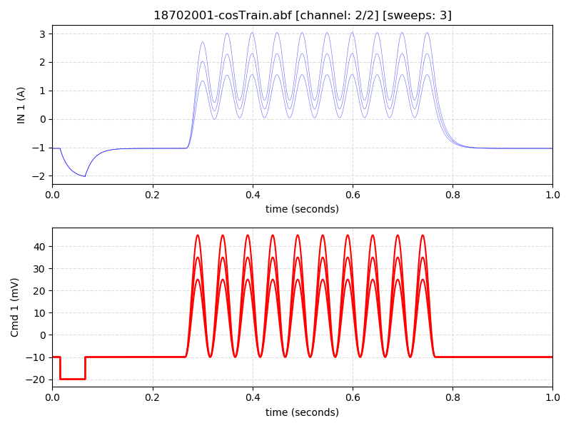</a>

## 18702001-pulseTrain.abf
ABF (version 2.6.0.0) with 2 channels (pA, A), sampled at 20.0 kHz, containing 3 sweeps, having no tags, with a total length of 0.07 minutes, recorded with protocol "0201 memtest". 
[View the full header](headers/18702001-pulseTrain.md)<a href='headers/18702001-pulseTrain.png'>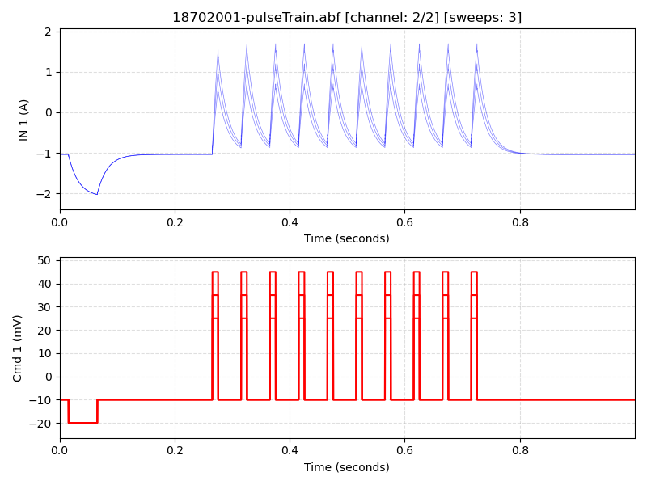</a>

## 18702001-ramp.abf
ABF (version 2.6.0.0) with 2 channels (pA, A), sampled at 20.0 kHz, containing 3 sweeps, having no tags, with a total length of 0.07 minutes, recorded with protocol "0201 memtest". 
[View the full header](headers/18702001-ramp.md)<a href='headers/18702001-ramp.png'>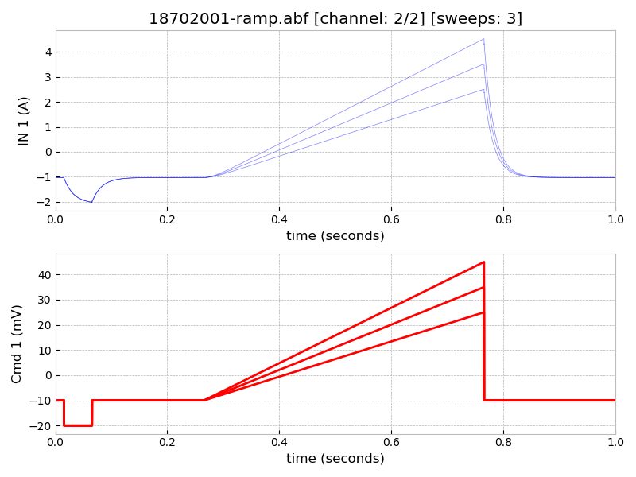</a>

## 18702001-step.abf
ABF (version 2.6.0.0) with 2 channels (pA, A), sampled at 20.0 kHz, containing 3 sweeps, having no tags, with a total length of 0.07 minutes, recorded with protocol "0201 memtest". 
[View the full header](headers/18702001-step.md)<a href='headers/18702001-step.png'>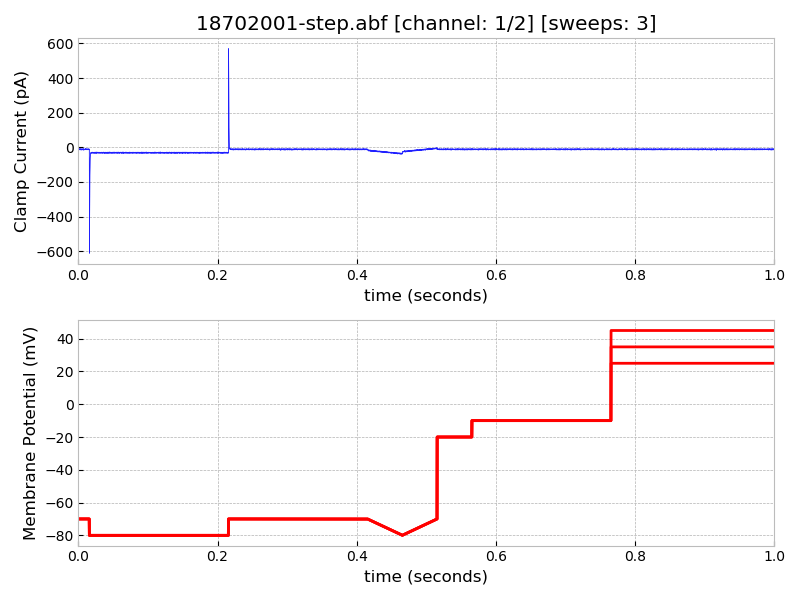</a>

## 18702001-triangleTrain.abf
ABF (version 2.6.0.0) with 2 channels (pA, A), sampled at 20.0 kHz, containing 3 sweeps, having no tags, with a total length of 0.07 minutes, recorded with protocol "0201 memtest". 
[View the full header](headers/18702001-triangleTrain.md)<a href='headers/18702001-triangleTrain.png'>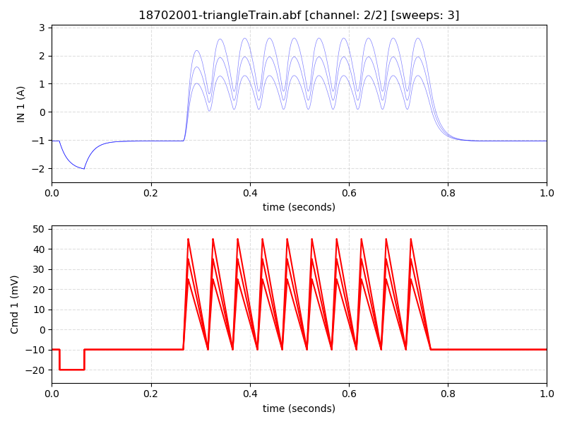</a>

## 18711001.abf
ABF (version 2.6.0.0) with 1 channel (mV), sampled at 20.0 kHz, containing 30 sweeps, having no tags, with a total length of 10.03 minutes, recorded with protocol "FICurve_Hyperpolarizing_KL". 
[View the full header](headers/18711001.md)<a href='headers/18711001.png'>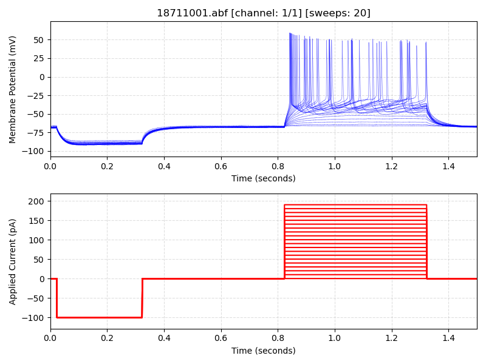</a>

## 18713001.abf
ABF (version 2.6.0.0) with 1 channel (mV), sampled at 20.0 kHz, containing 30 sweeps, having no tags, with a total length of 10.03 minutes, recorded with protocol "FICurve_Hyperpolarizing_KL". 
[View the full header](headers/18713001.md)<a href='headers/18713001.png'>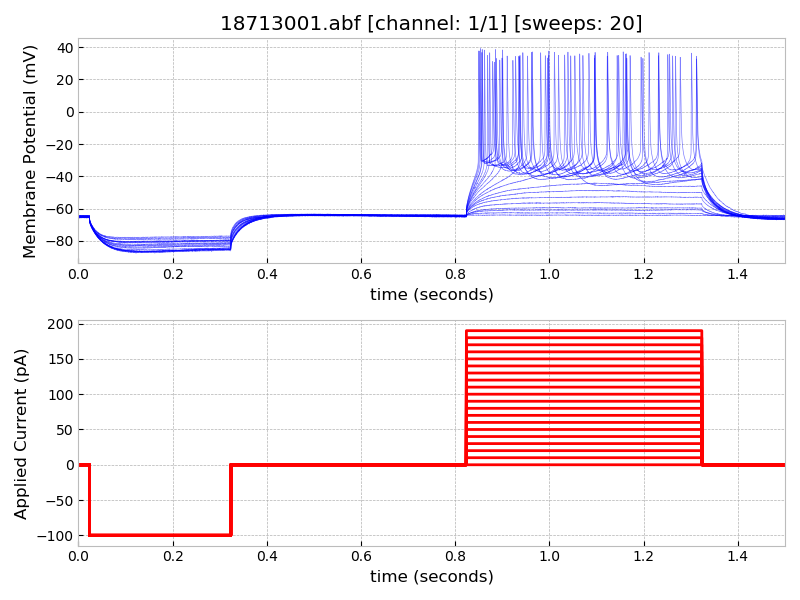</a>

## 18807005.abf
ABF (version 2.6.0.0) with 1 channel (pA), sampled at 20.0 kHz, containing 2 sweeps, having no tags, with a total length of 0.05 minutes, recorded with protocol "0111 continuous ramp". 
[View the full header](headers/18807005.md)<a href='headers/18807005.png'>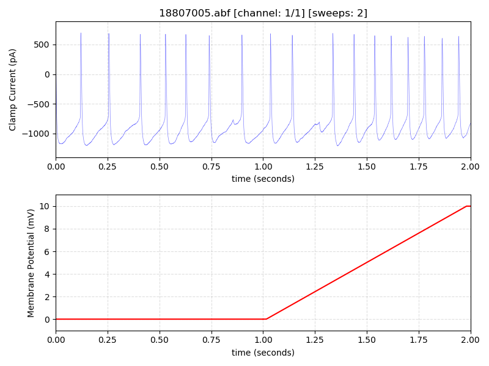</a>

## 18808025.abf
ABF (version 2.6.0.0) with 1 channel (pA), sampled at 20.0 kHz, containing 40 sweeps, having no tags, with a total length of 0.41 minutes, recorded with protocol "0201 memtest". 
[View the full header](headers/18808025.md)<a href='headers/18808025.png'>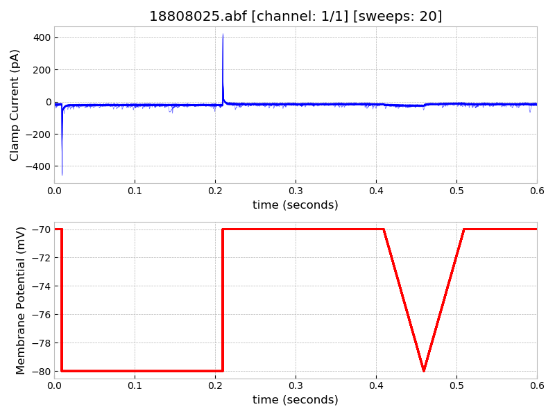</a>

## 2018_04_13_0016a_original.abf
ABF (version 2.0.0.0) with 2 channels (pA, pA), sampled at 250.0 kHz, containing 52 sweeps, having no tags, with a total length of 0.17 minutes, recorded with protocol "ONRec_Hv1". 
[View the full header](headers/2018_04_13_0016a_original.md)<a href='headers/2018_04_13_0016a_original.png'>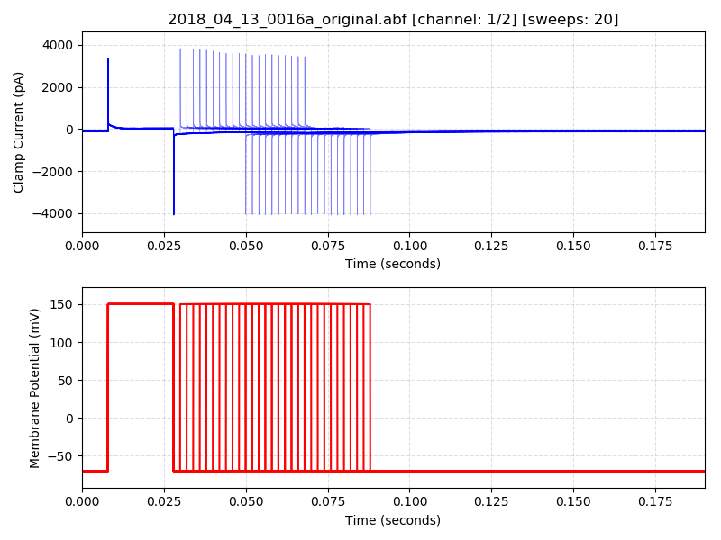</a>

## 2018_04_13_0016b_modified.abf
ABF (version 2.6.0.0) with 2 channels (pA, pA), sampled at 250.0 kHz, containing 48 sweeps, having no tags, with a total length of 0.16 minutes, recorded with protocol "ONRec_Hv1". 
[View the full header](headers/2018_04_13_0016b_modified.md)

## 2018_05_08_0028-IC-VC-pair.abf
ABF (version 2.6.0.0) with 2 channels (mV, pA), sampled at 20.0 kHz, containing 20 sweeps, having no tags, with a total length of 1.75 minutes, recorded with protocol "p0601 IC1 VC2". 
[View the full header](headers/2018_05_08_0028-IC-VC-pair.md)<a href='headers/2018_05_08_0028-IC-VC-pair.png'>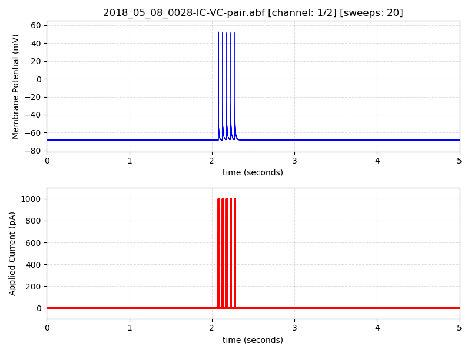</a>

## 2018_08_23_0009.abf
ABF (version 2.6.0.0) with 1 channel (pA), sampled at 20.0 kHz, containing 40 sweeps, having no tags, with a total length of 0.41 minutes, recorded with protocol "0201 memtest". 
[View the full header](headers/2018_08_23_0009.md)<a href='headers/2018_08_23_0009.png'>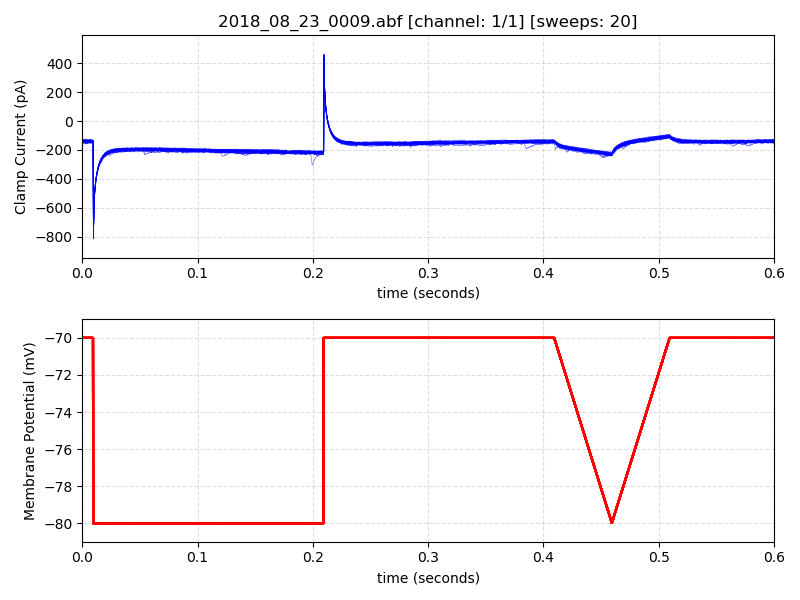</a>

## 2018_11_16_sh_0006.abf
ABF (version 2.6.0.0) with 1 channel (pA), sampled at 20.0 kHz, containing 60 sweeps, having 1 tag (+drug at 3min), with a total length of 5.00 minutes, recorded with protocol "0201 memtest". 
[View the full header](headers/2018_11_16_sh_0006.md)<a href='headers/2018_11_16_sh_0006.png'>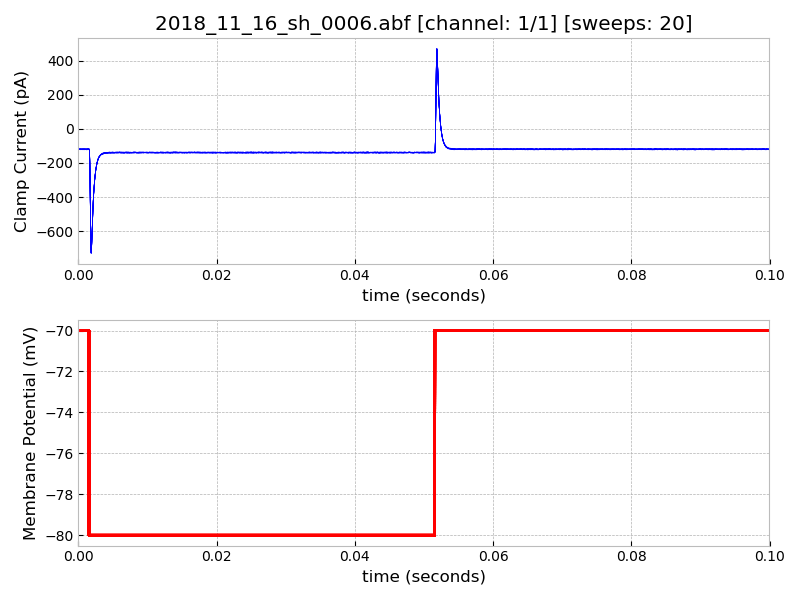</a>

## 2018_12_09_pCLAMP11_0001.abf
ABF (version 2.9.0.0) with 1 channel (A), sampled at 10.0 kHz, containing 10 sweeps, having no tags, with a total length of 0.04 minutes, recorded without a protocol file. 
[View the full header](headers/2018_12_09_pCLAMP11_0001.md)<a href='headers/2018_12_09_pCLAMP11_0001.png'>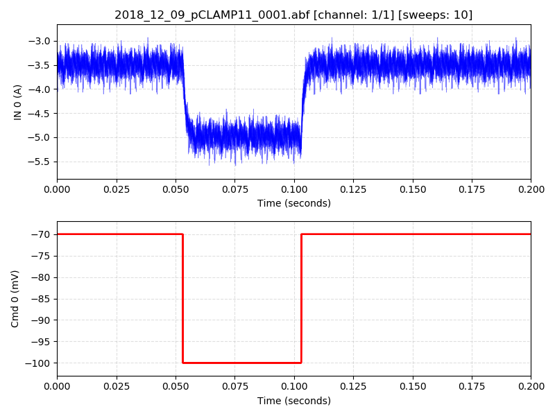</a>

## 2018_12_15_0000.abf
ABF (version 2.9.0.0) with 4 channels (pA, pA, pA, pA), sampled at 10.0 kHz, containing 10 sweeps, having no tags, with a total length of 0.04 minutes, recorded without a protocol file. 
[View the full header](headers/2018_12_15_0000.md)<a href='headers/2018_12_15_0000.png'>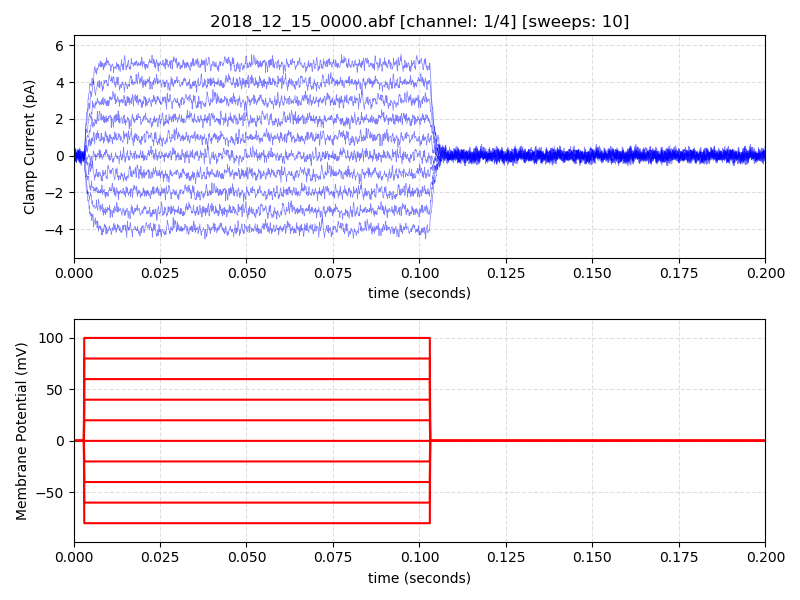</a>

## File_axon_1.abf
ABF (version 2.0.0.0) with 1 channel (pA), sampled at 10.0 kHz, containing 1 sweep, having no tags, with a total length of 3.19 minutes, recorded with protocol "VC_cour01G20". 
[View the full header](headers/File_axon_1.md)<a href='headers/File_axon_1.png'>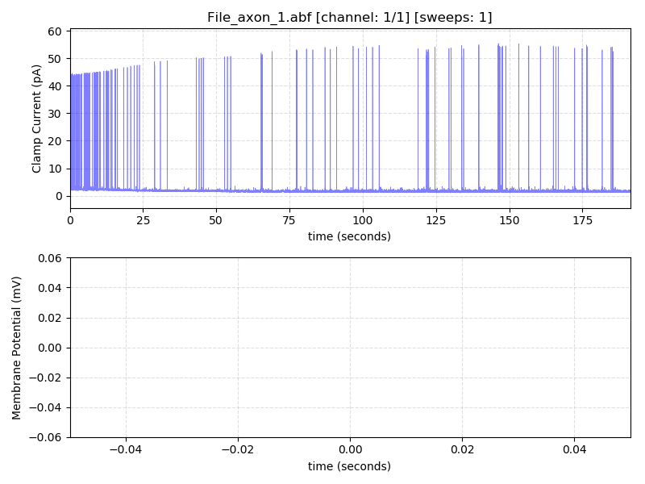</a>

## File_axon_2.abf
ABF (version 1.8.3.0) with 1 channel (mV), sampled at 1.0 kHz, containing 1 sweep, having 4 tags (Clampex start acquisition, C:\Axon\rsultats\06-05\11-06-05\05611005.abf, Clampex end (1), Clampex start acquisition), with a total length of 20.00 minutes, recorded with protocol "Cc_minidigi". 
[View the full header](headers/File_axon_2.md)<a href='headers/File_axon_2.png'>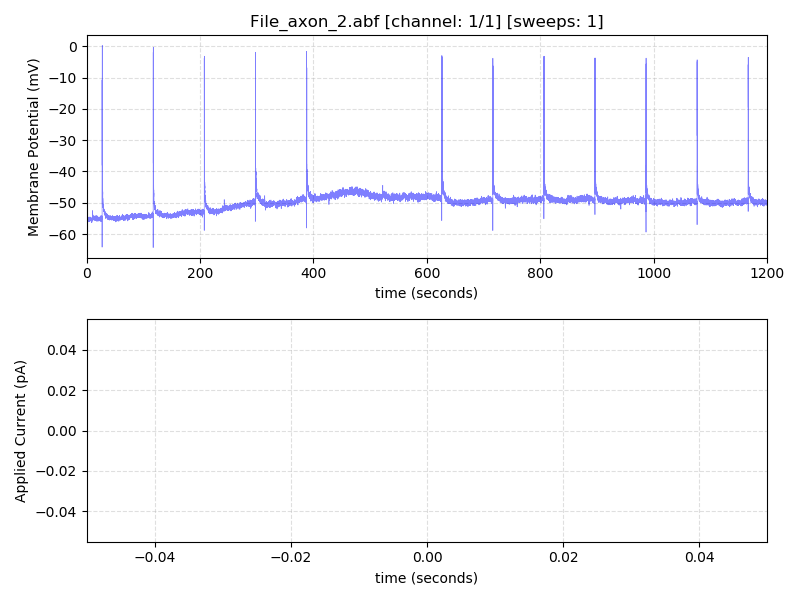</a>

## File_axon_3.abf
ABF (version 1.8.3.0) with 2 channels (mV, pA), sampled at 40.0 kHz, containing 5 sweeps, having no tags, with a total length of 0.05 minutes, recorded with protocol "Cc_stim ONL". 
[View the full header](headers/File_axon_3.md)<a href='headers/File_axon_3.png'>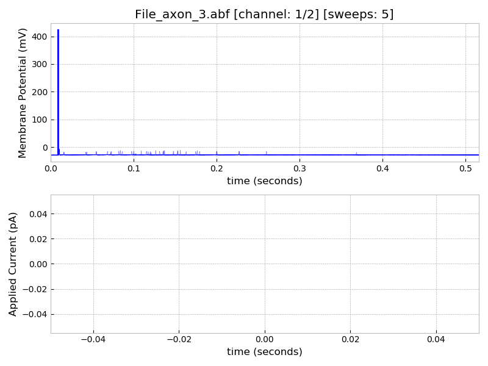</a>

## File_axon_4.abf
ABF (version 2.0.0.0) with 1 channel (pA), sampled at 10.0 kHz, containing 1 sweep, having 1 tag (drogue on), with a total length of 3.63 minutes, recorded with protocol "VC_cour01G20". 
[View the full header](headers/File_axon_4.md)<a href='headers/File_axon_4.png'>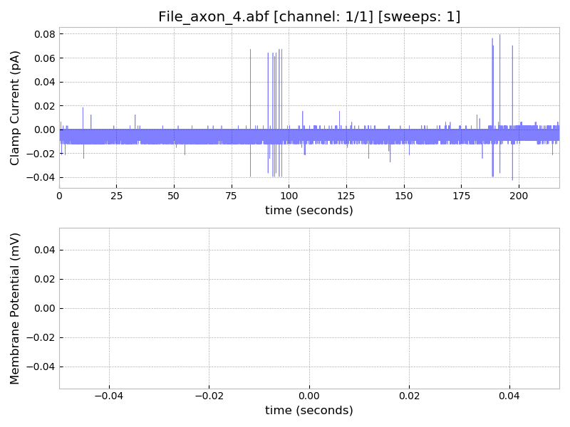</a>

## File_axon_5.abf
ABF (version 2.0.0.0) with 1 channel (mV), sampled at 20.0 kHz, containing 9 sweeps, having no tags, with a total length of 0.77 minutes, recorded with protocol "step cclamp". 
[View the full header](headers/File_axon_5.md)<a href='headers/File_axon_5.png'>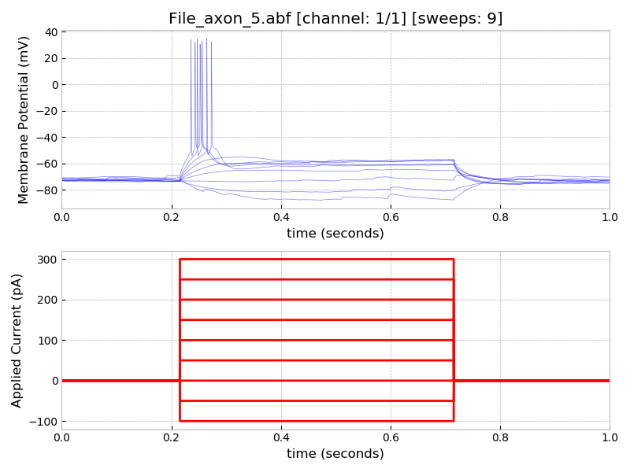</a>

## File_axon_6.abf
ABF (version 2.0.0.0) with 2 channels (mV, nA), sampled at 20.0 kHz, containing 32 sweeps, having no tags, with a total length of 10.68 minutes, recorded with protocol "step cclamp 2nA for 2ms". 
[View the full header](headers/File_axon_6.md)<a href='headers/File_axon_6.png'>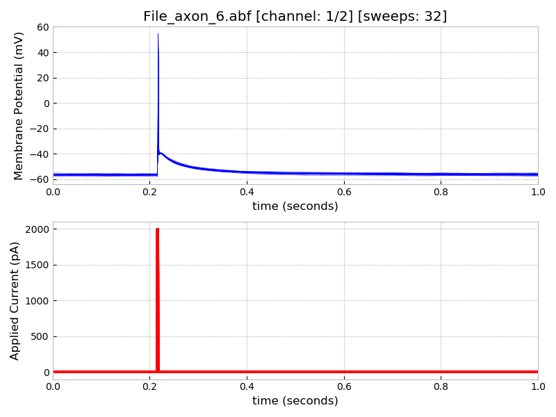</a>

## File_axon_7.abf
ABF (version 2.6.0.0) with 1 channel (pA), sampled at 0.403 kHz, containing 12 sweeps, having no tags, with a total length of 2.07 minutes, recorded with protocol "Apl NMDA 2 s -80mV cada 2ms esp 10 2480us". 
[View the full header](headers/File_axon_7.md)<a href='headers/File_axon_7.png'>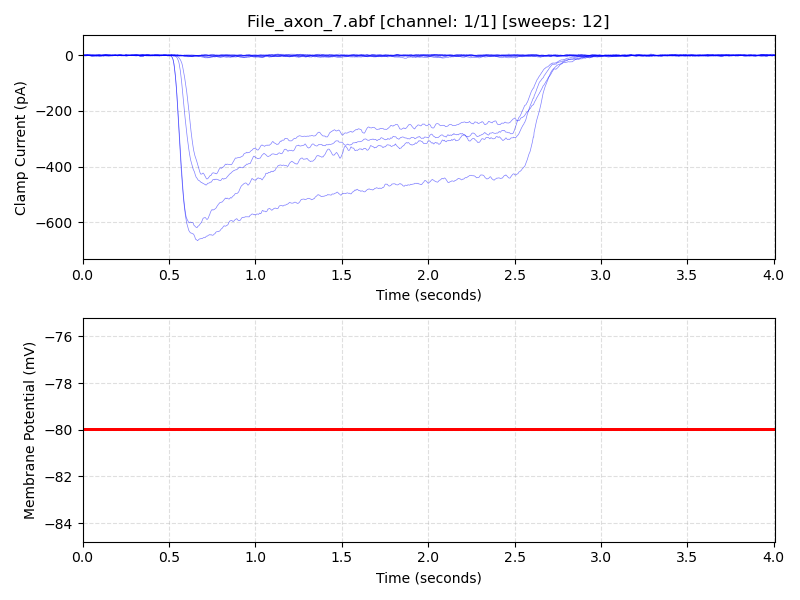</a>

## abf1_with_tags.abf
ABF (version 1.8.3.0) with 1 channel (pA), sampled at 20.0 kHz, containing 1 sweep, having 1 tag (APV+CGP+DNQX+ON@6), with a total length of 15.00 minutes, recorded with protocol "15minGapfree". 
[View the full header](headers/abf1_with_tags.md)<a href='headers/abf1_with_tags.png'>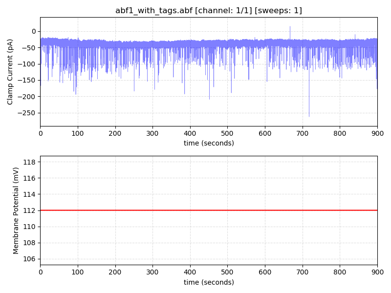</a>

## f1.abf
ABF (version 1.8.3.0) with 4 channels (pA, pA, mV, mV), sampled at 80.0 kHz, containing 10 sweeps, having no tags, with a total length of 0.11 minutes, recorded with protocol "JAF 1 electrode  ST-EPSC". 
[View the full header](headers/f1.md)<a href='headers/f1.png'>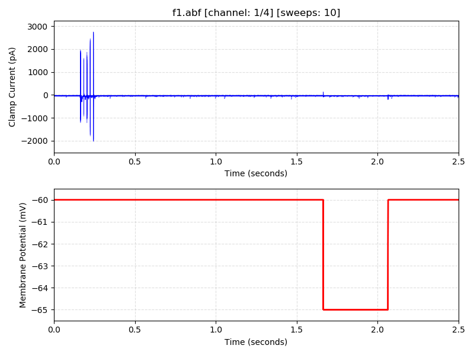</a>

## f1_saved.abf
ABF (version 1.2.9.9) with 1 channel (pA), sampled at 20.0 kHz, containing 10 sweeps, having no tags, with a total length of 0.46 minutes, recorded without a protocol file. 
[View the full header](headers/f1_saved.md)<a href='headers/f1_saved.png'>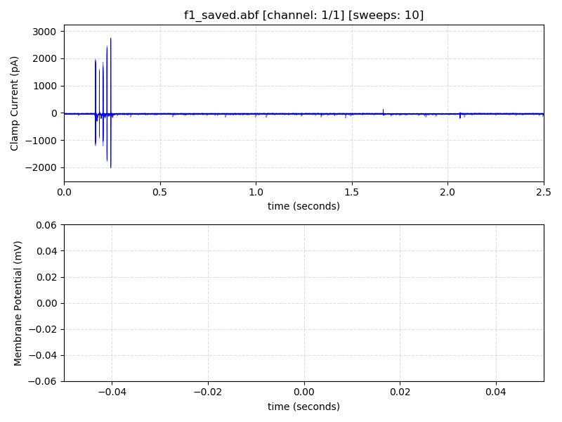</a>

## model_vc_ramp.abf
ABF (version 2.6.0.0) with 1 channel (pA), sampled at 20.0 kHz, containing 50 sweeps, having no tags, with a total length of 0.10 minutes, recorded with protocol "0204 Cm ramp". 
[View the full header](headers/model_vc_ramp.md)<a href='headers/model_vc_ramp.png'>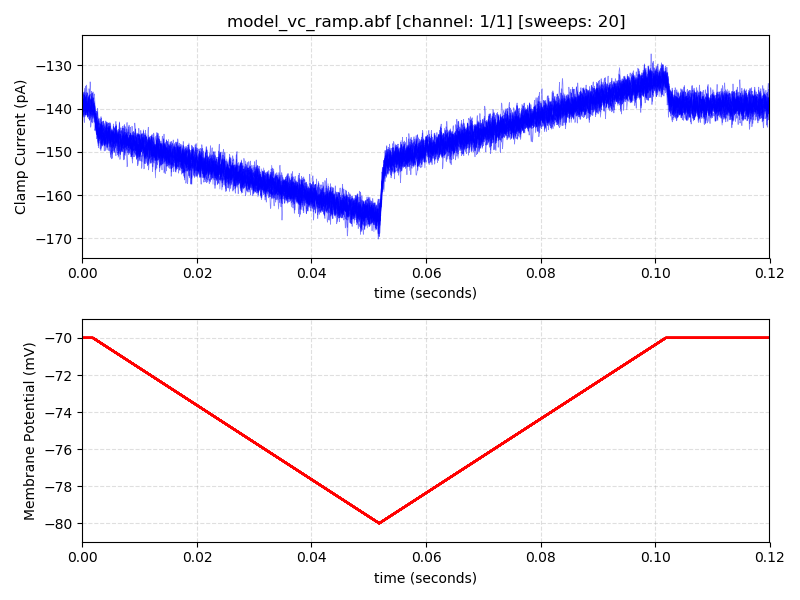</a>

## model_vc_step.abf
ABF (version 2.6.0.0) with 1 channel (pA), sampled at 20.0 kHz, containing 20 sweeps, having no tags, with a total length of 0.17 minutes, recorded with protocol "0201 memtest". 
[View the full header](headers/model_vc_step.md)<a href='headers/model_vc_step.png'>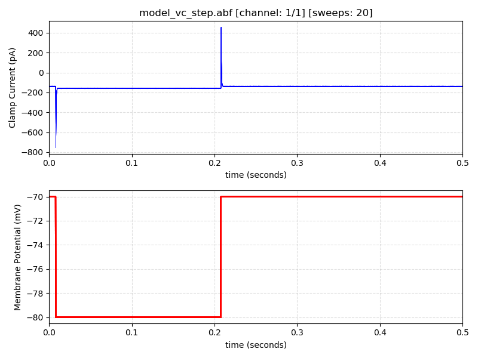</a>

## pclamp11_4ch.abf
ABF (version 2.9.0.0) with 4 channels (pA, pA, pA, pA), sampled at 20.0 kHz, containing 10 sweeps, having no tags, with a total length of 0.04 minutes, recorded without a protocol file. 
[View the full header](headers/pclamp11_4ch.md)<a href='headers/pclamp11_4ch.png'>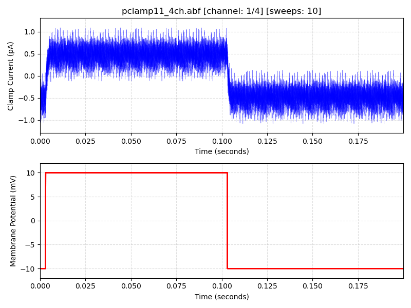</a>

## pclamp11_4ch_abf1.abf
ABF (version 1.8.4.0) with 4 channels (pA, pA, pA, pA), sampled at 80.0 kHz, containing 10 sweeps, having no tags, with a total length of 0.01 minutes, recorded without a protocol file. 
[View the full header](headers/pclamp11_4ch_abf1.md)

## sample trace_0054.abf
ABF (version 1.6.4.9) with 1 channel (nA), sampled at 50.0 kHz, containing 1 sweep, having no tags, with a total length of 0.74 minutes, recorded with protocol "slaven-Ch1-gapfree". 
[View the full header](headers/sample%20trace_0054.md)

## sine sweep magnitude 20.abf
ABF (version 2.0.0.0) with 1 channel (?), sampled at 10.0 kHz, containing 1 sweep, having no tags, with a total length of 0.17 minutes, recorded without a protocol file. 
[View the full header](headers/sine%20sweep%20magnitude%2020.md)

## vc_drug_memtest.abf
ABF (version 2.0.0.0) with 1 channel (pA), sampled at 20.0 kHz, containing 482 sweeps, having 2 tags (+TGOT, -TGOT), with a total length of 16.10 minutes, recorded with protocol "0401 VC 2s MT-70". 
[View the full header](headers/vc_drug_memtest.md)<a href='headers/vc_drug_memtest.png'>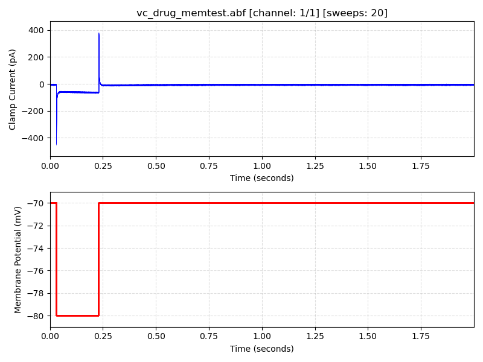</a>

