# Sample ABFs

This is a small collection of various ABFs I practice developing with. Many of them were emailed to me by contributors. If you have a unique type of ABF file, email it to me and I will include it here. Note that this page is generated automatically by [generate-data-index.py](generate-data-index.py).

ABF Information | Header Map | Thumbnails
---|---|---
**05210017_vc_abf1.abf** ABF Version: 1.8.3.0 Channels: 2 (pA, pA) Sweeps: 6 Protocol: _Apply ACh with imaging (VC) 2 (no movies)_ | 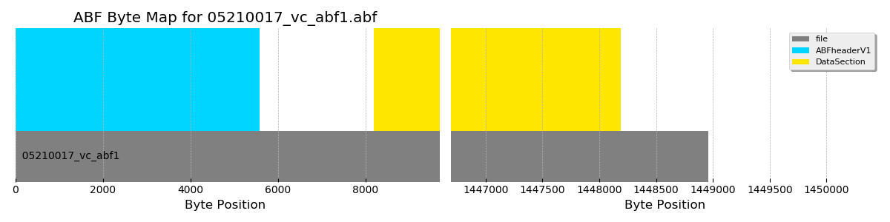 [view entire header](headers/05210017_vc_abf1.md) | 
**130618-1-12.abf** ABF Version: 1.2.9.9 Channels: 1 (pA) Sweeps: 3 Protocol: _{_ | 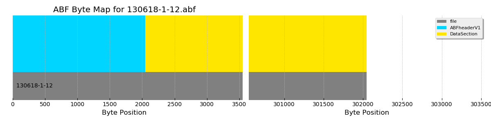 [view entire header](headers/130618-1-12.md) | 
**14o08011_ic_pair.abf** ABF Version: 2.0.0.0 Channels: 2 (mV, mV) Sweeps: 3 Protocol: _pair-loose-60_ | 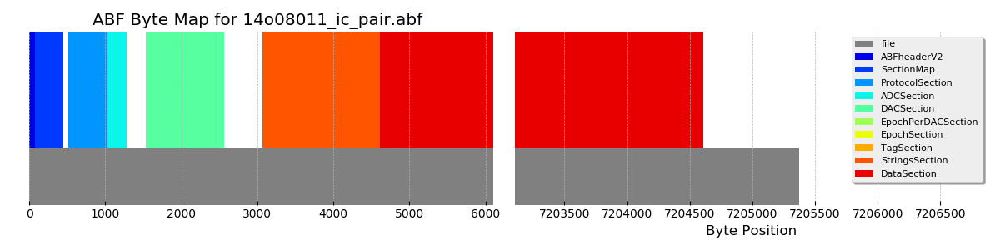 [view entire header](headers/14o08011_ic_pair.md) | 
**14o16001_vc_pair_step.abf** ABF Version: 2.0.0.0 Channels: 2 (pA, pA) Sweeps: 13 Protocol: _pair-MTIV_ |  [view entire header](headers/14o16001_vc_pair_step.md) | 
**16d05007_vc_tags.abf** ABF Version: 2.0.0.0 Channels: 1 (pA) Sweeps: 187 Protocol: _0402 VC 2s MT-50_ | 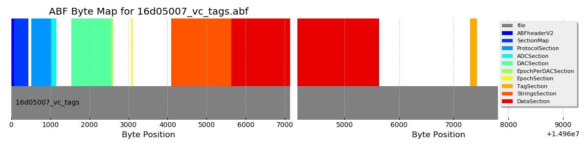 [view entire header](headers/16d05007_vc_tags.md) | 
**16d22006_kim_gapfree.abf** ABF Version: 2.0.0.0 Channels: 2 (dB, mV) Sweeps: 1 Protocol: _mapping_ |  [view entire header](headers/16d22006_kim_gapfree.md) | 
**171116sh_0011.abf** ABF Version: 2.6.0.0 Channels: 1 (pA) Sweeps: 20 Protocol: _0201 memtest_ | 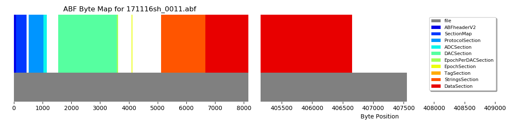 [view entire header](headers/171116sh_0011.md) | 
**171116sh_0012.abf** ABF Version: 2.6.0.0 Channels: 1 (pA) Sweeps: 7 Protocol: _0202 IV dual_ | 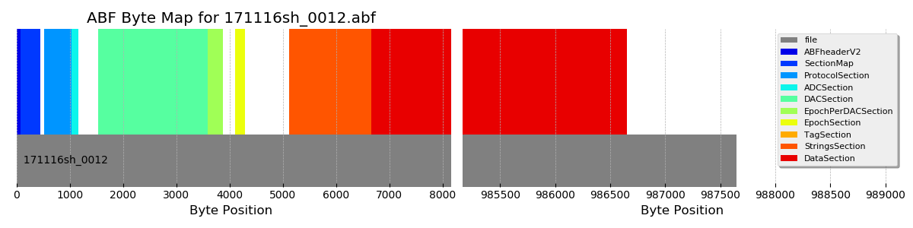 [view entire header](headers/171116sh_0012.md) | 
**171116sh_0013.abf** ABF Version: 2.6.0.0 Channels: 1 (pA) Sweeps: 13 Protocol: _0203 IV fast_ |  [view entire header](headers/171116sh_0013.md) | 
**171116sh_0014.abf** ABF Version: 2.6.0.0 Channels: 1 (pA) Sweeps: 50 Protocol: _0204 Cm ramp_ |  [view entire header](headers/171116sh_0014.md) | 
**171116sh_0015.abf** ABF Version: 2.6.0.0 Channels: 1 (pA) Sweeps: 3 Protocol: _0221 VC sine sweep 70 +- 5 mV_ |  [view entire header](headers/171116sh_0015.md) | 
**171116sh_0016.abf** ABF Version: 2.6.0.0 Channels: 1 (mV) Sweeps: 11 Protocol: _0111 continuous ramp_ | 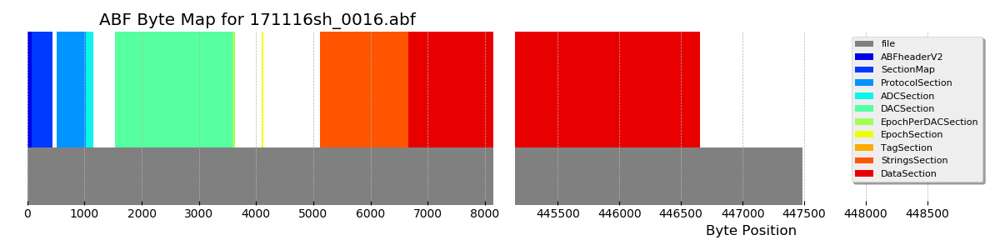 [view entire header](headers/171116sh_0016.md) | 
**171116sh_0017.abf** ABF Version: 2.6.0.0 Channels: 1 (mV) Sweeps: 3 Protocol: _0121 IC sine sweep 0 +- 20 pA_ | 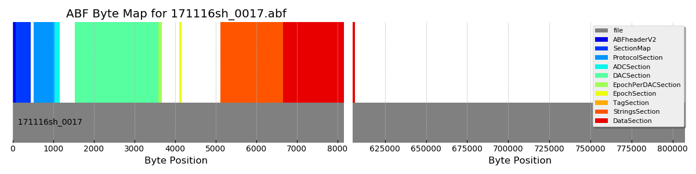 [view entire header](headers/171116sh_0017.md) | 
**171116sh_0018.abf** ABF Version: 2.6.0.0 Channels: 1 (mV) Sweeps: 17 Protocol: _0113 steps dual -100 to 300 step 25_ | 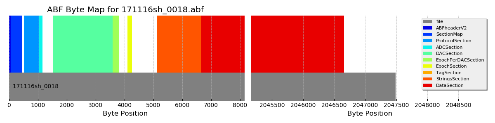 [view entire header](headers/171116sh_0018.md) | 
**171116sh_0019.abf** ABF Version: 2.6.0.0 Channels: 1 (mV) Sweeps: 22 Protocol: _0114 steps dual -100 to 2000 step 100_ | 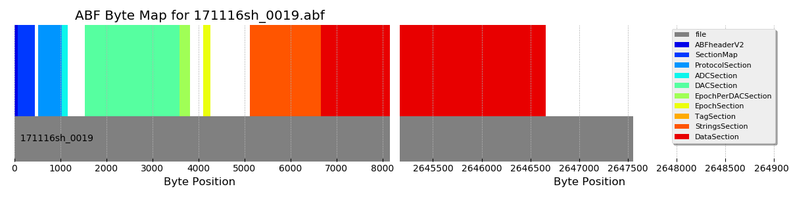 [view entire header](headers/171116sh_0019.md) | 
**171116sh_0020.abf** ABF Version: 2.6.0.0 Channels: 1 (pA) Sweeps: 7 Protocol: _0406 VC 10s MT-50_ | 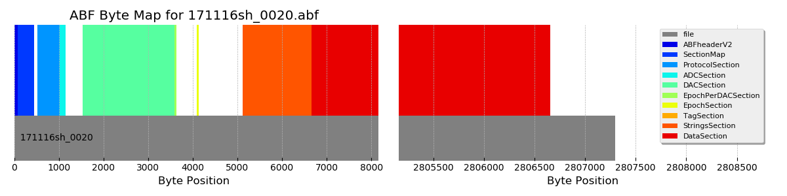 [view entire header](headers/171116sh_0020.md) | 
**171117_HFMixFRET.abf** ABF Version: 2.0.0.0 Channels: 4 (uA, mV, V, V) Sweeps: 13 Protocol: _fret_fv_2s_ | 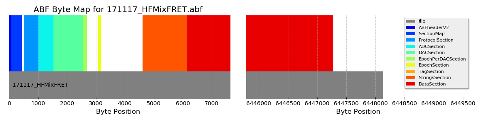 [view entire header](headers/171117_HFMixFRET.md) | 
**17o05024_vc_steps.abf** ABF Version: 2.6.0.0 Channels: 1 (pA) Sweeps: 7 Protocol: _0202 IV dual_ | 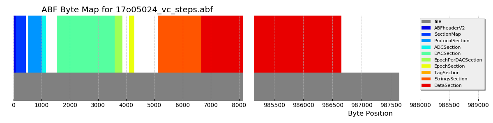 [view entire header](headers/17o05024_vc_steps.md) | 
**17o05026_vc_stim.abf** ABF Version: 2.6.0.0 Channels: 1 (pA) Sweeps: 8 Protocol: _0501 opto -50_ | 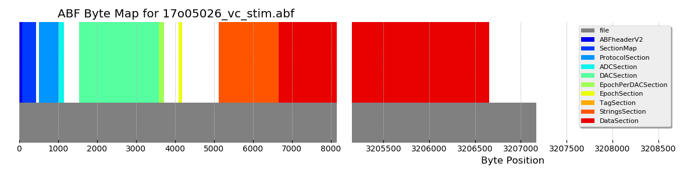 [view entire header](headers/17o05026_vc_stim.md) | 
**17o05027_ic_ramp.abf** ABF Version: 2.6.0.0 Channels: 1 (mV) Sweeps: 2 Protocol: _0111 continuous ramp_ |  [view entire header](headers/17o05027_ic_ramp.md) | 
**17o05028_ic_steps.abf** ABF Version: 2.6.0.0 Channels: 1 (mV) Sweeps: 16 Protocol: _0112 steps dual -50 to 150 step 10_ | 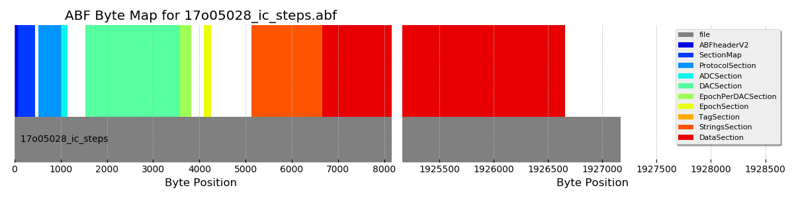 [view entire header](headers/17o05028_ic_steps.md) | 
**180415_aaron_temp.abf** ABF Version: 2.3.0.0 Channels: 2 (V, deg C) Sweeps: 1 Protocol: _PacemakerTempTest_ | 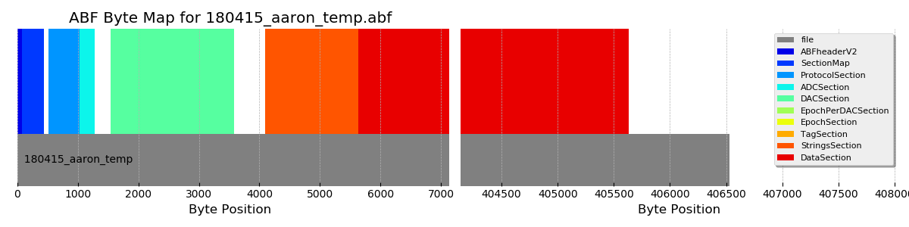 [view entire header](headers/180415_aaron_temp.md) | 
**18702001-biphasicTrain.abf** ABF Version: 2.6.0.0 Channels: 2 (pA, A) Sweeps: 3 Protocol: _0201 memtest_ |  [view entire header](headers/18702001-biphasicTrain.md) | 
**18702001-cosTrain.abf** ABF Version: 2.6.0.0 Channels: 2 (pA, A) Sweeps: 3 Protocol: _0201 memtest_ |  [view entire header](headers/18702001-cosTrain.md) | 
**18702001-pulseTrain.abf** ABF Version: 2.6.0.0 Channels: 2 (pA, A) Sweeps: 3 Protocol: _0201 memtest_ |  [view entire header](headers/18702001-pulseTrain.md) | 
**18702001-ramp.abf** ABF Version: 2.6.0.0 Channels: 2 (pA, A) Sweeps: 3 Protocol: _0201 memtest_ |  [view entire header](headers/18702001-ramp.md) | 
**18702001-step.abf** ABF Version: 2.6.0.0 Channels: 2 (pA, A) Sweeps: 3 Protocol: _0201 memtest_ | 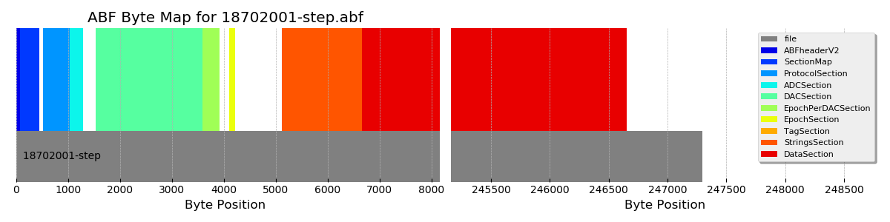 [view entire header](headers/18702001-step.md) | 
**18702001-triangleTrain.abf** ABF Version: 2.6.0.0 Channels: 2 (pA, A) Sweeps: 3 Protocol: _0201 memtest_ |  [view entire header](headers/18702001-triangleTrain.md) | 
**18711001.abf** ABF Version: 2.6.0.0 Channels: 1 (mV) Sweeps: 30 Protocol: _FICurve_Hyperpolarizing_KL_ | 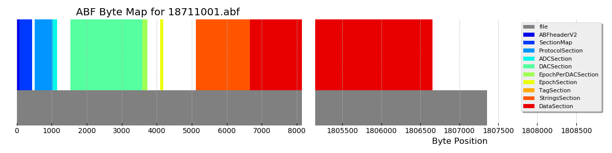 [view entire header](headers/18711001.md) | 
**18713001.abf** ABF Version: 2.6.0.0 Channels: 1 (mV) Sweeps: 30 Protocol: _FICurve_Hyperpolarizing_KL_ | 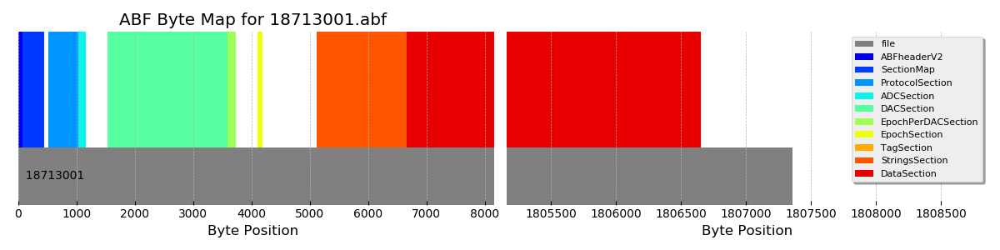 [view entire header](headers/18713001.md) | 
**2018_04_13_0016a_original.abf** ABF Version: 2.0.0.0 Channels: 2 (pA, pA) Sweeps: 52 Protocol: _ONRec_Hv1_ | 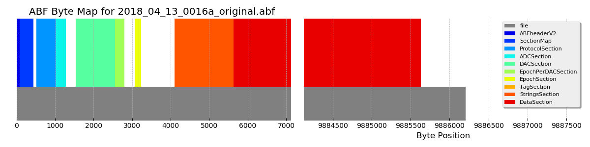 [view entire header](headers/2018_04_13_0016a_original.md) | 
**2018_04_13_0016b_modified.abf** ABF Version: 2.6.0.0 Channels: 2 (pA, pA) Sweeps: 48 Protocol: _ONRec_Hv1_ | 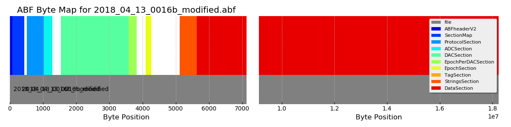 [view entire header](headers/2018_04_13_0016b_modified.md) | 
**model_vc_ramp.abf** ABF Version: 2.6.0.0 Channels: 1 (pA) Sweeps: 50 Protocol: _0204 Cm ramp_ |  [view entire header](headers/model_vc_ramp.md) | 
**model_vc_step.abf** ABF Version: 2.6.0.0 Channels: 1 (pA) Sweeps: 20 Protocol: _0201 memtest_ | 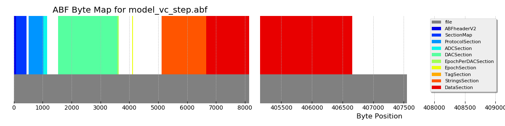 [view entire header](headers/model_vc_step.md) | 
