# Sample ABFs

This is a small collection of various ABFs I practice developing with. Many of them were emailed to me by contributors. If you have a unique type of ABF file, email it to me and I will include it here. Note that this page is [generated automatically](/tests/test_generate_headerImages.py).

ABF Description | Thumbnail
---|---
**05210017_vc_abf1.abf** is an ABF (version 1.8.3.0) with 2 channels (pA, pA), sampled at 20.0 kHz, containing 6 sweeps, having no tags, with a total length of 0.35 minutes, recorded with protocol "Apply ACh with imaging (VC) 2 (no movies)".  [View the full header](headers/05210017_vc_abf1.md) | 
**130618-1-12.abf** is an ABF (version 1.2.9.9) with 1 channel (pA), sampled at 50.0 kHz, containing 3 sweeps, having no tags, with a total length of 0.07 minutes, recorded without a protocol file.  [View the full header](headers/130618-1-12.md) | 
**14o08011_ic_pair.abf** is an ABF (version 2.0.0.0) with 2 channels (mV, mV), sampled at 10.0 kHz, containing 3 sweeps, having no tags, with a total length of 4.00 minutes, recorded with protocol "pair-loose-60".  [View the full header](headers/14o08011_ic_pair.md) | 
**14o16001_vc_pair_step.abf** is an ABF (version 2.0.0.0) with 2 channels (pA, pA), sampled at 10.0 kHz, containing 13 sweeps, having no tags, with a total length of 0.93 minutes, recorded with protocol "pair-MTIV".  [View the full header](headers/14o16001_vc_pair_step.md) | 
**16d05007_vc_tags.abf** is an ABF (version 2.0.0.0) with 1 channel (pA), sampled at 20.0 kHz, containing 187 sweeps, having 2 tags (+TGOT, -TGOT), with a total length of 6.27 minutes, recorded with protocol "0402 VC 2s MT-50".  [View the full header](headers/16d05007_vc_tags.md) | 
**16d22006_kim_gapfree.abf** is an ABF (version 2.0.0.0) with 2 channels (dB, mV), sampled at 10.0 kHz, containing 1 sweep, having no tags, with a total length of 0.80 minutes, recorded with protocol "mapping".  [View the full header](headers/16d22006_kim_gapfree.md) | 
**171116sh_0011.abf** is an ABF (version 2.6.0.0) with 1 channel (pA), sampled at 20.0 kHz, containing 20 sweeps, having no tags, with a total length of 0.17 minutes, recorded with protocol "0201 memtest".  [View the full header](headers/171116sh_0011.md) | 
**171116sh_0012.abf** is an ABF (version 2.6.0.0) with 1 channel (pA), sampled at 20.0 kHz, containing 7 sweeps, having no tags, with a total length of 0.47 minutes, recorded with protocol "0202 IV dual".  [View the full header](headers/171116sh_0012.md) | 
**171116sh_0013.abf** is an ABF (version 2.6.0.0) with 1 channel (pA), sampled at 20.0 kHz, containing 13 sweeps, having no tags, with a total length of 0.23 minutes, recorded with protocol "0203 IV fast".  [View the full header](headers/171116sh_0013.md) | 
**171116sh_0014.abf** is an ABF (version 2.6.0.0) with 1 channel (pA), sampled at 20.0 kHz, containing 50 sweeps, having no tags, with a total length of 0.10 minutes, recorded with protocol "0204 Cm ramp".  [View the full header](headers/171116sh_0014.md) | 
**171116sh_0015-ATFwaveform.abf** is an ABF (version 2.6.0.0) with 1 channel (pA), sampled at 10.0 kHz, containing 3 sweeps, having no tags, with a total length of 0.67 minutes, recorded with protocol "0221 VC sine sweep 70 +- 5 mV".  [View the full header](headers/171116sh_0015-ATFwaveform.md) | 
**171116sh_0015.abf** is an ABF (version 2.6.0.0) with 1 channel (pA), sampled at 10.0 kHz, containing 3 sweeps, having no tags, with a total length of 0.67 minutes, recorded with protocol "0221 VC sine sweep 70 +- 5 mV".  [View the full header](headers/171116sh_0015.md) | 
**171116sh_0016.abf** is an ABF (version 2.6.0.0) with 1 channel (mV), sampled at 20.0 kHz, containing 11 sweeps, having no tags, with a total length of 0.20 minutes, recorded with protocol "0111 continuous ramp".  [View the full header](headers/171116sh_0016.md) | 
**171116sh_0017.abf** is an ABF (version 2.6.0.0) with 1 channel (mV), sampled at 10.0 kHz, containing 3 sweeps, having no tags, with a total length of 0.67 minutes, recorded with protocol "0121 IC sine sweep 0 +- 20 pA".  [View the full header](headers/171116sh_0017.md) | 
**171116sh_0018.abf** is an ABF (version 2.6.0.0) with 1 channel (mV), sampled at 20.0 kHz, containing 17 sweeps, having no tags, with a total length of 0.90 minutes, recorded with protocol "0113 steps dual -100 to 300 step 25".  [View the full header](headers/171116sh_0018.md) | 
**171116sh_0019.abf** is an ABF (version 2.6.0.0) with 1 channel (mV), sampled at 20.0 kHz, containing 22 sweeps, having no tags, with a total length of 1.15 minutes, recorded with protocol "0114 steps dual -100 to 2000 step 100".  [View the full header](headers/171116sh_0019.md) | 
**171116sh_0020.abf** is an ABF (version 2.6.0.0) with 1 channel (pA), sampled at 20.0 kHz, containing 7 sweeps, having no tags, with a total length of 1.33 minutes, recorded with protocol "0406 VC 10s MT-50".  [View the full header](headers/171116sh_0020.md) | 
**171116sh_0020_saved.abf** is an ABF (version 1.2.9.9) with 1 channel (pA), sampled at 20.0 kHz, containing 7 sweeps, having no tags, with a total length of 1.33 minutes, recorded without a protocol file.  [View the full header](headers/171116sh_0020_saved.md) | 
**171117_HFMixFRET.abf** is an ABF (version 2.0.0.0) with 4 channels (uA, mV, V, V), sampled at 10.0 kHz, containing 13 sweeps, having no tags, with a total length of 14.40 minutes, recorded with protocol "fret_fv_2s".  [View the full header](headers/171117_HFMixFRET.md) | 
**17o05024_vc_steps.abf** is an ABF (version 2.6.0.0) with 1 channel (pA), sampled at 20.0 kHz, containing 7 sweeps, having no tags, with a total length of 0.47 minutes, recorded with protocol "0202 IV dual".  [View the full header](headers/17o05024_vc_steps.md) | 
**17o05026_vc_stim.abf** is an ABF (version 2.6.0.0) with 1 channel (pA), sampled at 20.0 kHz, containing 8 sweeps, having no tags, with a total length of 1.50 minutes, recorded with protocol "0501 opto -50".  [View the full header](headers/17o05026_vc_stim.md) | 
**17o05027_ic_ramp.abf** is an ABF (version 2.6.0.0) with 1 channel (mV), sampled at 20.0 kHz, containing 2 sweeps, having no tags, with a total length of 0.05 minutes, recorded with protocol "0111 continuous ramp".  [View the full header](headers/17o05027_ic_ramp.md) | 
**17o05028_ic_steps.abf** is an ABF (version 2.6.0.0) with 1 channel (mV), sampled at 20.0 kHz, containing 16 sweeps, having no tags, with a total length of 0.85 minutes, recorded with protocol "0112 steps dual -50 to 150 step 10".  [View the full header](headers/17o05028_ic_steps.md) | 
**180415_aaron_temp.abf** is an ABF (version 2.3.0.0) with 2 channels (V, deg C), sampled at 100.0 kHz, containing 1 sweep, having no tags, with a total length of 0.02 minutes, recorded with protocol "PacemakerTempTest".  [View the full header](headers/180415_aaron_temp.md) | 
**18425108.abf** is an ABF (version 2.9.0.0) with 2 channels (nA, mV), sampled at 25.0 kHz, containing 1 sweep, having no tags, with a total length of 4.00 minutes, recorded with protocol "11 - 15 pulse AHP w_laser".  [View the full header](headers/18425108.md) | 
**18425108_abf1.abf** is an ABF (version 1.8.4.0) with 2 channels (nA, mV), sampled at 25.0 kHz, containing 1 sweep, having no tags, with a total length of 0.17 minutes, recorded with protocol "11 - 15 pulse AHP w_laser".  [View the full header](headers/18425108_abf1.md) | 
**18702001-biphasicTrain.abf** is an ABF (version 2.6.0.0) with 2 channels (pA, A), sampled at 20.0 kHz, containing 3 sweeps, having no tags, with a total length of 0.07 minutes, recorded with protocol "0201 memtest".  [View the full header](headers/18702001-biphasicTrain.md) | 
**18702001-cosTrain.abf** is an ABF (version 2.6.0.0) with 2 channels (pA, A), sampled at 20.0 kHz, containing 3 sweeps, having no tags, with a total length of 0.07 minutes, recorded with protocol "0201 memtest".  [View the full header](headers/18702001-cosTrain.md) | 
**18702001-pulseTrain.abf** is an ABF (version 2.6.0.0) with 2 channels (pA, A), sampled at 20.0 kHz, containing 3 sweeps, having no tags, with a total length of 0.07 minutes, recorded with protocol "0201 memtest".  [View the full header](headers/18702001-pulseTrain.md) | 
**18702001-ramp.abf** is an ABF (version 2.6.0.0) with 2 channels (pA, A), sampled at 20.0 kHz, containing 3 sweeps, having no tags, with a total length of 0.07 minutes, recorded with protocol "0201 memtest".  [View the full header](headers/18702001-ramp.md) | 
**18702001-step.abf** is an ABF (version 2.6.0.0) with 2 channels (pA, A), sampled at 20.0 kHz, containing 3 sweeps, having no tags, with a total length of 0.07 minutes, recorded with protocol "0201 memtest".  [View the full header](headers/18702001-step.md) | 
**18702001-triangleTrain.abf** is an ABF (version 2.6.0.0) with 2 channels (pA, A), sampled at 20.0 kHz, containing 3 sweeps, having no tags, with a total length of 0.07 minutes, recorded with protocol "0201 memtest".  [View the full header](headers/18702001-triangleTrain.md) | 
**18711001.abf** is an ABF (version 2.6.0.0) with 1 channel (mV), sampled at 20.0 kHz, containing 30 sweeps, having no tags, with a total length of 10.03 minutes, recorded with protocol "FICurve_Hyperpolarizing_KL".  [View the full header](headers/18711001.md) | 
**18713001.abf** is an ABF (version 2.6.0.0) with 1 channel (mV), sampled at 20.0 kHz, containing 30 sweeps, having no tags, with a total length of 10.03 minutes, recorded with protocol "FICurve_Hyperpolarizing_KL".  [View the full header](headers/18713001.md) | 
**18807005.abf** is an ABF (version 2.6.0.0) with 1 channel (pA), sampled at 20.0 kHz, containing 2 sweeps, having no tags, with a total length of 0.05 minutes, recorded with protocol "0111 continuous ramp".  [View the full header](headers/18807005.md) | 
**18808025.abf** is an ABF (version 2.6.0.0) with 1 channel (pA), sampled at 20.0 kHz, containing 40 sweeps, having no tags, with a total length of 0.41 minutes, recorded with protocol "0201 memtest".  [View the full header](headers/18808025.md) | 
**190619B_0003.abf** is an ABF (version 1.8.3.0) with 2 channels (mV, mV), sampled at 10.0 kHz, containing 10 sweeps, having no tags, with a total length of 0.56 minutes, recorded with protocol "IV_FI_IN0_saray".  [View the full header](headers/190619B_0003.md) | [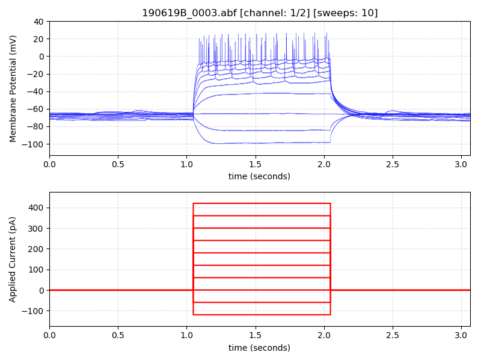](headers/190619B_0003.png)
**19122043.abf** is an ABF (version 1.8.3.0) with 4 channels (A, mV, mV, pA), sampled at 10.0 kHz, containing 16 sweeps, having 1 tag (C9, L3,  RMP -66.8 mv), with a total length of 1.46 minutes, recorded with protocol "I-V curve ,-400 pA".  [View the full header](headers/19122043.md) | [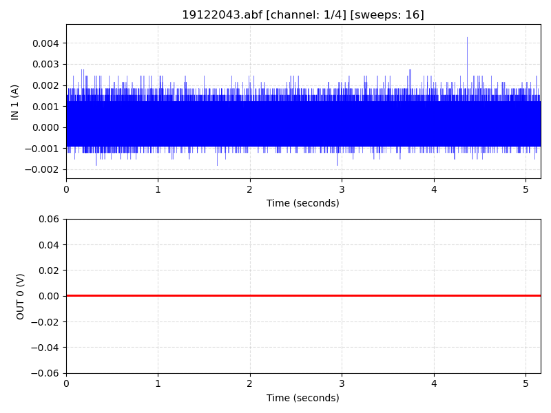](headers/19122043.png)
**19212027.abf** is an ABF (version 2.0.0.0) with 2 channels (pA, mV), sampled at 100.0 kHz, containing 12 sweeps, having no tags, with a total length of 0.26 minutes, recorded with protocol "IH_act_hp-70".  [View the full header](headers/19212027.md) | [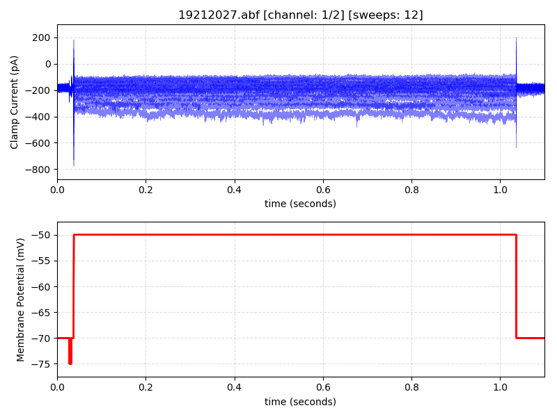](headers/19212027.png)
**2015_09_10_0001.abf** is an ABF (version 2.0.0.0) with 3 channels (pA, mV, um), sampled at 20.0 kHz, containing 13 sweeps, having no tags, with a total length of 2.17 minutes, recorded with protocol "piezo 1um-ms delta1".  [View the full header](headers/2015_09_10_0001.md) | [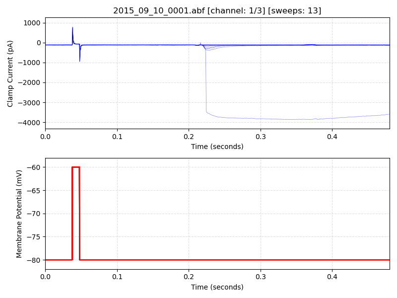](headers/2015_09_10_0001.png)
**2018_04_13_0016a_original.abf** is an ABF (version 2.0.0.0) with 2 channels (pA, pA), sampled at 250.0 kHz, containing 52 sweeps, having no tags, with a total length of 0.17 minutes, recorded with protocol "ONRec_Hv1".  [View the full header](headers/2018_04_13_0016a_original.md) | 
**2018_04_13_0016b_modified.abf** is an ABF (version 2.6.0.0) with 2 channels (pA, pA), sampled at 250.0 kHz, containing 48 sweeps, having no tags, with a total length of 0.16 minutes, recorded with protocol "ONRec_Hv1".  [View the full header](headers/2018_04_13_0016b_modified.md) | 
**2018_05_08_0028-IC-VC-pair.abf** is an ABF (version 2.6.0.0) with 2 channels (mV, pA), sampled at 20.0 kHz, containing 20 sweeps, having no tags, with a total length of 1.75 minutes, recorded with protocol "p0601 IC1 VC2".  [View the full header](headers/2018_05_08_0028-IC-VC-pair.md) | 
**2018_08_23_0009.abf** is an ABF (version 2.6.0.0) with 1 channel (pA), sampled at 20.0 kHz, containing 40 sweeps, having no tags, with a total length of 0.41 minutes, recorded with protocol "0201 memtest".  [View the full header](headers/2018_08_23_0009.md) | 
**2018_11_16_sh_0006.abf** is an ABF (version 2.6.0.0) with 1 channel (pA), sampled at 20.0 kHz, containing 60 sweeps, having 1 tag (+drug at 3min), with a total length of 5.00 minutes, recorded with protocol "0201 memtest".  [View the full header](headers/2018_11_16_sh_0006.md) | 
**2018_12_09_pCLAMP11_0001.abf** is an ABF (version 2.9.0.0) with 1 channel (A), sampled at 10.0 kHz, containing 10 sweeps, having no tags, with a total length of 0.04 minutes, recorded without a protocol file.  [View the full header](headers/2018_12_09_pCLAMP11_0001.md) | 
**2018_12_15_0000.abf** is an ABF (version 2.9.0.0) with 4 channels (pA, pA, pA, pA), sampled at 10.0 kHz, containing 10 sweeps, having no tags, with a total length of 0.04 minutes, recorded without a protocol file.  [View the full header](headers/2018_12_15_0000.md) | 
**2019_05_02_DIC2_0011.abf** is an ABF (version 2.6.0.0) with 2 channels (mV, pA), sampled at 20.0 kHz, containing 3 sweeps, having no tags, with a total length of 0.67 minutes, recorded with protocol "4s-HALO Current Clamp Pulse".  [View the full header](headers/2019_05_02_DIC2_0011.md) | [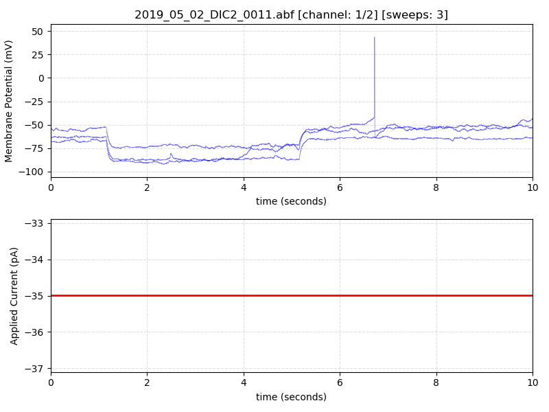](headers/2019_05_02_DIC2_0011.png)
**2019_07_24_0055_fsi.abf** is an ABF (version 2.6.0.0) with 1 channel (mV), sampled at 20.0 kHz, containing 17 sweeps, having no tags, with a total length of 0.90 minutes, recorded with protocol "0113 AP gain [-100 to 300]".  [View the full header](headers/2019_07_24_0055_fsi.md) | [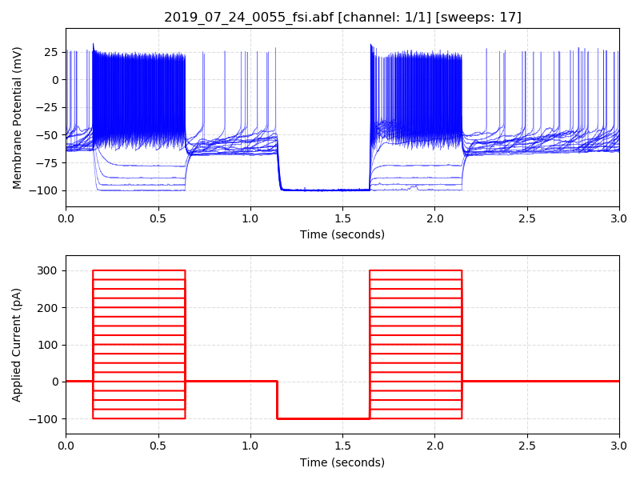](headers/2019_07_24_0055_fsi.png)
**2020_03_02_0000.abf** is an ABF (version 2.9.0.0) with 2 channels (mV, pA), sampled at 10.0 kHz, containing 16 sweeps, having no tags, with a total length of 0.57 minutes, recorded with protocol "Trigem_Current_Clamp_Current injection_Neg".  [View the full header](headers/2020_03_02_0000.md) | [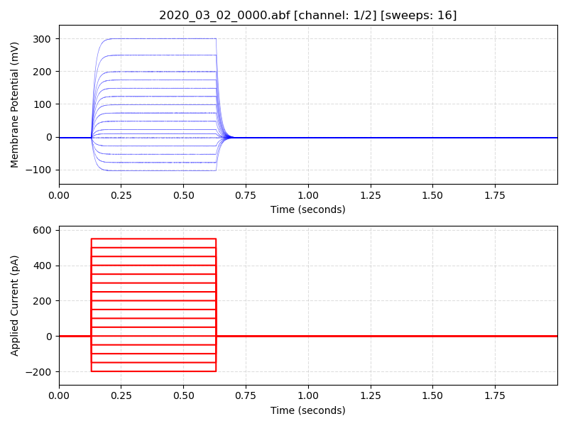](headers/2020_03_02_0000.png)
**2020_06_16_0000.abf** is an ABF (version 2.3.0.0) with 1 channel (pA), sampled at 10.0 kHz, containing 3 sweeps, having no tags, with a total length of 0.20 minutes, recorded with protocol "10kHzAquisitionTriggered".  [View the full header](headers/2020_06_16_0000.md) | [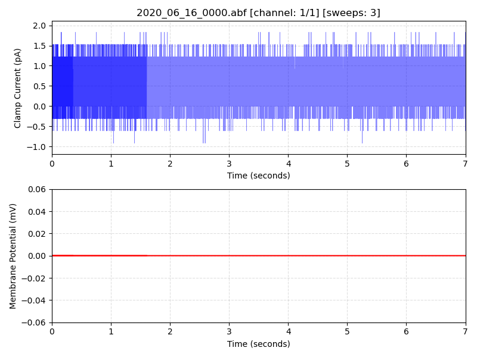](headers/2020_06_16_0000.png)
**2020_06_16_0001.abf** is an ABF (version 2.3.0.0) with 1 channel (pA), sampled at 10.0 kHz, containing 2 sweeps, having no tags, with a total length of 0.08 minutes, recorded with protocol "10kHzAquisitionTriggered".  [View the full header](headers/2020_06_16_0001.md) | [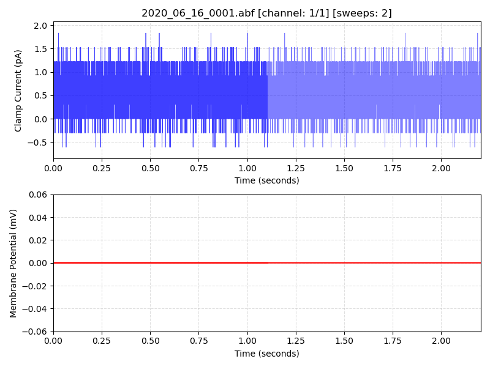](headers/2020_06_16_0001.png)
**2020_07_29_0062.abf** is an ABF (version 2.9.0.0) with 2 channels (mV, pA), sampled at 10.0 kHz, containing 1 sweep, having 1 tag (Digital Outputs => 00000001), with a total length of 0.31 minutes, recorded with protocol "Current_Clamp_gap free".  [View the full header](headers/2020_07_29_0062.md) | [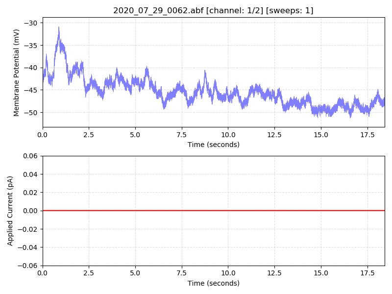](headers/2020_07_29_0062.png)
**DM1_0000.abf** is an ABF (version 2.9.0.0) with 2 channels (pA, mmHg), sampled at 20.0 kHz, containing 7 sweeps, having no tags, with a total length of 0.14 minutes, recorded with protocol "10mmHg_pressure_holding-80mV".  [View the full header](headers/DM1_0000.md) | [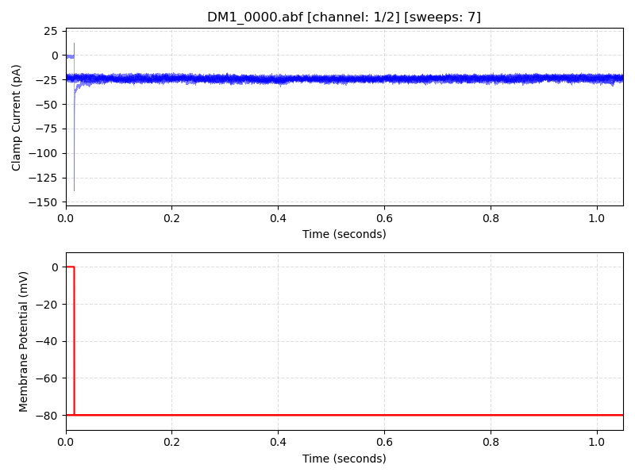](headers/DM1_0000.png)
**DM1_0001.abf** is an ABF (version 2.9.0.0) with 2 channels (pA, mmHg), sampled at 20.0 kHz, containing 7 sweeps, having no tags, with a total length of 0.14 minutes, recorded with protocol "10mmHg_pressure_holding-80mV".  [View the full header](headers/DM1_0001.md) | [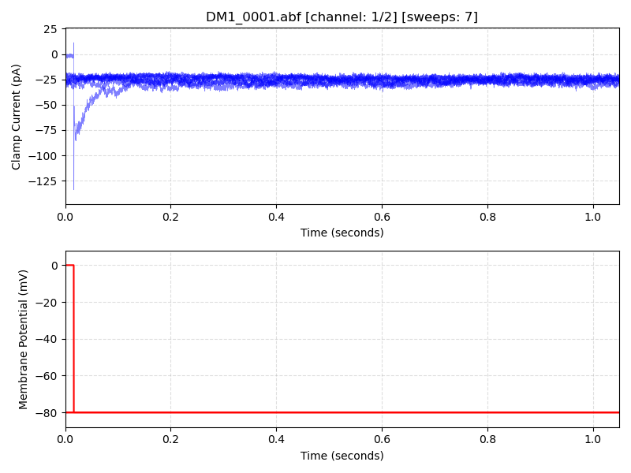](headers/DM1_0001.png)
**DM1_0002.abf** is an ABF (version 2.9.0.0) with 2 channels (pA, mmHg), sampled at 20.0 kHz, containing 7 sweeps, having no tags, with a total length of 0.40 minutes, recorded with protocol "10mmHg_pressure_voltageramp".  [View the full header](headers/DM1_0002.md) | [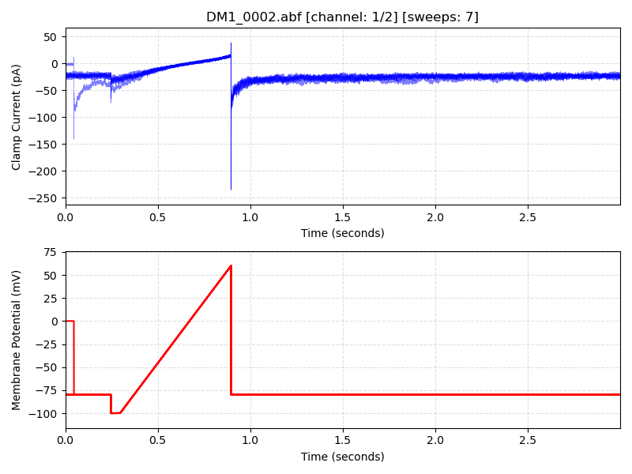](headers/DM1_0002.png)
**DM1_0003.abf** is an ABF (version 2.9.0.0) with 2 channels (pA, mmHg), sampled at 20.0 kHz, containing 7 sweeps, having no tags, with a total length of 0.40 minutes, recorded with protocol "10mmHg_pressure_voltageramp".  [View the full header](headers/DM1_0003.md) | [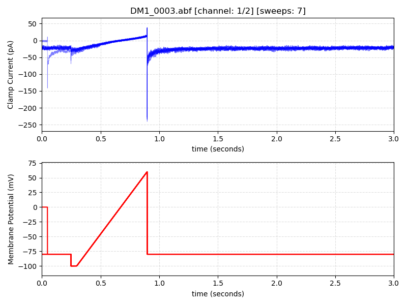](headers/DM1_0003.png)
**File_axon_1.abf** is an ABF (version 2.0.0.0) with 1 channel (pA), sampled at 10.0 kHz, containing 1 sweep, having no tags, with a total length of 3.19 minutes, recorded with protocol "VC_cour01G20".  [View the full header](headers/File_axon_1.md) | 
**File_axon_2.abf** is an ABF (version 1.8.3.0) with 1 channel (mV), sampled at 1.0 kHz, containing 1 sweep, having 4 tags (Clampex start acquisition, C:\Axon\rsultats\06-05\11-06-05\05611005.abf, Clampex end (1), Clampex start acquisition), with a total length of 20.00 minutes, recorded with protocol "Cc_minidigi".  [View the full header](headers/File_axon_2.md) | 
**File_axon_3.abf** is an ABF (version 1.8.3.0) with 2 channels (V, mV), sampled at 20.0 kHz, containing 5 sweeps, having no tags, with a total length of 0.10 minutes, recorded with protocol "Cc_stim ONL".  [View the full header](headers/File_axon_3.md) | 
**File_axon_4.abf** is an ABF (version 2.0.0.0) with 1 channel (pA), sampled at 10.0 kHz, containing 1 sweep, having 1 tag (drogue on), with a total length of 3.63 minutes, recorded with protocol "VC_cour01G20".  [View the full header](headers/File_axon_4.md) | 
**File_axon_5.abf** is an ABF (version 2.0.0.0) with 1 channel (mV), sampled at 20.0 kHz, containing 9 sweeps, having no tags, with a total length of 0.77 minutes, recorded with protocol "step cclamp".  [View the full header](headers/File_axon_5.md) | 
**File_axon_6.abf** is an ABF (version 2.0.0.0) with 2 channels (mV, nA), sampled at 20.0 kHz, containing 32 sweeps, having no tags, with a total length of 10.68 minutes, recorded with protocol "step cclamp 2nA for 2ms".  [View the full header](headers/File_axon_6.md) | 
**File_axon_7.abf** is an ABF (version 2.6.0.0) with 1 channel (pA), sampled at 0.403 kHz, containing 12 sweeps, having no tags, with a total length of 2.07 minutes, recorded with protocol "Apl NMDA 2 s -80mV cada 2ms esp 10 2480us".  [View the full header](headers/File_axon_7.md) | 
**H19_29_150_11_21_01_0011.abf** is an ABF (version 2.6.0.0) with 2 channels (mV, pA), sampled at 50.0 kHz, containing 2 sweeps, having no tags, with a total length of 0.65 minutes, recorded with protocol "C1NSD1SHORT".  [View the full header](headers/H19_29_150_11_21_01_0011.md) | [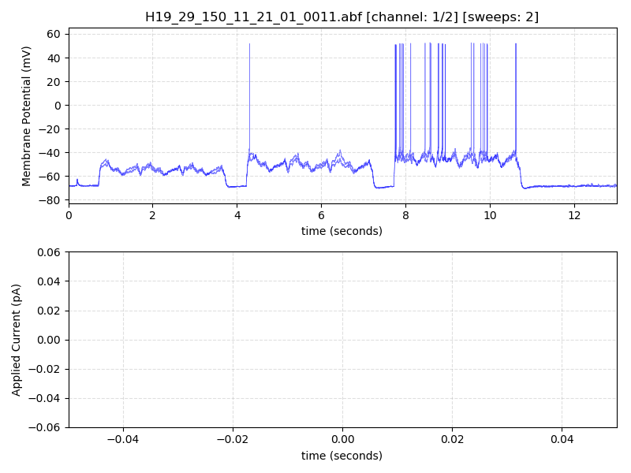](headers/H19_29_150_11_21_01_0011.png)
**abf1_with_tags.abf** is an ABF (version 1.8.3.0) with 1 channel (pA), sampled at 20.0 kHz, containing 1 sweep, having 1 tag (APV+CGP+DNQX+ON@6), with a total length of 15.00 minutes, recorded with protocol "15minGapfree".  [View the full header](headers/abf1_with_tags.md) | 
**ch121219_1_0001.abf** is an ABF (version 2.6.0.0) with 2 channels (mV, pA), sampled at 50.0 kHz, containing 1 sweep, having 16 tags (<External>, <External>, <External>, <External>, <External>, <External>, <External>, <External>, <External>, <External>, <External>, <External>, <External>, <External>, <External>, <External>), with a total length of 2.75 minutes, recorded with protocol "gapfree1".  [View the full header](headers/ch121219_1_0001.md) | [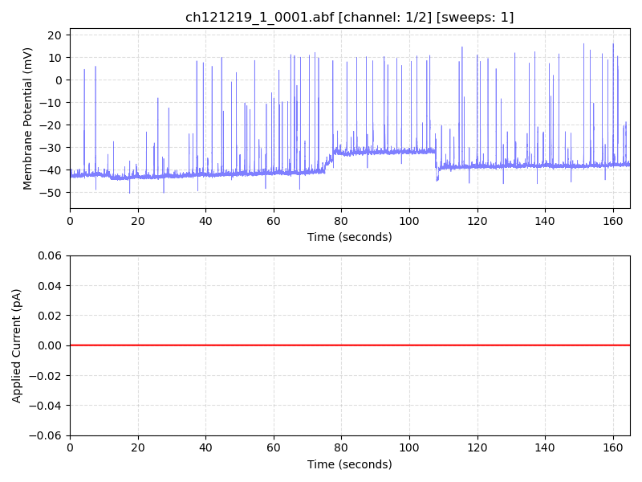](headers/ch121219_1_0001.png)
**f1.abf** is an ABF (version 1.8.3.0) with 4 channels (pA, pA, mV, mV), sampled at 20.0 kHz, containing 10 sweeps, having no tags, with a total length of 0.46 minutes, recorded with protocol "JAF 1 electrode  ST-EPSC".  [View the full header](headers/f1.md) | 
**f1_saved.abf** is an ABF (version 1.2.9.9) with 1 channel (pA), sampled at 20.0 kHz, containing 10 sweeps, having no tags, with a total length of 0.46 minutes, recorded without a protocol file.  [View the full header](headers/f1_saved.md) | 
**invalidDate-abf1.abf** is an ABF (version 1.2.9.9) with 1 channel (pA), sampled at 20.0 kHz, containing 50 sweeps, having no tags, with a total length of 0.10 minutes, recorded without a protocol file.  [View the full header](headers/invalidDate-abf1.md) | [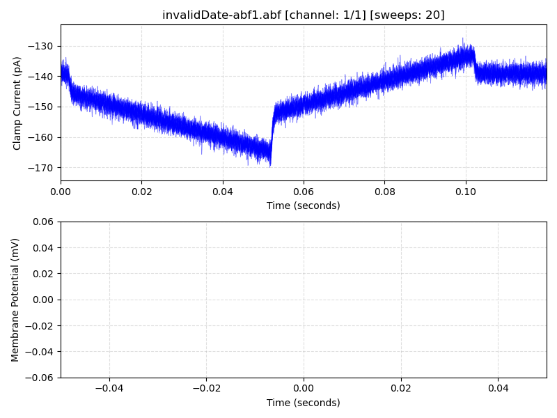](headers/invalidDate-abf1.png)
**invalidDate-abf2.abf** is an ABF (version 2.6.0.0) with 1 channel (pA), sampled at 20.0 kHz, containing 50 sweeps, having no tags, with a total length of 0.10 minutes, recorded with protocol "0204 Cm ramp".  [View the full header](headers/invalidDate-abf2.md) | [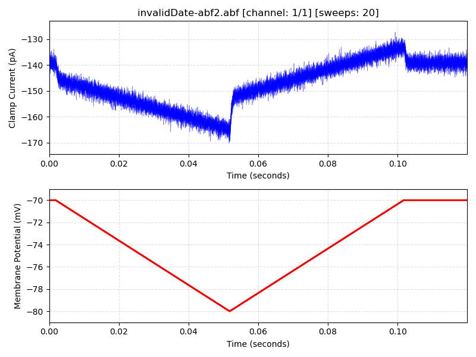](headers/invalidDate-abf2.png)
**model_vc_ramp.abf** is an ABF (version 2.6.0.0) with 1 channel (pA), sampled at 20.0 kHz, containing 50 sweeps, having no tags, with a total length of 0.10 minutes, recorded with protocol "0204 Cm ramp".  [View the full header](headers/model_vc_ramp.md) | 
**model_vc_step.abf** is an ABF (version 2.6.0.0) with 1 channel (pA), sampled at 20.0 kHz, containing 20 sweeps, having no tags, with a total length of 0.17 minutes, recorded with protocol "0201 memtest".  [View the full header](headers/model_vc_step.md) | 
**multichannelAbf1WithTags.abf** is an ABF (version 1.8.4.0) with 2 channels (pA, mV), sampled at 20.0 kHz, containing 187 sweeps, having 2 tags (+TGOT, -TGOT), with a total length of 0.26 minutes, recorded with protocol "0402 VC 2s MT-50".  [View the full header](headers/multichannelAbf1WithTags.md) | [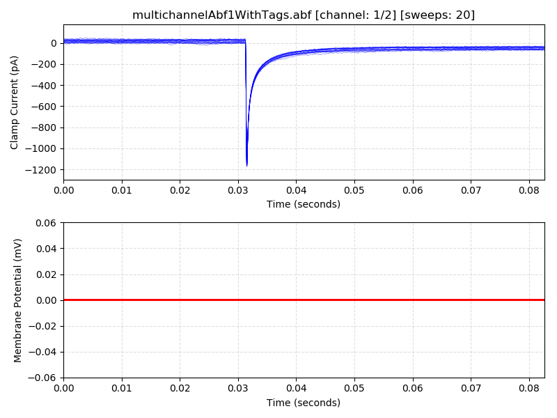](headers/multichannelAbf1WithTags.png)
**opto_aps_bad_units.abf** is an ABF (version 2.6.0.0) with 1 channel (pA), sampled at 20.0 kHz, containing 3 sweeps, having no tags, with a total length of 1.33 minutes, recorded with protocol "0504 opto [0] 10 Hz 2 ms (5s in 20s sweep)".  [View the full header](headers/opto_aps_bad_units.md) | [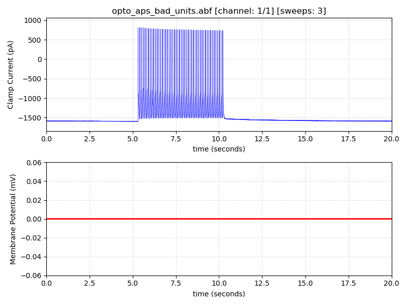](headers/opto_aps_bad_units.png)
**opto_aps_good_units.abf** is an ABF (version 2.6.0.0) with 1 channel (mV), sampled at 20.0 kHz, containing 3 sweeps, having no tags, with a total length of 1.33 minutes, recorded with protocol "0504 opto [0] 10 Hz 2 ms (5s in 20s sweep)".  [View the full header](headers/opto_aps_good_units.md) | 
**pclamp11_4ch.abf** is an ABF (version 2.9.0.0) with 4 channels (pA, pA, pA, pA), sampled at 20.0 kHz, containing 10 sweeps, having no tags, with a total length of 0.04 minutes, recorded without a protocol file.  [View the full header](headers/pclamp11_4ch.md) | 
**pclamp11_4ch_abf1.abf** is an ABF (version 1.8.4.0) with 4 channels (pA, pA, pA, pA), sampled at 20.0 kHz, containing 10 sweeps, having no tags, with a total length of 0.04 minutes, recorded without a protocol file.  [View the full header](headers/pclamp11_4ch_abf1.md) | 
**sample trace_0054.abf** is an ABF (version 1.6.4.9) with 1 channel (nA), sampled at 50.0 kHz, containing 1 sweep, having no tags, with a total length of 0.74 minutes, recorded with protocol "slaven-Ch1-gapfree".  [View the full header](headers/sample%20trace_0054.md) | 
**sine sweep magnitude 20.abf** is an ABF (version 2.0.0.0) with 1 channel (?), sampled at 10.0 kHz, containing 1 sweep, having no tags, with a total length of 0.17 minutes, recorded without a protocol file.  [View the full header](headers/sine%20sweep%20magnitude%2020.md) | 
**user-list-durations.abf** is an ABF (version 2.0.0.0) with 2 channels (pA, mV), sampled at 2.0 kHz, containing 3 sweeps, having no tags, with a total length of 2.18 minutes, recorded with protocol "WT_act with ramp_reversed_env".  [View the full header](headers/user-list-durations.md) | [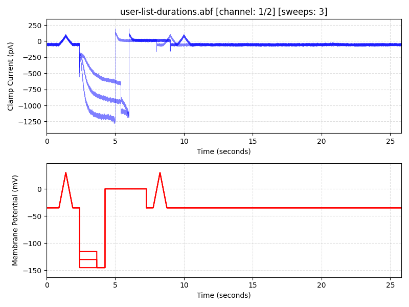](headers/user-list-durations.png)
**vc_drug_memtest.abf** is an ABF (version 2.0.0.0) with 1 channel (pA), sampled at 20.0 kHz, containing 482 sweeps, having 2 tags (+TGOT, -TGOT), with a total length of 16.10 minutes, recorded with protocol "0401 VC 2s MT-70".  [View the full header](headers/vc_drug_memtest.md) | 
