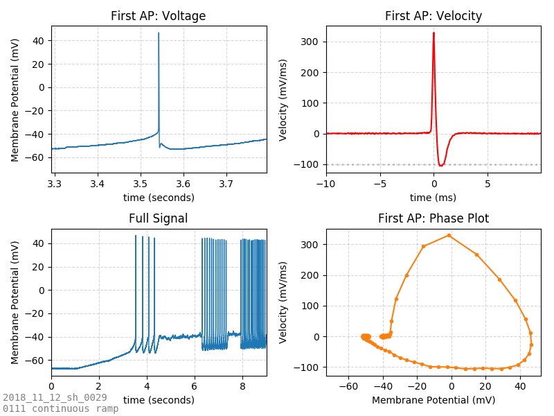
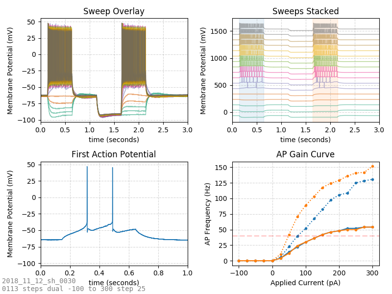
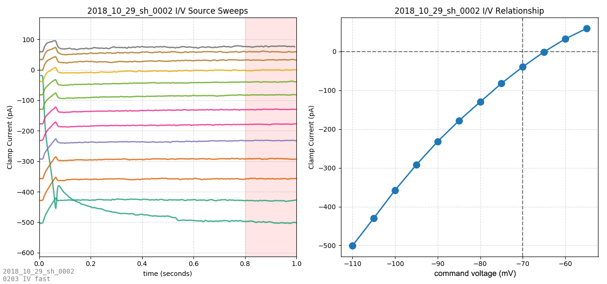
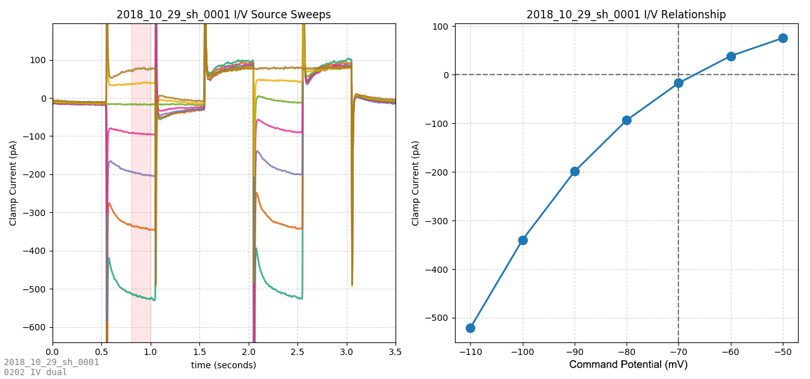
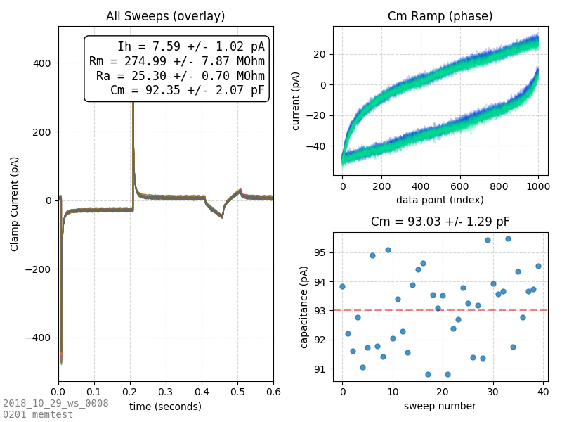
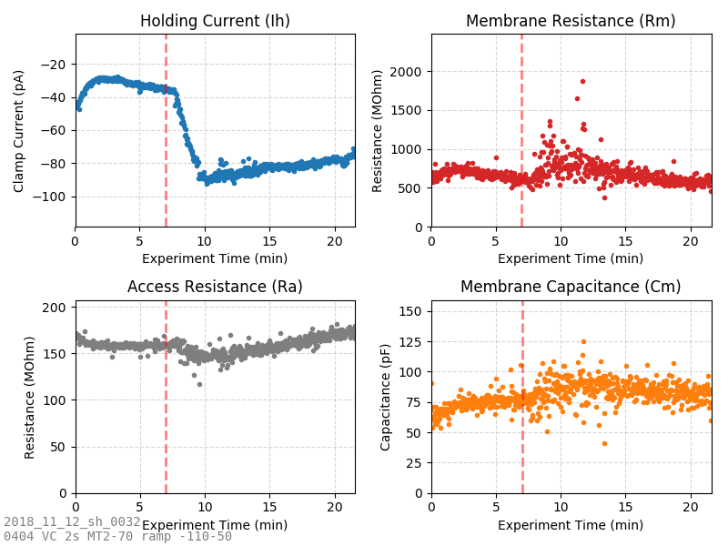
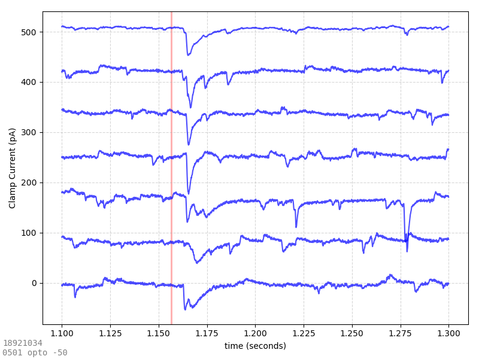
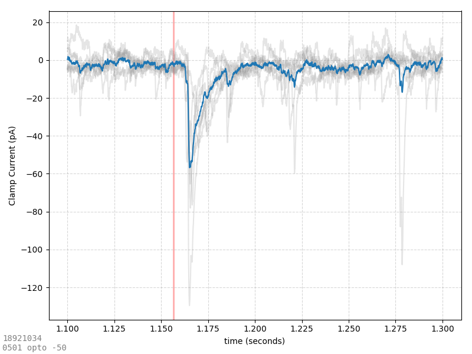

# ABF Auto-Analysis

Experimental code in this folder uses pyABF to serving as the analytical core of an ABF analysis pipeline where ABF files are generated by rigs, saved to a network drive, auto-detected by [autoabf.py](autoabf.py), auto-analyzed according to [analysisByProtocool.py](), graphs are made and saved alongside the ABF files, and a web front-end ([SWHLabPHP](https://github.com/swharden/SWHLabPHP)) displays images acquired at rig time (DIC and fluorescent) alongside ABF file information and graphs generated in real time as data is saved.

ClampFit supports the use of protocol files. Using the Protocol Editor you can design an electrophysiology stimulation waveform, and save these settings as a .pro file. **Once a pCLAMP protocol file is made, every ABF file recording using that protocol can be analyzed identically.** It is this phenomenon that underlies the fully automatic analysis of ABF files. Code here attempts to automate this process to a level which requires no human input. As ABF files are recorded they can be analyzed automatically to produce graphs which are saved as images within seconds of the ABF being saved.

This code is highly experimental and is not yet intended to be used by anyone other than the developer. It is stored here to serve as an example of how pyABF may be used to perform analytical tasks.

## Example Output

### Action Potential Analysis
Automatic analysis of action potential shape and calculation of properties (threshold voltage, rheobase current, half-width, repolarization velocity, etc.) from voltage-clamp ramps. The first AP in response to a ramp is analyzed:

### Action Potential Gain
Action potential detection allows for frequency assessments. Comparison of frequency vs. applied current allows generation of an AP gain plot. Instantaneous frequency of the first pair of APs (dotted lines) vs. steady state frequency (solid lines) allows assessment of accommodation graphically as a function of current injection. Response with and without a hyperpolarizing pulse is shown.

### Current/Voltage Relationship
Current/voltage relationships can be automatically detected by comparison of current (measured from the ADC in voltage clamp) to the command voltage.

This can be done from traces containing current steps (above, useful for visualizing voltage-dependent current transients) or from slow ramps (below, ideal for creating steady stage IV curves).

### Passive Membrane Properties
Analysis of the current transient produced by a voltage-step can yield steady state current (Ih), membrane resistance (Rm), access resistance (Ra), and membrane capacitance (Cm). Code here also calculates capacitance from high-speed voltage-clamp ramps (a technique less sensitive to hardware low-pass filtering, changes in access resistance, and spontaneous currents).

Analysis of membrane test (memtest) properties in every sweep of an experiment where drug is added (vertical red line, automatically added from the time position of comment tags in the ABF file) allows analysis of how that drug affected channels in the membrane...

### Optogenetics and Evoked Currents
Rapid assessment of evoked currents is facilitated by visual inspection. Sweep-by-sweep evoked synaptic current fidelity is visualized by stacked sweeps:

The magnitude of evoked currents (and the post-stimulus delay) is visible when averaging all sweeps together. Note that the position of the optogenetic stimulus (red line) is taken from the digital output signal stored in the ABF file. If a longer optogenetic stimulation is used, the shaded area becomes wider automatically. 
