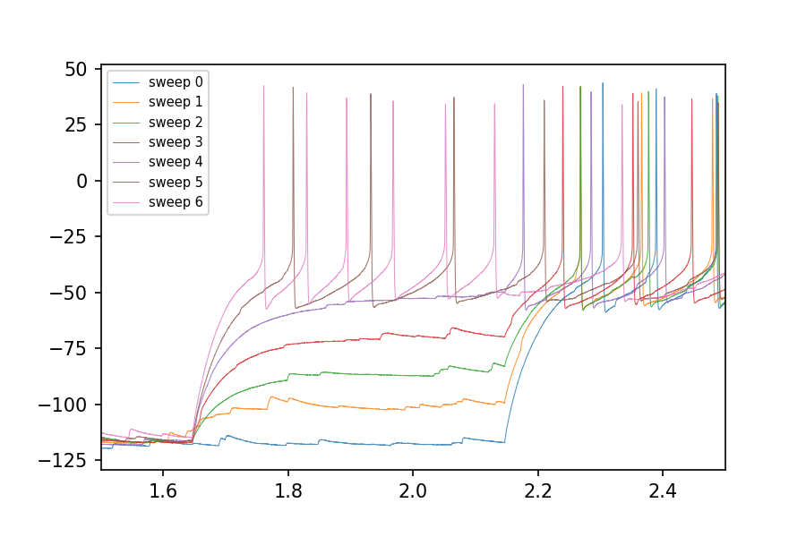

**NOTES ABOUT EXAMPLE CODE:** This folder contains a standalone collection of code created from a snapshot of a work-in-progress project. It is meant for educational purposes only, and better code which does the same things may be found elsewhere
in this project.

## Notable Changes
* All ABF header code (structures and display functions too) are in a single header.py file. This file is kept intentionally simple (and well documented) to make it easy to port this class to other languages. It has *NO* dependencies, even though other parts of the pyABF project do (i.e., numpy and matplotlib). This file has minimal data access functions (for getting sweeps or getting data between arbitrarily time points) but it is left to the end user to multiply it by the scale factor. If vector math is availale, that's the way to go.
* Added `getData` and `getTimes` (to get Ys and Xs for any arbitrarily span of time). The same functions are also available for sweeps.

## Example Plot
```python
import matplotlib.pyplot as plt
import numpy as np
abfHeader=ABFheader(R"../../../../data/17o05028_ic_steps.abf")
times = abfHeader.getTimesSweep()
for sweepNumber in range(5):
	data=abfHeader.getDataSweep(sweepNumber)
	data=np.array(data)*abfHeader.header['signalScale']
	plt.plot(times,data,alpha=.8,lw=.5,label="sweep %d"%sweepNumber)
plt.axis([1.5,2.5,None,None])
plt.legend(fontsize=7)
plt.savefig('_demo.png')
plt.show()    
```

