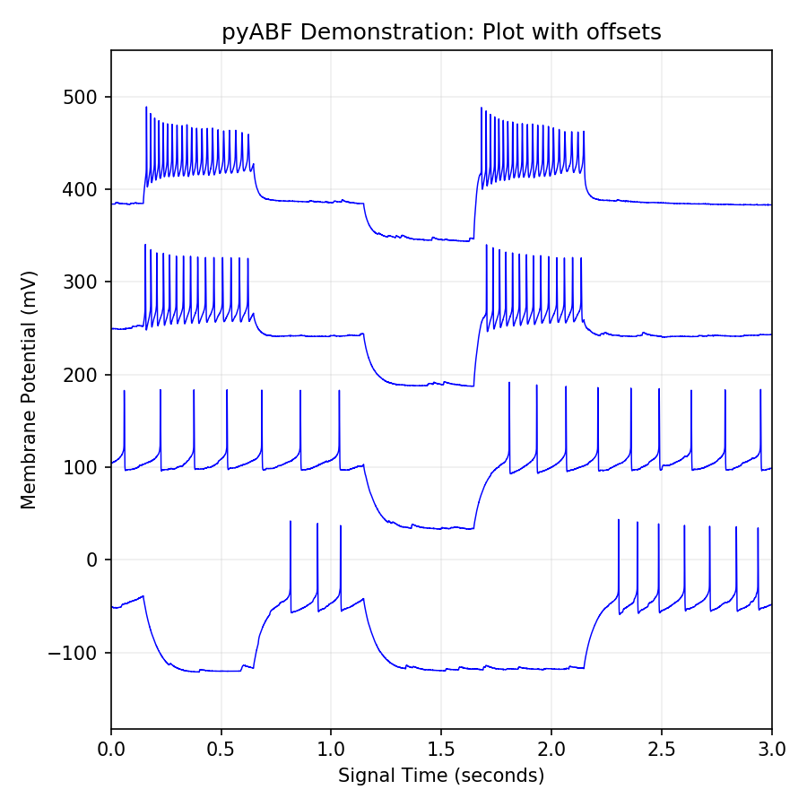

**NOTES ABOUT EXAMPLE CODE:** This folder contains a standalone collection of code created from a snapshot of a work-in-progress project. It is meant for educational purposes only, and better code which does the same things may be found elsewhere
in this project.

## Notable Changes
* added code to compare headers of two ABF files. This was actually really useful. I.e., quickly find the keys that change between single-channel or dual-channel recordings, or VC vs IC recordings.
* stuck in a matplotlib demo
* using the warnings module to warn about numpy not being installed
* add loadtime message (and ability to silence it)
* got a good start for the ABF class. I haven't locked anything in yet.

## Practice Usage

### Demo: overlayed plot
```python
abf=ABF(R"../../../../data/17o05028_ic_steps.abf")  
plt.figure(figsize=(10,4))
plt.title("pyABF Demonstration: Simple Plot")
plt.grid(alpha=.2)
for sweepNumber in [0,5,10,15]:
    abf.setSweep(sweepNumber)
    plt.plot(abf.dataX,abf.dataY,linewidth=.7,alpha=.8,label="sweep %d"%(sweepNumber))
plt.margins(0,.1)
plt.legend(fontsize=8)
plt.ylabel(abf.unitsLong)
plt.xlabel(abf.unitsTimeLong)
plt.tight_layout()
plt.savefig("_demo_plotSimple")
```


### Demo: plot with X and Y offsets
```python
abf=ABF(R"../../../../data/17o05028_ic_steps.abf") 
plt.figure(figsize=(6,6))
plt.title("pyABF Demonstration: Plot with offsets")
plt.grid(alpha=.2)
for sweepNumber in [0,5,10,15]:
    abf.setSweep(sweepNumber)
    plt.plot(abf.dataX,abf.dataY+(sweepNumber*30),linewidth=.7,color='b')
plt.margins(0,.1)
plt.ylabel(abf.unitsLong)
plt.xlabel(abf.unitsTimeLong)
plt.tight_layout()
plt.savefig("_demo_offset1")
```


### Demo: stacked plot
```python
abf=ABF(R"../../../../data/17o05026_vc_stim.abf") 
plt.figure(figsize=(10,4))
plt.title("pyABF Demonstration: Plot with offsets")
plt.grid(alpha=.2)
for sweepNumber in range(8):
    abf.setSweep(sweepNumber)
    color=plt.cm.get_cmap('winter')(sweepNumber/abf.sweepCount)
    abf.dataY[:len(abf.dataY)-.5*abf.pointsPerSec]=np.nan
    plt.plot(abf.dataX+(sweepNumber*.02),abf.dataY+(sweepNumber*3),linewidth=.7,alpha=.5,color=color)
plt.margins(.02,.1)
plt.ylabel(abf.unitsLong)
plt.xlabel(abf.unitsTimeLong)
plt.tight_layout()
plt.savefig("_demo_offset2")
```


