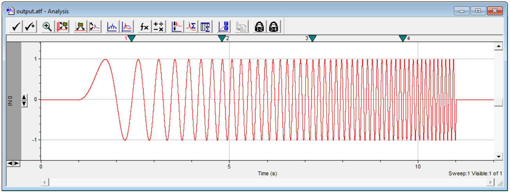

# Creating Arbitrary Stimulus Waveforms
Sometimes you want to control current or voltage with a waveform more complex than simple epoch-based steps and ramps. If you design the waveform in Python (likely with Numpy), it can be saved as an ATF (Axon Text Format) and loaded as a stimulus waveform in ClampEx.

### Sample ATF File
```
ATF	1.0
8	2     
"AcquisitionMode=Episodic Stimulation"
"Comment="
"YTop=2000"
"YBottom=-2000"
"SyncTimeUnits=20"
"SweepStartTimesMS=0.000"
"SignalsExported=IN 0"
"Signals="	"IN 0"
"Time (s)"	"Trace #1"
0.0000  0.000000
...
9.9996	15.5849
9.9997	15.8339
9.9998	16.0741
9.9999	16.3103
```

## Sine Wave Sweeps
We desire to create a stimulus waveform which is a sine wave that increases frequency _linearly_. 
This is accomplished in [synth-atf.py](src/synth-atf.py)


### Modern Code (Jan, 2018)

This function creates a sine sweep of a given frequency and span.

```python
def synth_sine_sweep(freq_max_hz=10, span_sec=10, rate=20000):
    time_scale=freq_max_hz/span_sec/2
    Xs=np.arange(rate*span_sec)/rate
    data=np.sin(2*np.pi*(Xs**2)*time_scale)
```

Don't overlook the fact that because we used math to generate the sine wave, we can also use math to determine the time points of zero-crossings, as well as the instantaneous frequency at each crossing. This will prove useful later when we want to do things like peak detection (once per cycle):

```python
zero_cross=np.sqrt(np.arange((Xs[-1]**2)*time_scale)/time_scale)
cycle_freqs=np.concatenate(([0],1/np.diff(zero_cross)))
```

Output:


ClampEx cuts off the first 1/64th of a sweep, even if it is a pre-recorded stimulus waveform file. In voltage clamp this creates a step as the voltage jumps between the holding voltage and whatever point the sine sweep is when it makes the jump. This causes a huge capacitative transient and it's just a mess. We overcome this by padding the data with one second of zeros. We do it on each side to make the data easy on the eyes.


To test it out, just open the ATF file in ClampEx



Looks great! This is ready to use. I typically open it in Clampfit then save it as an ABF 1.8 file (floating point) so it's smaller and faster to load.

### Early Code (Feb, 2014)
I found this jewel in my archives. Thank you 2014 Scott for saving this!

```python
import numpy as np
import pylab

### DEFINE SINE WAVE CRITERIA ###
DUR=5                   # duration of stimulus file (seconds)
MAXFREQ=20              # maximum frequency at end of duration (Hz)
RATE=1000               # sample rate in Hz
MULT=MAXFREQ/DUR/2      # multiplier (for 2*pi*x^2)

### CREATE ARRAYS ###
xs=np.arange(0,DUR,1/RATE)                         # time points for x axis
zi=np.sqrt(np.arange(0,(xs[-1]**2)*MULT,1)/MULT)   # zero intercept times
ys=np.sin(2*np.pi*(xs**2)*MULT)                    # sin(2*pi*x^2*MULT)

### SHOW DATA IN CONSOLE ###
print("Zero-intercept cross time points:\n",zi)    # show the times

### PLOT DATA ###
pylab.figure(figsize=(12,2))        # create a figure of defined size
pylab.plot(xs,ys,'b-',alpha=.5)     # plot the sine wave
pylab.plot(zi,[0]*len(zi),'kx')     # plot the zero intercept points
pylab.axis([-.1,DUR+.1,-1.1,1.1])   # zoom out a touch
pylab.tight_layout()                # minimize gray space
pylab.savefig("sine.png")           # save the figure
pylab.show()                        # present plot to the user
```
