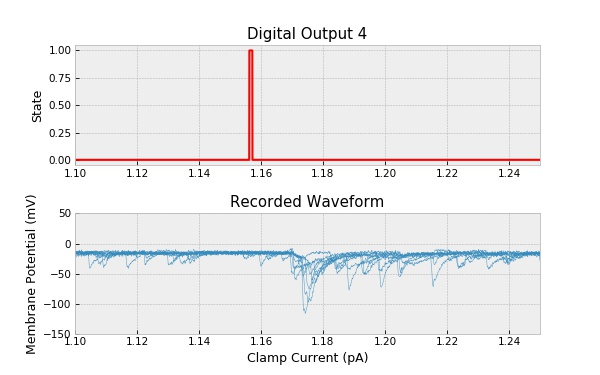
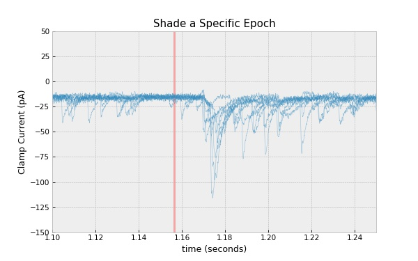
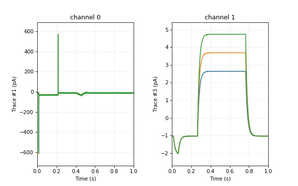
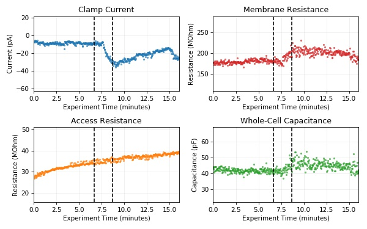

# Advanced pyABF Examples

* Review this page only after reviewing the 
[getting started](/docs/getting-started) guide.
* This page is a collection of advanced tasks performed by pyABF.
* Use these advanced features at your own risk!
  * Many of these examples are dirty hacks which may get cleaner with time
  * However, this means the syntax may change as the API improves
  * These examples will never be removed. Their code will always be updated.


## Advanced Plotting with the `pyabf.plot` Module

pyabf has a plot module which has been designed to simplify the act
of creating matplotlib plots of electrophysiological data loaded with
the ABF class. This module isn't fully developed yet (so don't rely
on code you write today working with it tomorrow), but it's a strong
start and has some interesting functionality that might be worth
inspecting. 

If you care a lot about how your graphs look, plot them yourself with
matplotlib commands. If you want to save keystrokes, don't care how
the graphs look, or don't know how to use matplotlib (and don't feel
like learning), maybe some of the functions in `pyabf.plot` will be
useful to you. You don't have to import it, just call its functions
and pass-in the abf object you're currently working with.

Notice in this example there is an L-shaped scalebar. Nice!

**Code:**

```python
import pyabf
import pyabf.plot
abf = pyabf.ABF("171116sh_0018.abf")
pyabf.plot.sweeps(abf, title=False, 
    offsetXsec=.1, offsetYunits=20, startAtSec=0, endAtSec=1.5)
pyabf.plot.scalebar(abf, hideFrame=True)
plt.tight_layout()
plt.show()
```

**Output:**


## Accessing Digital Outputs

Epochs don't just control DAC clamp settings, they also control digital
outputs. Digital outputs are stored as an 8-bit byte with 0 representing
off and 1 representing on. Calling `abf.sweepD(digOutNum)` will return
a waveform (scaled 0 to 1) to show the high/low state of the digital
output number given (usually 0-7). Here a digital output controls an 
optogenetic stimulator, and a light-evoked EPSC is seen several 
milliseconds after the stimulus

**Code:**

```python
import pyabf
abf = pyabf.ABF("17o05026_vc_stim.abf")

fig = plt.figure(figsize=(8, 5))

ax1 = fig.add_subplot(211)
ax1.grid(alpha=.2)
ax1.set_title("Digital Output 4")
ax1.set_ylabel("Digital Output")

# plot the digital output of the first sweep
ax1.plot(abf.sweepX, abf.sweepD(4), color='r')
ax1.set_yticks([0, 1])
ax1.set_yticklabels(["OFF", "ON"])
ax1.axes.set_ylim(-.5, 1.5)

ax2 = fig.add_subplot(212, sharex=ax1)
ax2.grid(alpha=.2)
ax2.set_title("Recorded Waveform")
ax2.set_xlabel(abf.sweepLabelY)
ax2.set_ylabel(abf.sweepLabelC)

# plot the data from every sweep
for sweepNumber in abf.sweepList:
    abf.setSweep(sweepNumber)
    ax2.plot(abf.sweepX, abf.sweepY, color='C0', alpha=.8, lw=.5)

# zoom in on an interesting region
ax2.axes.set_xlim(1.10, 1.25)
ax2.axes.set_ylim(-150, 50)
plt.show()
```

**Output:**



## Shading Epochs

In this ABF digital output 4 is high during epoch C. Let's highlight
this by plotting sweeps and shading that epoch.

`print(abf.epochPoints)` yields `[0, 3125, 7125, 23125, 23145, 200000]`
and I know the epoch I'm interested in is bound by index 3 and 4.

**Code:**

```python
import pyabf
abf = pyabf.ABF("17o05026_vc_stim.abf")

plt.figure(figsize=(8, 5))
for sweepNumber in abf.sweepList:
    abf.setSweep(sweepNumber)
    plt.plot(abf.sweepX, abf.sweepY, color='C0', alpha=.5, lw=.5)
plt.ylabel(abf.sweepLabelY)
plt.xlabel(abf.sweepLabelX)
plt.title("Shade a Specific Epoch")
plt.axis([1.10, 1.25, -150, 50])

epochNumber = 3
t1 = abf.sweepEpochs.p1s[epochNumber] * abf.dataSecPerPoint
t2 = abf.sweepEpochs.p2s[epochNumber] * abf.dataSecPerPoint
plt.axvspan(t1, t2, color='r', alpha=.3, lw=0)
plt.grid(alpha=.2)
plt.show()
```

**Output:**



## Create an I/V Curve

This example analyzes 171116sh_0013.abf (a voltage clamp ABF which 
goes from -110 mV to -50 mV increasing the clamp voltage by 5 mV each
sweep). To get the "I" the sweep is averaged between 500ms and 1s, and
to get the "V" the second epoch is accessed.

**Code:**

```python
import pyabf
abf = pyabf.ABF("171116sh_0013.abf")
pt1 = int(500 * abf.dataPointsPerMs)
pt2 = int(1000 * abf.dataPointsPerMs)

currents=[]
voltages=[]
for sweep in abf.sweepList:
    abf.setSweep(sweep)
    currents.append(np.average(abf.sweepY[pt1:pt2]))
    voltages.append(abf.sweepEpochs.levels[2])

plt.figure(figsize=(8, 5))
plt.grid(alpha=.5, ls='--')
plt.plot(voltages, currents, '.-', ms=15)
plt.ylabel(abf.sweepLabelY)
plt.xlabel(abf.sweepLabelC)
plt.title(f"I/V Relationship of {abf.abfID}")

plt.show()
```

**Output:**


## Plotting Data from ATF Files

Although most of the effort in this project has gone into the ABF class,
there also exists an ATF class with much of the similar functionality.
This class can read Axon Text Format (ATF) files and has a setSweep()
with nearly identical sentax to the ABF class. 

Extra attention was invested into supporting muli-channel ATF data.
Note that this example plots only channel 2 from a multi-channel ATF 
file.

**Code:**

```python
import pyabf
atf = pyabf.ATF("18702001-step.atf")  # not ABF!

fig = plt.figure(figsize=(8, 5))
ax1 = fig.add_subplot(121)
ax2 = fig.add_subplot(122)

for channel, ax in enumerate([ax1, ax2]):
    ax.set_title("channel %d"%(channel))
    ax.set_xlabel(atf.sweepLabelX)
    ax.set_ylabel(atf.sweepLabelY)
    for sweepNumber in atf.sweepList:
        atf.setSweep(sweepNumber, channel)
        ax.plot(atf.sweepX, atf.sweepY)

ax1.margins(0, .1)
ax2.margins(0, .1)
ax1.grid(alpha=.2)
ax2.grid(alpha=.2)
plt.show()
```

**Output:**



## Passive Membrane Properties

The pyabf.tools.memtest module has methods which can determine passive
membrane properties (holding current, membrane resistance, access
resistance, whole-cell capacitance) from voltage-clamp traces containing
a hyperpolarizing step. Theory and implimentation details are in the
comments of the module. This example demonstrates how to graph passive
membrane properties sweep-by-sweep, and indicate where comment tags
were added.

**Code:**

```python
import pyabf
import pyabf.tools.memtest

abf = pyabf.ABF("vc_drug_memtest.abf")
Ihs, Rms, Ras, Cms = pyabf.tools.memtest.step_valuesBySweep(abf)

# That's it! The rest of the code just plots these 4 numpy arrays.
fig = plt.figure(figsize=(8, 5))

ax1 = fig.add_subplot(221)
ax1.grid(alpha=.2)
ax1.plot(abf.sweepTimesMin, Ihs, ".", color='C0', alpha=.7, mew=0)
ax1.set_title("Clamp Current")
ax1.set_ylabel("Current (pA)")

ax2 = fig.add_subplot(222)
ax2.grid(alpha=.2)
ax2.plot(abf.sweepTimesMin, Rms, ".", color='C3', alpha=.7, mew=0)
ax2.set_title("Membrane Resistance")
ax2.set_ylabel("Resistance (MOhm)")

ax3 = fig.add_subplot(223)
ax3.grid(alpha=.2)
ax3.plot(abf.sweepTimesMin, Ras, ".", color='C1', alpha=.7, mew=0)
ax3.set_title("Access Resistance")
ax3.set_ylabel("Resistance (MOhm)")

ax4 = fig.add_subplot(224)
ax4.grid(alpha=.2)
ax4.plot(abf.sweepTimesMin, Cms, ".", color='C2', alpha=.7, mew=0)
ax4.set_title("Whole-Cell Capacitance")
ax4.set_ylabel("Capacitance (pF)")

for ax in [ax1, ax2, ax3, ax4]:
    ax.margins(0, .9)
    ax.set_xlabel("Experiment Time (minutes)")
    for tagTime in abf.tagTimesMin:
        ax.axvline(tagTime, color='k', ls='--')

plt.tight_layout()
plt.show()
```

**Output:**

