# Getting Started with pyABF

**This page demonstrates how to use pyABF to perform many common tasks.**
Examples start out simple and increase in complexity. 
Browsing this page is the best way to get started with pyABF, as every core 
function is demonstrated in this document.
All ABFs used in these examples are provided in [the data folder](/data/), 
so you can practice recreating these examples in your own programming 
environment.

**Advanced examples:** experimental features (useful, but subject to syntax 
changes as the pyABF API matures) are demonstrated on the 
[advanced examples](advanced.md) page.

**Technical note:** this guide is generated automatically by
[gettingStarted.py](/tests/tests/gettingStarted.py)) and so this page doubles 
as a test suite (all these examples should produce identical graphs after all
code changes). 

## Prerequisite Imports

Although it's not explicitly shown in every example, it is assumed the following
lines are present at the top of your Python script:

```python
import pyabf
import numpy as np
import matplotlib.pyplot as plt
```


## Load an ABF File

Give an ABF file path to `pyabf.ABF()` to get started

**Code:**
```python
import pyabf
abf = pyabf.ABF("demo.abf")
print(abf)
```

**Output:**
```
ABF file (demo.abf) with 1 channel, 187 sweeps, and a total length of 6.23 min.
```

## Inspect the ABF header

Sometimes it is useful to see all the data contained in the ABF header.
While inspecting the header is not necessary to use pyabf, it is useful
to know how to access this information.

**Code:**
```python
import pyabf
abf = pyabf.ABF("demo.abf")
print(abf.headerText) # display header information in the console
abf.headerLaunch() # display header information in a web browser
```

## Access Sweep Data

ABF objects provide access to ABF data by sweep number. Sweep numbers
start at zero, and after setting a sweep you can access that sweep's
ADC data with `sweepY`, DAC simulus waveform / command signal with 
`sweepC`, and the time units for the sweep with `sweepX`.

**Code:**
```python
import pyabf
abf = pyabf.ABF("18808025.abf")
abf.setSweep(14)
print("sweep data (ADC):", abf.sweepY)
print("sweep command (DAC):", abf.sweepC)
print("sweep times (seconds):", abf.sweepX)
```

**Output:**
```
sweep data (ADC): [-13.6719 -12.9395 -12.207  ..., -15.8691 -15.8691 -16.7236]
sweep command (DAC): [-70. -70. -70. ..., -70. -70. -70.]
sweep times (seconds): [ 0.      0.0001  0.0001 ...,  0.5998  0.5999  0.5999]
```

## Plot a Sweep with Matplotlib

Matplotlib is a fantastic plotting library for Python. This example
shows how to plot an ABF sweep using matplotlib.
ABF `setSweep()` is used to tell the ABF class what sweep to load
into memory. After that you can just plot `sweepX` and `sweepY`.

**Code:**

```python
import pyabf
abf = pyabf.ABF("17o05028_ic_steps.abf")
abf.setSweep(14)
plt.figure(figsize=(8, 5))
plt.plot(abf.sweepX, abf.sweepY)
plt.show()
```

**Output:**

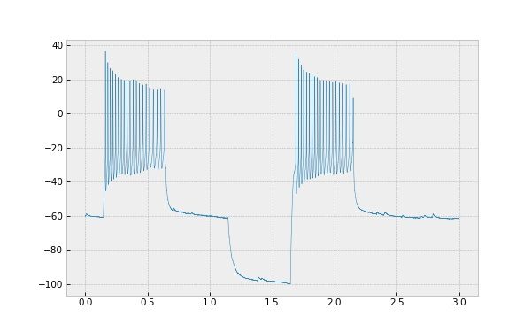

## Decorate Plots with ABF Information

The ABF class provides easy access to lots of information about the ABF.
This example shows how to use these class methods to create a prettier
plot of several sweeps from the same file.

**Code:**

```python
import pyabf
abf = pyabf.ABF("17o05028_ic_steps.abf")
plt.figure(figsize=(8, 5))
plt.title("pyABF and Matplotlib are a great pair!")
plt.ylabel(abf.sweepLabelY)
plt.xlabel(abf.sweepLabelX)
for i in [0, 5, 10, 15]:
    abf.setSweep(i)
    plt.plot(abf.sweepX, abf.sweepY, alpha=.5, label="sweep %d"%(i))
plt.legend()
plt.show()
```

**Output:**

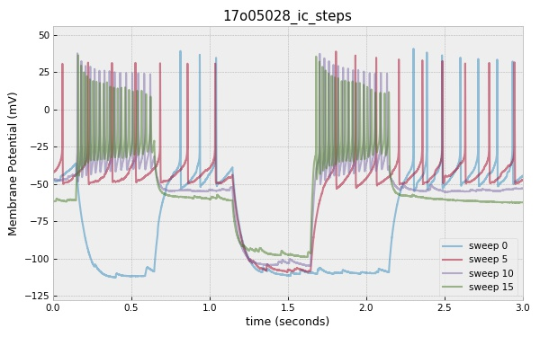

## Plot Multi-Channel ABFs

Channel selection is achieved by defining a channel when calling
`setSweep()`.

**Code:**

```python
import pyabf
abf = pyabf.ABF("14o08011_ic_pair.abf")
fig = plt.figure(figsize=(8, 5))

# plot the first channel
abf.setSweep(sweepNumber=0, channel=0)
plt.plot(abf.sweepX, abf.sweepY, label="Channel 1")

# plot the second channel
abf.setSweep(sweepNumber=0, channel=1)
plt.plot(abf.sweepX, abf.sweepY, label="Channel 2")

# decorate the plot
plt.ylabel(abf.sweepLabelY)
plt.xlabel(abf.sweepLabelX)
plt.axis([25, 45, -70, 50])
plt.legend()
plt.show()
```

**Output:**

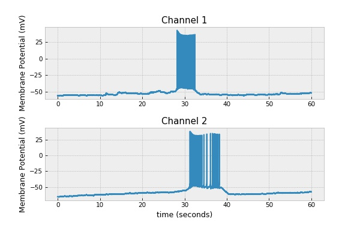

## Plot the Command Waveform

Episodic ABF files can have complex protocols designed with in waveform
editor. After calling `setSweep()` the command waveform can be accessed
as `sweep.C`. 

To get more information about the epoch table (such as the list of 
levels for each epoch, specific time points epochs start and stop, etc.)
check out properties of the `abf.sweepEpochs` object, which represents
the currently loaded sweep/channel.

**Code:**

```python
import pyabf
abf = pyabf.ABF("171116sh_0018.abf")
abf.setSweep(14)
fig = plt.figure(figsize=(8, 5))

# plot the ADC (voltage recording)
ax1 = fig.add_subplot(211)
ax1.set_title("ADC (recorded waveform)")
ax1.plot(abf.sweepX, abf.sweepY)

# plot the DAC (clamp current)
ax2 = fig.add_subplot(212)
ax2.set_title("DAC (stimulus waveform)")
ax2.plot(abf.sweepX, abf.sweepC, color='r')

# decorate the plots
ax1.set_ylabel(abf.sweepLabelY)
ax2.set_xlabel(abf.sweepLabelX)
ax2.set_ylabel(abf.sweepLabelC)
plt.show()
```

**Output:**

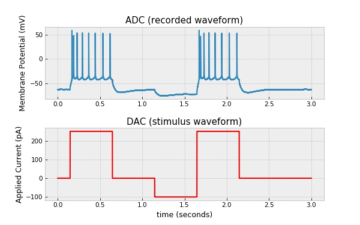

## Axis-Linked Subplots

Matplotlib allows you to create subplots with linked axes. This is
convenient when plotting a waveform and its command stimulus at the
same time, because zooming-in on one will zoom-in on the other. This
is most useful when using interactive graphs, but works in all cases.

**Code:**

```python
import pyabf
abf = pyabf.ABF("171116sh_0018.abf")
abf.setSweep(14)
fig = plt.figure(figsize=(8, 5))

# plot the ADC (voltage recording)
ax1 = fig.add_subplot(211)
ax1.set_title("ADC (recorded waveform)")
ax1.plot(abf.sweepX, abf.sweepY)

# plot the DAC (clamp current)
ax2 = fig.add_subplot(212, sharex=ax1)  # <-- this argument is new
ax2.set_title("DAC (stimulus waveform)")
ax2.plot(abf.sweepX, abf.sweepC, color='r')

# decorate the plots
ax1.set_ylabel(abf.sweepLabelY)
ax2.set_xlabel(abf.sweepLabelX)
ax2.set_ylabel(abf.sweepLabelC)
ax1.axes.set_xlim(1.25, 2.5)  # <-- adjust axis like this
plt.show()
```

**Output:**

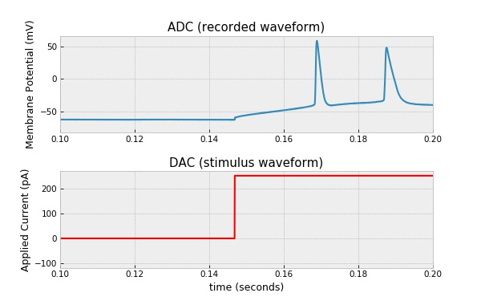

## Plot Stacked Sweeps

I often like to view sweeps stacked one on top of another. In ClampFit
this is done with "distribute traces". Here we can add a bit of offset
when plotting sweeps and achieve the same effect. This example makes
use of `abf.sweepList`, which is the same as `range(abf.sweepCount)`

**Code:**

```python
import pyabf
abf = pyabf.ABF("171116sh_0018.abf")
plt.figure(figsize=(8, 5))

# plot every sweep (with vertical offset)
for sweepNumber in abf.sweepList:
    abf.setSweep(sweepNumber)
    offset = 140*sweepNumber
    plt.plot(abf.sweepX, abf.sweepY+offset, color='C0')

# decorate the plot
plt.gca().get_yaxis().set_visible(False)  # hide Y axis
plt.xlabel(abf.sweepLabelX)
plt.show()
```

**Output:**

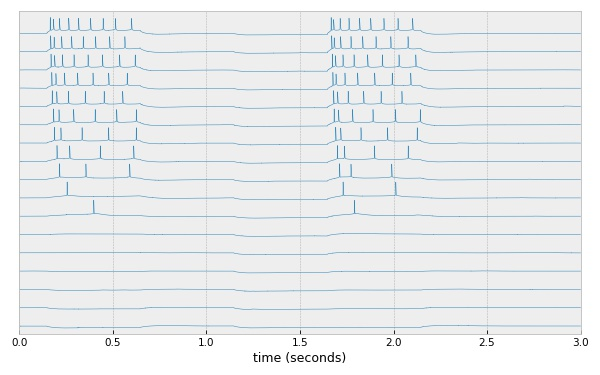

## Plot Sweeps in 3D

The previous example how to plot stacked sweeps by adding a Y offset
to each sweep. If you add an X and Y offset to each sweep, you can
create a 3D effect.

**Code:**

```python
import pyabf
abf = pyabf.ABF("171116sh_0018.abf")

plt.figure(figsize=(8, 5))
for sweepNumber in abf.sweepList:
    abf.setSweep(sweepNumber)
    i1, i2 = 0, int(abf.dataRate * 1) # plot part of the sweep
    dataX = abf.sweepX[i1:i2] + .025 * sweepNumber
    dataY = abf.sweepY[i1:i2] + 15 * sweepNumber
    plt.plot(dataX, dataY, color='C0', alpha=.5)

plt.gca().axis('off') # hide axes to enhance floating effect
plt.show()
```

**Output:**

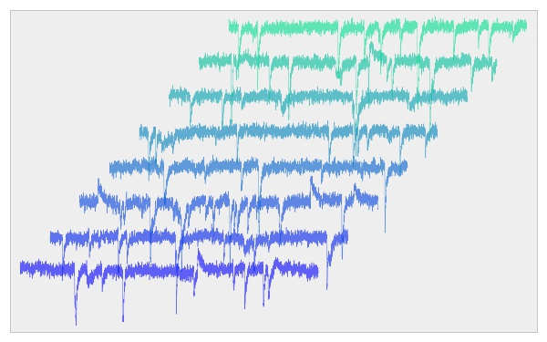

## Custom Colormaps

Matplotlib's colormap tools can be used to add an extra dimension to
graphs. All matplotlib colormaps are [listed here](https://matplotlib.org/examples/color/colormaps_reference.html).
For an interesting discussion on choosing ideal colormaps for scientific
data visit [bids.github.io/colormap/](https://bids.github.io/colormap/).
Good colors for e-phys are "winter", "rainbow", and "viridis".

**Code:**

```python
import pyabf
abf = pyabf.ABF("171116sh_0018.abf")

# use a custom colormap to create a different color for every sweep
cm = plt.get_cmap("winter")
colors = [cm(x/abf.sweepCount) for x in abf.sweepList]
#colors.reverse()

plt.figure(figsize=(8, 5))
for sweepNumber in abf.sweepList:
    abf.setSweep(sweepNumber)
    i1, i2 = 0, int(abf.dataRate * 1)
    dataX = abf.sweepX[i1:i2] + .025 * sweepNumber
    dataY = abf.sweepY[i1:i2] + 15 * sweepNumber
    plt.plot(dataX, dataY, color=colors[sweepNumber], alpha=.5)

plt.gca().axis('off')
plt.show()
```

**Output:**

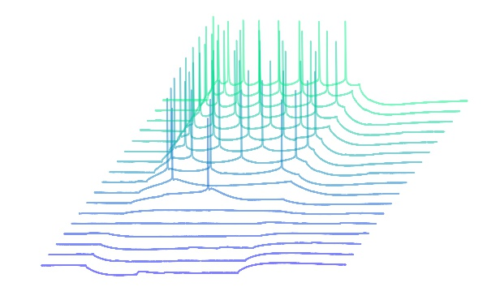

## Plotting Gap-Free ABFs

The pyABF treats every ABF like it's episodic (with sweeps). As such,
gap free ABF files are loaded as if they were episodic files with
a single sweep. When an ABF is loaded, `setSweep(0)` is called
automatically, so the entire gap-free set of data is already available
by plotting `sweepX` and `sweepY`.

**Code:**

```python
import pyabf
abf = pyabf.ABF("abf1_with_tags.abf")
plt.figure(figsize=(8, 5))
plt.plot(abf.sweepX, abf.sweepY, lw=.5)
plt.axis([725, 825, -150, -15])
plt.ylabel(abf.sweepLabelY)
plt.xlabel(abf.sweepLabelX)
plt.title("Example Gap Free File")
plt.show()
```

**Output:**

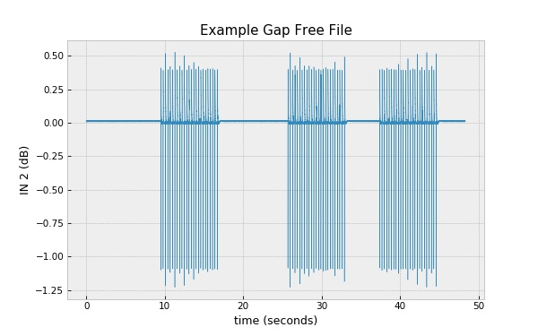

## Accessing Comments (Tags) in ABF Files

While recording an ABF the user can insert a comment at a certain
time point. pClamp calls these "tags", and they can be a useful
way to mark when a drug was applied during an experiment. For this
to work, `sweepX` needs to be a list of times in the ABF recording
(not times which always start at 0 for every new sweep). Set this
behavior by setting `absoluteTime=True` when calling `setSweep()`.

A list of comments (the text of tags) is stored in a list 
`abf.tagComments`. The sweep for each tag is in `abf.tagSweeps`, while
the time of each tag is in `abf.tagTimesSec` and `abf.tagTimesMin`

**Code:**

```python
import pyabf
abf = pyabf.ABF("16d05007_vc_tags.abf")

# create a plot with time on the horizontal axis
plt.figure(figsize=(8, 5))
for sweep in abf.sweepList:
    abf.setSweep(sweep, absoluteTime=True) # <-- relates to sweepX
    plt.plot(abf.sweepX, abf.sweepY, lw=.5, alpha=.5, color='C0')
plt.margins(0, .5)
plt.ylabel(abf.sweepLabelY)
plt.xlabel(abf.sweepLabelX)

# now add the tags as vertical lines
for i, tagTimeSec in enumerate(abf.tagTimesSec):
    posX = abf.tagTimesSec[i]
    comment = abf.tagComments[i]
    color = "C%d"%(i+1)
    plt.axvline(posX, label=comment, color=color, ls='--')
plt.legend()

plt.title("ABF File with Comments (Tags)")
plt.show()
```

**Output:**

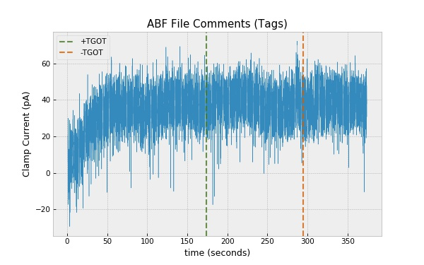

## Baseline Subtraction

Sometimes it is worthwhile to center every sweep at 0. This can be done
easily giving a time range to baseline subtract to when calling 
setSweep().

**Code:**

```python
import pyabf
abf = pyabf.ABF("17o05026_vc_stim.abf")
plt.figure(figsize=(8, 5))

# plot a sweep the regular way
abf.setSweep(3)
plt.plot(abf.sweepX, abf.sweepY, alpha=.8, label="original")

# plot a sweep with baseline subtraction
abf.setSweep(3, baseline=[2.1, 2.15])
plt.plot(abf.sweepX, abf.sweepY, alpha=.8, label="subtracted")

# decorate the plot
plt.title("Sweep Baseline Subtraction")
plt.axhline(0, color='k', ls='--')
plt.ylabel(abf.sweepLabelY)
plt.xlabel(abf.sweepLabelX)
plt.legend()
plt.axis([2, 2.5, -50, 20])
plt.show()
```

**Output:**

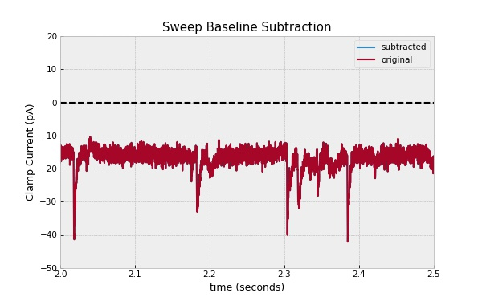

## Gaussian Filter (Lowpass Filter / Data Smoothing)

Noisy data can be filtered in software. This is especially helpful
for inspection of evoked or spontaneuos post-synaptic currents. To
apply low-pass filtering on a specific channel, invoke the 
`abf.filter.gaussian()` method before calling `setSweep()`.

The degree of smoothing is defined by _sigma_ (milliseconds units), 
passed as an argument: `abf.filter.gaussian(abf, sigma)`. 

When an ABF file is loaded its entire data is loaded into memory. When
the gaussian filter is called, the entire data is smoothed in memory.
This means calling the filter several times with the same sigma will
make it progressively smoother (although extremely processor-intensive).

Set sigma to 0 to remove all filters. This will cause the original data
to be re-read from the ABF file.

**Code:**

```python
import pyabf
import pyabf.filter

abf = pyabf.ABF("17o05026_vc_stim.abf")
plt.figure(figsize=(8, 5))

# plot the original data
abf.setSweep(3)
plt.plot(abf.sweepX, abf.sweepY, alpha=.3, label="original")

# show multiple degrees of smoothless
for sigma in [.5, 2, 10]:
    pyabf.filter.gaussian(abf, 0) # remove old filter
    pyabf.filter.gaussian(abf, sigma) # apply custom sigma
    abf.setSweep(3) # reload sweep with new filter
    label = "sigma: %.02f" % (sigma)
    plt.plot(abf.sweepX, abf.sweepY, alpha=.8, label=label)

# zoom in on an interesting region and decorate the plot
plt.title("Gaussian Filtering of ABF Data")
plt.ylabel(abf.sweepLabelY)
plt.xlabel(abf.sweepLabelX)
plt.axis([8.20, 8.30, -45, -5])
plt.legend()
plt.show()
```

**Output:**

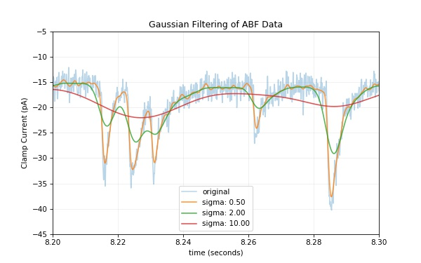

## Accessing Epoch Information

In some ABFs an epoch table is used to control the command level of the
DAC to control voltage or current. While the epoch table can be
confusing to access directly from the header (e.g., the first epoch
does not start at time 0, but rather 1/64 of the sweep length), a
simplified way to access epoch types and levels is provided with the
`abf.sweepEpochs` object, which contains epoch points, levels, and types
for the currently-loaded sweep.

For example, the output of this script:
```python
import pyabf
abf = pyabf.ABF("2018_08_23_0009.abf")
for i, p1 in enumerate(abf.sweepEpochs.p1s):
    epochLevel = abf.sweepEpochs.levels[i]
    epochType = abf.sweepEpochs.types[i]
    print(f"epoch index {i}: at point {p1} there is a {epochType} to level {epochLevel}")
```

looks like this:
```
epoch index 0: at point 0 there is a Step to level -70.0
epoch index 1: at point 187 there is a Step to level -80.0
epoch index 2: at point 4187 there is a Step to level -70.0
epoch index 3: at point 8187 there is a Ramp to level -80.0
epoch index 4: at point 9187 there is a Ramp to level -70.0
epoch index 5: at point 10187 there is a Step to level -70.0
```

**Code:**

```python
import pyabf
abf = pyabf.ABF("2018_08_23_0009.abf")

fig = plt.figure(figsize=(8, 5))

ax1 = fig.add_subplot(211)
ax1.plot(abf.sweepY, color='b')
ax1.set_ylabel("ADC (measurement)")
ax1.set_xlabel("sweep point (index)")

ax2 = fig.add_subplot(212)
ax2.plot(abf.sweepC, color='r')
ax2.set_ylabel("DAC (command)")
ax2.set_xlabel("sweep point (index)")

for p1 in abf.sweepEpochs.p1s:
    ax1.axvline(p1, color='k', ls='--', alpha=.5)
    ax2.axvline(p1, color='k', ls='--', alpha=.5)

plt.tight_layout()
plt.show()
```

**Output:**

