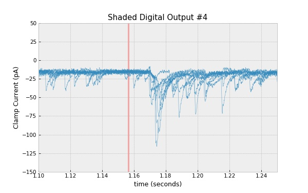

# Getting Started with pyABF

This page is a collection of common tasks performed by pyABF.
They start out simple and increase in complexity.

  * All ABFs used are provided in  [the data folder](/data/)
  * These tests (and this output) are automated by [generate.py](generate.py)
  * Examples `import matplotlib.pyplot as plt`
  * Examples `import numpy as np`
  * Alternate color scheme provided with `plt.style.use('bmh')`


## Access Sweep Data

Load an ABF and display data from a certain sweep. 
The output will look like: 
`[-60.08911 -60.08911 ..., -61.67602 -61.64550]`.
Note that sweeps start at 0, so calling `setSweep(14)` really loads
the 15th sweep.

**Code:**

```python
import pyabf
plt.figure(figsize=(8, 5))
abf = pyabf.ABF("17o05028_ic_steps.abf")
abf.setSweep(14)
print(abf.sweepY)
```

## Plot Sweep Data

Plot a sweep of ABF data using matplotlib.

**Code:**

```python
import pyabf
abf = pyabf.ABF("17o05028_ic_steps.abf")
abf.setSweep(14)
plt.figure(figsize=(8, 5))
plt.plot(abf.sweepX, abf.sweepY, lw=.5)
plt.show()
```

**Output:**


## Decorate Plots with ABF Information

Plot every 5th sweep and decorate the plot nicely.
Note that the _displayed_ sweep number starts at 1.

**Code:**

```python
import pyabf
abf = pyabf.ABF("17o05028_ic_steps.abf")

plt.figure(figsize=(8, 5))
for sweepNumber in range(abf.sweepCount)[::5]:
    abf.setSweep(sweepNumber)
    plt.plot(abf.sweepX, abf.sweepY, alpha=.5,
             label=f"sweep {sweepNumber+1}")

plt.margins(0, .1)
plt.legend()
plt.ylabel(abf.sweepLabelY)
plt.xlabel(abf.sweepLabelX)
plt.title(abf.abfID)
plt.tight_layout()
plt.show()
```

**Output:**


## Plot Multi-Channel ABFs

Channel selection is done by adding the `channel=` 
argument in `setSweep()`

**Code:**

```python
import pyabf
abf = pyabf.ABF("14o08011_ic_pair.abf")

fig = plt.figure(figsize=(8, 5))

abf.setSweep(sweepNumber=0, channel=0)
ax1 = fig.add_subplot(211)
ax1.set_title(f"Channel {abf.sweepChannel+1}")
ax1.plot(abf.sweepX, abf.sweepY, lw=.5)
ax1.set_ylabel(abf.sweepLabelY)

abf.setSweep(sweepNumber=0, channel=1)
ax2 = fig.add_subplot(212)
ax2.set_title(f"Channel {abf.sweepChannel+1}")
ax2.plot(abf.sweepX, abf.sweepY, lw=.5)
ax2.set_xlabel(abf.sweepLabelX)
ax2.set_ylabel(abf.sweepLabelY)

fig.subplots_adjust(hspace=.4)  # add more space between the subplots

plt.show()
```

**Output:**


## Plot the Stimulus Waveform

Episodic ABF files can have complex protocols designed with the waveform
editor. After calling `setSweep()` the command waveform can be accessed
as `sweep.C`.

**Code:**

```python
import pyabf
abf = pyabf.ABF("171116sh_0018.abf")
abf.setSweep(14)

fig = plt.figure(figsize=(8, 5))

ax1 = fig.add_subplot(211)
ax1.set_title("ADC (recorded waveform)")
ax1.plot(abf.sweepX, abf.sweepY, lw=.5)
ax1.set_ylabel(abf.sweepLabelY)

ax2 = fig.add_subplot(212)
ax2.set_title("DAC (stimulus waveform)")
ax2.plot(abf.sweepX, abf.sweepC, color='r')
ax2.set_xlabel(abf.sweepLabelX)
ax2.set_ylabel(abf.sweepLabelC)

fig.subplots_adjust(hspace=.4)  # add more space between the subplots

plt.show()
```

**Output:**


## Zooming Gracefully

While you can zoom in on data by setting its matplotlib axis, when
using subplots it helps to link them together horizontally.

**Code:**

```python
import pyabf
abf = pyabf.ABF("171116sh_0018.abf")
abf.setSweep(14)

fig = plt.figure(figsize=(8, 5))

ax1 = fig.add_subplot(211)
ax1.set_title("ADC (recorded waveform)")
ax1.plot(abf.sweepX, abf.sweepY, lw=.5)
ax1.set_ylabel(abf.sweepLabelY)

ax2 = fig.add_subplot(212, sharex=ax1)  # this links them together
ax2.set_title("DAC (stimulus waveform)")
ax2.plot(abf.sweepX, abf.sweepC, color='r')
ax2.set_xlabel(abf.sweepLabelX)
ax2.set_ylabel(abf.sweepLabelC)

fig.subplots_adjust(hspace=.4)  # add more space between the subplots

ax1.axes.set_xlim(0.1, 0.4)  # zoom between 100 and 200 ms

plt.show()
```

**Output:**


## Stacking Sweeps

I often like to view sweeps stacked one on top of another. In ClampFit
this is done with "distribute traces". Here we can add a bit of offset
when plotting sweeps.

Note also that `abf.sweepList` is the same as `range(abf.sweepCount)`

**Code:**

```python
import pyabf
abf = pyabf.ABF("171116sh_0018.abf")

plt.figure(figsize=(8, 5))

for sweepNumber in abf.sweepList:
    abf.setSweep(sweepNumber)
    plt.plot(abf.sweepX, abf.sweepY + 140*sweepNumber,
             color='C0', lw=.5)

plt.gca().get_yaxis().set_visible(False)  # hide Y axis
plt.xlabel(abf.sweepLabelX)
plt.margins(0, .02)
plt.tight_layout()

plt.show()
```

**Output:**


## XY Offset and Custom Colormap

Plotting every sweep with a slight X and Y offset produces a cool
3D effect. I often use this view to visually inspect drug effects.

I also assign a color by sweep from a matplotlib colormap.

**Code:**

```python
import pyabf
abf = pyabf.ABF("17o05026_vc_stim.abf")

# only plot data between this time range
i1 = int(abf.dataRate*3.0)
i2 = int(abf.dataRate*3.5)

# use a custom colormap
cm = plt.get_cmap("winter")
colors = [cm(x/abf.sweepCount) for x in abf.sweepList]

plt.figure(figsize=(8, 5))
for sweepNumber in abf.sweepList:
    abf.setSweep(sweepNumber)
    plt.plot(
        abf.sweepX[i1:i2] + .05 * sweepNumber,
        abf.sweepY[i1:i2] + 15*sweepNumber,
        color=colors[sweepNumber],
        lw=.5, alpha=.6)

# remove axes and use tight margins
plt.gca().get_yaxis().set_visible(False)  # hide Y axis
plt.gca().get_xaxis().set_visible(False)  # hide X axis
plt.margins(.02, .02)
plt.tight_layout()

plt.show()
```

**Output:**


## Accessing Digital Outputs

Epochs don't just control DAC clamp settings, they also control digital
outputs. Digital outputs are stored as an 8-bit byte with 0 representing
off and 1 representing on. Calling `abf.sweepD(digOutNum)` will return
a waveform (scaled 0 to 1) to show the high/low state of the digital
output number given (usually 0-7). Here a digital output controls an 
optogenetic stimulator, and a light-evoked EPSC is seen several 
milliseconds after the stimulus

**Code:**

```python
import pyabf
abf = pyabf.ABF("17o05026_vc_stim.abf")

fig = plt.figure(figsize=(8, 5))

ax1 = fig.add_subplot(211)
ax1.set_title("Digital Output 4")
ax1.set_ylabel("State")

# plot the digital output of the first sweep
ax1.plot(abf.sweepX, abf.sweepD(4), color='r')

ax2 = fig.add_subplot(212, sharex=ax1)
ax2.set_title("Recorded Waveform")
ax2.set_xlabel(abf.sweepLabelY)
ax2.set_ylabel(abf.sweepLabelC)

# plot the data from every sweep
for sweepNumber in abf.sweepList:
    abf.setSweep(sweepNumber)
    ax2.plot(abf.sweepX, abf.sweepY, color='C0', alpha=.8, lw=.5)

fig.subplots_adjust(hspace=.4)
ax2.axes.set_xlim(1.10, 1.25)
ax2.axes.set_ylim(-150, 50)

plt.show()
```

**Output:**


## Shading Digital Outputs

Drawing digital outputs on the same graph as the data is a bit more
subtle because it requires you to know the times digital outputs
switch state (rather than the instantaneous state of the output at every
point in time).

Notice how much easier life gets when we don't deal with subplots.

**Code:**

```python
import pyabf
abf = pyabf.ABF("17o05026_vc_stim.abf")

plt.figure(figsize=(8, 5))
for sweepNumber in abf.sweepList:
    abf.setSweep(sweepNumber)
    plt.plot(abf.sweepX, abf.sweepY, color='C0', alpha=.8, lw=.5)
plt.ylabel(abf.sweepLabelY)
plt.xlabel(abf.sweepLabelX)
plt.title("Current to Digital Output")
plt.axis([1.10, 1.25, -150, 50])

outputStateByEpoch = abf.digitalWaveformEpochs[4]  # digital output 4
for epochNumber, outputState in enumerate(outputStateByEpoch):
    if outputState == 1:
        t1 = abf.epochPoints[epochNumber]*abf.dataSecPerPoint
        t2 = abf.epochPoints[epochNumber+1]*abf.dataSecPerPoint
        print(t1, t2)
        plt.axvspan(t1, t2, color='r', alpha=.5, lw=0)

plt.show()
```

**Output:**

