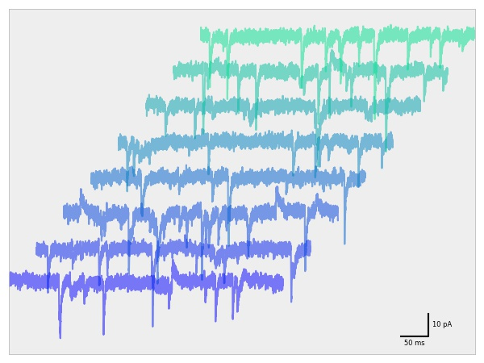
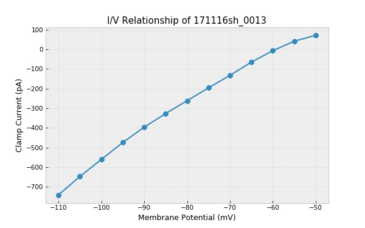
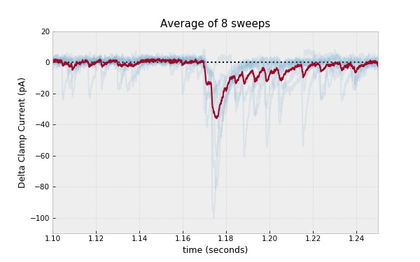
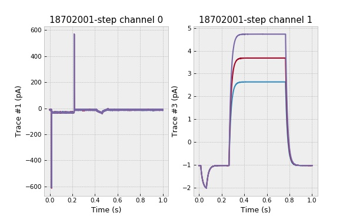

# Getting Started with pyABF

This page is a collection of common tasks performed by pyABF.
They start out simple and increase in complexity. Browsing this page is the best
way to get started with pyABF, as every core function is demonstrated in this
document.

The generation of this guide is fully automated 
(by [quickStart.py](/tests/tests/quickStart.py)) so this page doubles as a test suite.
All ABFs used in these examples are provided in  [the data folder](/data/), so
you can replicate them yourself.

## Prerequisite Imports

Although it's not explicitly shown in every example, it is assumed the following
lines are present at the top of your Python script:

```python
import pyabf
import numpy as np
import matplotlib.pyplot as plt
plt.style.use('bmh')
```

The last line defines the default style of all the graphs on this page. I've 
started to prefer the "bmh" style (with gray backgrounds), but a full list
of example styles is on [Tony Syu's page](https://tonysyu.github.io/raw_content/matplotlib-style-gallery/gallery.html)
and on the [official matplotlib style page](https://matplotlib.org/2.1.1/gallery/style_sheets/style_sheets_reference.html)


## Load an ABF File

Give an ABF file path to `pyabf.ABF()` to get started

**Code:**
```python
import pyabf
abf = pyabf.ABF("data/abfs/17o05028_ic_steps.abf")
print(abf)
```

**Output:**
```
ABF file (16d05007_vc_tags.abf) with 1 channel, 187 sweeps, and a total length of 6.23 min.
```

## Access Sweep Data

ABF objects provide access to ABF data by sweep number. Sweep numbers
start at zero, and after setting a sweep you can access that sweep's
ADC data (`sweepY`), DAC simulus waveform / command signal (`sweepC`), 
or the time units for the sweep (`sweepX`).

**Code:**

```python
import pyabf
abf = pyabf.ABF("17o05028_ic_steps.abf")
abf.setSweep(14)  # sweeps start at 0
print(abf.sweepY)  # sweep data (ADC)
print(abf.sweepC)  # sweep command (DAC)
print(abf.sweepX)  # sweep times (seconds)
```

## Plot Sweep Data

Plot a sweep of ABF data using matplotlib.

**Code:**

```python
import pyabf
abf = pyabf.ABF("17o05028_ic_steps.abf")
abf.setSweep(14)
plt.figure(figsize=(8, 5))
plt.plot(abf.sweepX, abf.sweepY, lw=.5)
plt.show()
```

**Output:**


## Decorate Plots with ABF Information

Plot every 5th sweep and decorate the plot nicely.
Note that the _displayed_ sweep number starts at 1.

**Code:**

```python
import pyabf
abf = pyabf.ABF("17o05028_ic_steps.abf")

plt.figure(figsize=(8, 5))
for sweepNumber in [0, 5, 10, 15]:
    abf.setSweep(sweepNumber)
    plt.plot(abf.sweepX, abf.sweepY, alpha=.5,
             label=f"sweep {sweepNumber}")

plt.margins(0, .1)
plt.legend()
plt.ylabel(abf.sweepLabelY)
plt.xlabel(abf.sweepLabelX)
plt.title(abf.abfID)
plt.tight_layout()
plt.show()
```

**Output:**


## Plot Multi-Channel ABFs

Channel selection is done by adding the `channel=` 
argument in `setSweep()`

**Code:**

```python
import pyabf
abf = pyabf.ABF("14o08011_ic_pair.abf")

fig = plt.figure(figsize=(8, 5))

abf.setSweep(sweepNumber=0, channel=0)
ax1 = fig.add_subplot(211)
ax1.set_title(f"Channel {abf.sweepChannel+1}")
ax1.plot(abf.sweepX, abf.sweepY, lw=.5)
ax1.set_ylabel(abf.sweepLabelY)

abf.setSweep(sweepNumber=0, channel=1)
ax2 = fig.add_subplot(212)
ax2.set_title(f"Channel {abf.sweepChannel+1}")
ax2.plot(abf.sweepX, abf.sweepY, lw=.5)
ax2.set_xlabel(abf.sweepLabelX)
ax2.set_ylabel(abf.sweepLabelY)

fig.subplots_adjust(hspace=.4)  # add more space between the subplots

plt.show()
```

**Output:**


## Plot the Stimulus Waveform

Episodic ABF files can have complex protocols designed with the waveform
editor. After calling `setSweep()` the command waveform can be accessed
as `sweep.C`.

**Code:**

```python
import pyabf
abf = pyabf.ABF("171116sh_0018.abf")
abf.setSweep(14)

fig = plt.figure(figsize=(8, 5))

ax1 = fig.add_subplot(211)
ax1.set_title("ADC (recorded waveform)")
ax1.plot(abf.sweepX, abf.sweepY, lw=.5)
ax1.set_ylabel(abf.sweepLabelY)

ax2 = fig.add_subplot(212)
ax2.set_title("DAC (stimulus waveform)")
ax2.plot(abf.sweepX, abf.sweepC, color='r')
ax2.set_xlabel(abf.sweepLabelX)
ax2.set_ylabel(abf.sweepLabelC)

fig.subplots_adjust(hspace=.4)  # add more space between the subplots

plt.show()
```

**Output:**


## Zooming Gracefully

While you can zoom in on data by setting its matplotlib axis, when
using subplots it helps to link them together horizontally.

**Code:**

```python
import pyabf
abf = pyabf.ABF("171116sh_0018.abf")
abf.setSweep(14)

fig = plt.figure(figsize=(8, 5))

ax1 = fig.add_subplot(211)
ax1.set_title("ADC (recorded waveform)")
ax1.plot(abf.sweepX, abf.sweepY, lw=.5)
ax1.set_ylabel(abf.sweepLabelY)

ax2 = fig.add_subplot(212, sharex=ax1)  # this links them together
ax2.set_title("DAC (stimulus waveform)")
ax2.plot(abf.sweepX, abf.sweepC, color='r')
ax2.set_xlabel(abf.sweepLabelX)
ax2.set_ylabel(abf.sweepLabelC)

fig.subplots_adjust(hspace=.4)  # add more space between the subplots

ax1.axes.set_xlim(0.1, 0.4)  # zoom between 100 and 200 ms

plt.show()
```

**Output:**


## Stacking Sweeps

I often like to view sweeps stacked one on top of another. In ClampFit
this is done with "distribute traces". Here we can add a bit of offset
when plotting sweeps.

Note also that `abf.sweepList` is the same as `range(abf.sweepCount)`

**Code:**

```python
import pyabf
abf = pyabf.ABF("171116sh_0018.abf")

plt.figure(figsize=(8, 5))

for sweepNumber in abf.sweepList:
    abf.setSweep(sweepNumber)
    plt.plot(abf.sweepX, abf.sweepY + 140*sweepNumber,
             color='C0', lw=.5)

plt.gca().get_yaxis().set_visible(False)  # hide Y axis
plt.xlabel(abf.sweepLabelX)
plt.margins(0, .02)
plt.tight_layout()

plt.show()
```

**Output:**


## XY Offset and Custom Colormap

Plotting every sweep with a slight X and Y offset produces a cool
3D effect. I often use this view to visually inspect drug effects.

I also assign a color by sweep from a matplotlib colormap.

**Code:**

```python
import pyabf
abf = pyabf.ABF("17o05026_vc_stim.abf")

# only plot data between this time range
i1 = int(abf.dataRate*3.0)
i2 = int(abf.dataRate*3.5)

# use a custom colormap
cm = plt.get_cmap("winter")
colors = [cm(x/abf.sweepCount) for x in abf.sweepList]

plt.figure(figsize=(8, 5))
for sweepNumber in abf.sweepList:
    abf.setSweep(sweepNumber)
    plt.plot(
        abf.sweepX[i1:i2] + .05 * sweepNumber,
        abf.sweepY[i1:i2] + 15*sweepNumber,
        color=colors[sweepNumber],
        lw=.5, alpha=.6)

# remove axes and use tight margins
plt.gca().get_yaxis().set_visible(False)  # hide Y axis
plt.gca().get_xaxis().set_visible(False)  # hide X axis
plt.margins(.02, .02)
plt.tight_layout()

plt.show()
```

**Output:**


## Advanced Plotting with the `pyabf.plot` Module

pyabf has a plot module which has been designed to simplify the act
of creating matplotlib plots of electrophysiological data loaded with
the ABF class. This module isn't fully developed yet (so don't rely
on code you write today working with it tomorrow), but it's a strong
start and has some interesting functionality that might be worth
inspecting. 

If you care a lot about how your graphs look, plot them yourself with
matplotlib commands. If you want to save keystrokes, don't care how
the graphs look, or don't know how to use matplotlib (and don't feel
like learning), maybe some of the functions in `pyabf.plot` will be
useful to you. You don't have to import it, just call its functions
and pass-in the abf object you're currently working with.

Notice in this example there is an L-shaped scalebar. Nice!

**Code:**

```python
import pyabf
abf = pyabf.ABF("17o05026_vc_stim.abf")
pyabf.plot.sweeps(abf, title=False, offsetXsec=.05,
                  offsetYunits=15, startAtSec=3, endAtSec=3.5)
pyabf.plot.scalebar(abf, hideFrame=True)
plt.gca().patch.set_alpha(0)
plt.tight_layout()
plt.show()
```

**Output:**



## Accessing Digital Outputs

Epochs don't just control DAC clamp settings, they also control digital
outputs. Digital outputs are stored as an 8-bit byte with 0 representing
off and 1 representing on. Calling `abf.sweepD(digOutNum)` will return
a waveform (scaled 0 to 1) to show the high/low state of the digital
output number given (usually 0-7). Here a digital output controls an 
optogenetic stimulator, and a light-evoked EPSC is seen several 
milliseconds after the stimulus

**Code:**

```python
import pyabf
abf = pyabf.ABF("17o05026_vc_stim.abf")

fig = plt.figure(figsize=(8, 5))

ax1 = fig.add_subplot(211)
ax1.set_title("Digital Output 4")
ax1.set_ylabel("State")

# plot the digital output of the first sweep
ax1.plot(abf.sweepX, abf.sweepD(4), color='r')

ax2 = fig.add_subplot(212, sharex=ax1)
ax2.set_title("Recorded Waveform")
ax2.set_xlabel(abf.sweepLabelY)
ax2.set_ylabel(abf.sweepLabelC)

# plot the data from every sweep
for sweepNumber in abf.sweepList:
    abf.setSweep(sweepNumber)
    ax2.plot(abf.sweepX, abf.sweepY, color='C0', alpha=.8, lw=.5)

fig.subplots_adjust(hspace=.4)
ax2.axes.set_xlim(1.10, 1.25)
ax2.axes.set_ylim(-150, 50)

plt.show()
```

**Output:**


## Shading Epochs

In this ABF digital output 4 is high during epoch C. Let's highlight
this by plotting sweeps and shading that epoch.

`print(abf.epochPoints)` yields `[0, 3125, 7125, 23125, 23145, 200000]`
and I know the epoch I'm interested in is bound by index 3 and 4.

**Code:**

```python
import pyabf
abf = pyabf.ABF("17o05026_vc_stim.abf")

plt.figure(figsize=(8, 5))
for sweepNumber in abf.sweepList:
    abf.setSweep(sweepNumber)
    plt.plot(abf.sweepX, abf.sweepY, color='C0', alpha=.5, lw=.5)
plt.ylabel(abf.sweepLabelY)
plt.xlabel(abf.sweepLabelX)
plt.title("Shade a Specific Epoch")
plt.axis([1.10, 1.25, -150, 50])

t1 = abf.sweepX[abf.epochPoints[3]]
t2 = abf.sweepX[abf.epochPoints[4]]
plt.axvspan(t1, t2, color='r', alpha=.3, lw=0)

plt.show()
```

**Output:**


## Working with Gap-Free Files

The pyABF project considers everything like it's an episodic ABF.
Gap free ABF files are treated as if they were episodic files with
a single sweep.

When an abf object is instantiated, `setSweep(0)` is called
automatically, so the entire gap-free set of data is pre-loaded into
sweepX and sweepY.

Note also that if it doesn't seem like the units are consistant
with a simple current-clamp or voltage-clamp signal, the label
is made from the channel name and the units.

**Code:**

```python
import pyabf
abf = pyabf.ABF("16d22006_kim_gapfree.abf")

plt.figure(figsize=(8, 5))
plt.plot(abf.sweepX, abf.sweepY, lw=.5)
plt.ylabel(abf.sweepLabelY)
plt.xlabel(abf.sweepLabelX)
plt.title("Example Gap Free File")
plt.show()
```

**Output:**


## Accessing Comments (Tags) in ABF Files

While recording an ABF the user can insert a comment at a certain
time point. ClampFit calls these "tags", and they can be a useful
way to mark things like drug applications during an experiment.

A list of comments (the text of tags) is stored in a list 
`abf.tagComments`. The sweep for each tag is in `abf.tagSweeps`, while
the time of each tag is in `abf.tagTimesSec` and `abf.tagTimesMin`

**Code:**

```python
import pyabf
abf = pyabf.ABF("16d05007_vc_tags.abf")

# first plot the entire ABF continuously
plt.figure(figsize=(8, 5))
for sweep in abf.sweepList:
    abf.setSweep(sweep, absoluteTime=True)
    abf.sweepY[:int(abf.dataRate*1.0)] = np.nan  # blank the memtest
    plt.plot(abf.sweepX, abf.sweepY, lw=.5, color='C0')
plt.ylabel(abf.sweepLabelY)
plt.xlabel(abf.sweepLabelX)

# now add the tags as vertical lines
for i, tagTimeSec in enumerate(abf.tagTimesSec):
    plt.axvline(abf.tagTimesSec[i], label=abf.tagComments[i],
                color=f"C{i+3}", ls='--', alpha=.8)
plt.legend()

plt.title("ABF File Comments (Tags)")
plt.show()
```

**Output:**


## Baseline Subtraction

Sometimes it is worthwhile to center every sweep at 0. This can be done
easily by running `abf.baseline(t1, t2)` (where t1 and t2 are both times
in seconds). Subsequent `setSweep()` calls will automatically subtract
the average data value between these two points from the entire sweep,
centering it at zero.

To turn off baseline subtraction after it has been enabled, call 
`abf.baseline()` without arguments.

**Code:**

```python
import pyabf
abf = pyabf.ABF("17o05026_vc_stim.abf")
plt.figure(figsize=(8, 5))

# enable baseline subtraction and plot a demo sweep
abf.sweepBaseline(2.1, 2.15)
abf.setSweep(3)
plt.plot(abf.sweepX, abf.sweepY, label="subtracted")

# disable baseline subtraction and plot a demo sweep
abf.sweepBaseline()
abf.setSweep(3)
plt.plot(abf.sweepX, abf.sweepY, label="original")

# decorate the plot
plt.title("Sweep Baseline Subtraction")
plt.axhline(0, color='k', ls='--')
plt.ylabel(abf.sweepLabelY)
plt.xlabel(abf.sweepLabelX)
plt.legend()
plt.axis([2, 2.5, -50, 20])
plt.show()
```

**Output:**


## Gaussian Filter (Lowpass Filter / Data Smoothing)

Noisy data can be filtered in software. This is especially helpful
for inspection of evoked or spontaneuos post-synaptic currents. To
apply low-pass filtering on a specific channel, invoke the 
`abf.filter.gaussian()` method a single time. After that, every
`setSweep()` will display filtered data.

The degree of smoothing is defined by _sigma_ (milliseconds units), 
passed as an argument: `abf.filter.gaussian(abf, sigma)`. Increase
sigma to increase the smoothness. Note that calling this filter 
multiple times on the same ABF will make it progressively smoother, but
the act is resource-intense and not recommended. 

Set sigma to 0 to remove all filters (the original data will be re-read
from the ABF file).

**Code:**

```python
import pyabf
abf = pyabf.ABF("17o05026_vc_stim.abf")
plt.figure(figsize=(8, 5))

# plot the original data
abf.setSweep(3)
plt.plot(abf.sweepX, abf.sweepY, alpha=.3, label="original")

# show multiple degrees of smoothless
for sigma in [.5, 2, 10]:
    pyabf.filter.gaussian(abf, 0)  # remove old filter
    pyabf.filter.gaussian(abf, sigma)  # apply custom sigma
    abf.setSweep(3)  # reload sweep
    plt.plot(abf.sweepX, abf.sweepY, alpha=.8, label=f"sigma: {sigma}")

# zoom in on an interesting region
plt.title("Gaussian Filtering")
plt.ylabel(abf.sweepLabelY)
plt.xlabel(abf.sweepLabelX)
plt.axis([8.20, 8.30, -45, -5])
plt.legend()
plt.show()
```

**Output:**


## Create an I/V Curve

This example analyzes 171116sh_0013.abf (a voltage clamp ABF which 
goes from -110 mV to -50 mV increasing the clamp voltage by 5 mV each
sweep).

Currents are the average value of each sweep between the 0.5 and 1 sec
mark. Notice our use of the additional module to get the average
value between two marks for every sweep. Clamp values are obtained
from `abf.epochValues`, a 2d array of DAC command values at each
epoch (columns) arranged by sweep (rows).

**Code:**

```python
import pyabf
abf = pyabf.ABF("171116sh_0013.abf")
currentsAv = pyabf.stats.rangeAverage(abf, .5, 1)
voltages = pyabf.stimulus.epochValues(abf)

plt.figure(figsize=(8, 5))
plt.grid(alpha=.5, ls='--')
plt.plot(voltages, currentsAv, '.-', ms=15)
plt.ylabel(abf.sweepLabelY)
plt.xlabel(abf.sweepLabelC)
plt.title(f"I/V Relationship of {abf.abfID}")

plt.show()
```

**Output:**



## Averaging Sweeps

Sometimes you want to analyze a sweep which is the average of several
sweeps. Often this is used in conjunction with baseline subtraction.

This can be done using the sweep range average function.
Although here it's given without arguments, it can take a list of
specific sweep numbers.

**Code:**

```python
import pyabf
abf = pyabf.ABF("17o05026_vc_stim.abf")
abf.sweepBaseline(1.10, 1.16)

plt.figure(figsize=(8, 5))
plt.grid(alpha=.5, ls='--')
plt.axhline(0, color='k', ls=':')

# plot all individual sweeps
for sweep in abf.sweepList:
    abf.setSweep(sweep)
    plt.plot(abf.sweepX, abf.sweepY, color='C0', alpha=.1)

# calculate and plot the average of all sweeps
avgSweep = pyabf.sweep.averageTrace(abf)
plt.plot(abf.sweepX, avgSweep, color='C1', lw=2)

# decorate the plot and zoom in on the interesting area
plt.title(f"Average of {abf.sweepCount} sweeps")
plt.ylabel(abf.sweepLabelY)
plt.xlabel(abf.sweepLabelX)
plt.axis([1.10, 1.25, -110, 20])

plt.show()
```

**Output:**



## Plotting Data from ATF Files

Although most of the effort in this project has gone into the ABF class,
there also exists an ATF class with much of the similar functionality.
This class can read Axon Text Format (ATF) files and has a setSweep()
with nearly identical sentax to the ABF class. 

Extra attention was invested into supporting muli-channel ATF data.
Note that this example plots only channel 2 from a multi-channel ATF 
file.

**Code:**

```python
import pyabf
atf = pyabf.ATF("18702001-step.atf")  # not ABF!

fig = plt.figure(figsize=(8, 5))
ax1 = fig.add_subplot(121)
ax2 = fig.add_subplot(122)

for channel, ax in enumerate([ax1, ax2]):
    ax.set_title(f"{atf.atfID} channel {channel}")
    ax.set_xlabel(atf.sweepLabelX)
    ax.set_ylabel(atf.sweepLabelY)
    for sweepNumber in atf.sweepList:
        atf.setSweep(sweepNumber, channel)
        ax.plot(atf.sweepX, atf.sweepY)

plt.show()
```

**Output:**

