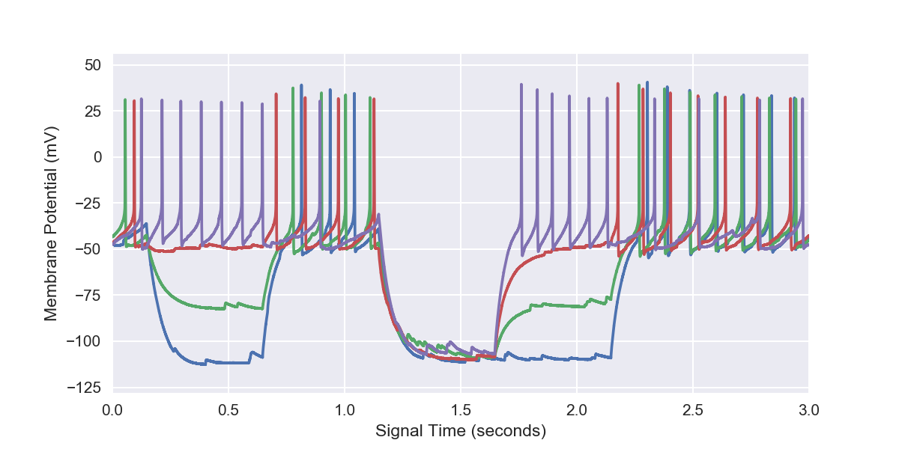

pyabf: A portable Python library for reading files in Axon Binary Format (ABF)
==============================================================================

* Project Homepage: `https://github.com/swharden/pyABF <https://github.com/swharden/pyABF>`_
* pyABF Cookbook: `Getting Started <https://github.com/swharden/pyABF/blob/master/cookbook/getting-started.ipynb>`_
* pyABF Cookbook: `Advanced Interactions with ABF Objects <https://github.com/swharden/pyABF/tree/master/cookbook>`_
* `The Unofficial Guide to the ABF File Format <https://github.com/swharden/pyABF/tree/master/doc/abf-file-format>`_

Quickstart
----------

**Display ABF Information:**

.. code-block:: python

  import pyabf
  abf=pyabf.ABF("filename.abf")
  abf.info()

**Access ABF Sweep Data:**

.. code-block:: python

  import pyabf
  abf=pyabf.ABF("filename.abf")
  abf.setSweep(7)
  print(abf.dataY, abf.units)
  print(abf.dataC, abf.unitsCommand)
  print(abf.dataX, abf.unitsTime)

Output:
  
.. code-block:: text

  [-47.729 -47.729 -47.76  ..., -42.542 -42.542 -42.572] mV
  [ 0.  0.  0. ...,  0.  0.  0.] pA
  [ 0.  0.  0. ...,  3.  3.  3.] seconds

**Plot all sweeps with matplotlib:**

.. code-block:: python

  import pyabf
  import matplotlib.pyplot as plt

  abf=pyabf.ABF("filename.abf") 
  plt.figure(figsize=(8,4))
  for sweepNumber in abf.sweepList:
      abf.setSweep(sweepNumber)
      plt.plot(abf.dataX,abf.dataY)
  	
  plt.ylabel(abf.unitsLong)
  plt.xlabel(abf.unitsTimeLong)
  plt.margins(0,.1)
  plt.show()
  
Output:

    

**Full pyabf API documentation**, additional code examples, a pyabf cookbook, and low-level information about the ABF file format can be found at the pyABF project homepage: https://github.com/swharden/pyABF
